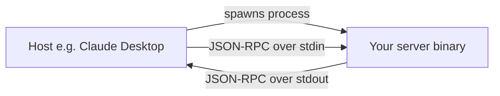
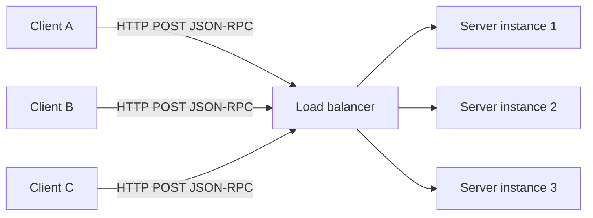
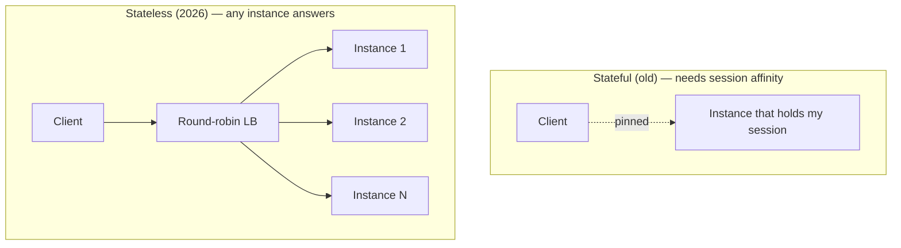

# 01-3 · Transports & the stateless spec

> **Level:** Beginner · **Prerequisites:** [01-2 · The protocol & the three primitives](02_protocol_and_primitives.md)
> **Time:** ~30–40 min · **Verified:** 2026-08-08 (MCP spec 2026-07-28 · FastMCP · Python 3.12)

## Why this matters

The same JSON-RPC messages from the last lesson can travel two ways, and choosing wrong is a deployment headache. A local desktop tool and a multi-user internal service have completely different needs — **stdio** vs. **streamable HTTP**. And the biggest change to MCP in 2026 wasn't a new feature, it was a *removal*: the protocol core became **stateless**, which is precisely what lets a remote MCP server scale like any boring web app. If you're going to deploy servers (Section 05), this is the lesson that makes them operable.

---

## Two transports

JSON-RPC doesn't care about the pipe — so MCP defines two.

### stdio — local subprocess

The host **launches your server as a child process** and talks to it over standard in/out. Messages are JSON-RPC lines written to `stdin` and read from `stdout`. No network, no ports, no auth handshake — the trust boundary is "the host started this binary."

**Use stdio when:** local development, desktop apps, a server that ships alongside the host. One host, one user, one process. It's the simplest thing that works — and (from 01-1) it means the host is **running your code locally**, so the trust/supply-chain concern is real.

### Streamable HTTP — remote

The server is an ordinary **HTTP endpoint**. The client POSTs JSON-RPC request bodies and reads responses; when a call needs to stream (progress, partial results) the server can respond with a stream. No subprocess — the server runs *somewhere else*, reachable by many clients.

**Use streamable HTTP when:** the server is remote, shared, multi-user, or centrally operated — an internal service many people's hosts connect to, or a SaaS MCP endpoint. It's a normal web service, so it deploys like one.

> **Rule of thumb.** *Runs on the user's machine for one user?* stdio. *Runs on a server for many users?* streamable HTTP. Same server logic, different transport — you pick it at deploy time.

---

## The 2026-07-28 stateless revision

Early MCP over HTTP was **stateful**: a client would `initialize`, the server would remember that session (keyed by an `Mcp-Session-Id` header), and every later request had to come back to the **same** server instance that held the session. That's fine for one process. It's a scaling nightmare for a real service, because it demands **session affinity** — sticky sessions pinning each client to one box.

The **2026-07-28** revision made the protocol core **stateless**. Here's what changed.

### What was removed

- **The `initialize` / `initialized` handshake.** No more "connect, negotiate, remember." There's no session to set up.
- **The `Mcp-Session-Id` header.** No server-side session state to key on, so no sticky routing.

### What was added

- **Self-describing requests.** Every request now carries what a server needs to interpret it **inline** — protocol version, client info, and capabilities — on *each* message (this is the per-request capability announcement from 01-2). No prior handshake required; any request stands alone.
- **Multi Round-Trip Requests (MRTR).** A tool that needs more input no longer requires a persistent bidirectional stream. It returns an **"input required"** result; the client gathers the answers and **retries** the call with them. The back-and-forth is modeled as ordinary independent request/response pairs — no long-lived socket.
- **Header-based routing.** Because requests are self-describing and there's no session to stick to, a plain **round-robin load balancer** can route any request to any instance. Routing decisions read headers, not server memory.

### Why stateless matters (the operational payoff)

Statelessness means **any instance can answer any request**, because no instance is holding anything the request depends on. Concretely:

- **No sticky sessions.** Drop the server behind an ordinary round-robin load balancer — the same primitive you'd use for any stateless web API.
- **Horizontal scale.** Add instances to handle load; the LB spreads requests with no coordination. Kill an instance mid-traffic and the client's next request just lands elsewhere — nothing was pinned to the dead box.
- **Operate it like any HTTP service.** Autoscaling, rolling deploys, and health checks all "just work" because there's no per-client session to preserve.

That's the headline: MCP over HTTP now scales **like any ordinary stateless web service**, because the protocol stopped remembering things between requests.

---

## Security flag (still just planting it)

Two reminders as you think about transports, unpacked fully in **Section 06**:

- **stdio = local code execution.** The host runs your binary on the user's machine — arbitrary code execution by design, and the soil the 2026 command-injection issues grew in (e.g. **CVE-2026-30623**, a stdio server executing its `command` field unsanitized).
- **HTTP = a real attack surface.** A remote MCP endpoint needs the same discipline as any public web service: authn/authz, input validation, TLS, rate limits. Statelessness simplifies *scaling*, not *security*.

---

## What's next

You now have the full mental model: the N×M argument, host/client/server, the three primitives, the two transports, and why 2026 made the core stateless. From here the course turns hands-on.

- **Section 02** — build your first MCP server with **FastMCP** (over stdio, locally).
- **Section 05** — take a server **remote and stateless over HTTP**, behind a load balancer, exactly as this lesson describes.

---

## Recap & next

- ✅ Two transports, same JSON-RPC: **stdio** (host spawns a local subprocess — dev/desktop, one user) and **streamable HTTP** (remote, shared, multi-user).
- ✅ The **2026-07-28** revision made the core **stateless**: removed the **`initialize` handshake** and **`Mcp-Session-Id`**; added **self-describing requests**, **MRTR**, and **header-based routing**.
- ✅ **MRTR** models "need more input" as a retry, not a persistent bidirectional stream.
- ✅ Stateless ⇒ **no session affinity** ⇒ plain round-robin load balancing ⇒ **horizontal scale** like any HTTP service.
- ✅ Security still applies: stdio is **local code execution**; HTTP is a **real attack surface** (Section 06).
- ✅ Self-check: why does removing the `Mcp-Session-Id` header let you put the server behind an ordinary load balancer?

→ Next: **[02 · Your first server with FastMCP](../02_first_server_fastmcp/README.md)**

## Exercises

1. For each, pick stdio or streamable HTTP and justify in one line: (a) a personal filesystem server for your own Claude Desktop; (b) an internal "company knowledge base" server 200 employees' hosts connect to; (c) a server you're actively developing on your laptop.

Solution

(a) **stdio** — one user, one machine, ships beside the host; no need for a network service. (b) **streamable HTTP** — remote, shared, multi-user; must scale and be centrally operated. (c) **stdio** — simplest local loop while developing (you can move the *same* server logic to HTTP for deployment later). Transport is a deploy-time choice, not a rewrite.

2. A team ran an MCP server behind a load balancer but pinned every client to one instance with sticky sessions "to be safe," and now scaling is painful. Given the 2026 stateless spec, what can they stop doing and why?

Solution

They can **drop session affinity entirely**. In the stateless spec there's no `initialize` handshake and no `Mcp-Session-Id` — every request is **self-describing**, so no instance holds session state the next request depends on. Any instance can answer any request, so a **plain round-robin LB** is correct and lets them scale horizontally (and survive instance restarts) with no sticky routing.

3. A tool needs a confirmation value it doesn't have yet. In the stateless world, how does MRTR handle this without a persistent bidirectional stream?

Solution

The tool returns an **"input required"** result instead of blocking on an open socket. The **client** collects the missing value from the user and **retries** the `tools/call` with it supplied. The whole exchange is ordinary independent request/response pairs — nothing stays connected between them — which is exactly what keeps the server stateless and load-balanceable.

