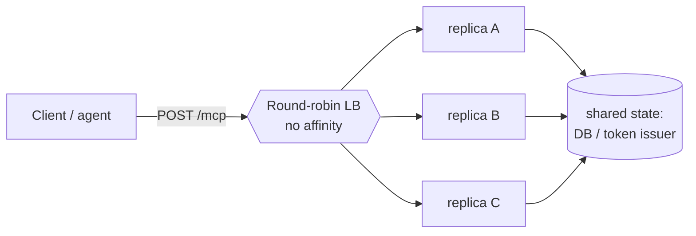

# 05-1 · From stdio to streamable HTTP

> **Level:** Intermediate→Advanced · **Prerequisites:** [04 · Tools over real systems](../04_real_backends/README.md)
> **Time:** ~45 min · **Verified:** 2026-08-08 (MCP spec 2026-07-28 · MCP Python SDK · FastMCP · Python 3.12)

## Why this matters

Every notevault server so far has run as a **stdio subprocess**: the host launches it, they talk over stdin/stdout, one process per user. That's perfect for a desktop tool and useless for a shared backend — you can't put stdin behind a load balancer. To serve many users and agents from one deployment you need **streamable HTTP**, and the 2026-07-28 spec made that transport **stateless**, which is the single thing that lets an MCP server scale like the FastAPI services you already ship. This lesson is the bridge from "a script Claude spawns" to "a service on a URL."

---

## Two transports, two jobs

MCP defines exactly two transports, and they answer different questions:

| | **stdio** | **streamable HTTP** |
|---|---|---|
| Where it runs | Local — host spawns the process | Remote — a service on a URL |
| Who reaches it | One host on the same machine | Many users/agents over the network |
| Wire | JSON-RPC over stdin/stdout | JSON-RPC over HTTP POST (+ optional SSE) |
| Auth | Ambient (it's your own process) | **OAuth 2.1 bearer tokens** (next lesson) |
| Scaling | One process per client | Horizontal, behind a load balancer |

**stdio is not "worse" — it's for a different deployment.** A CLI tool, an editor plugin, a personal automation: stdio, no network, no auth, done. The moment the answer to "who runs the host?" becomes *"lots of people, hitting a shared server"*, you switch to streamable HTTP. notevault is going multi-user, so it switches.

> There was a third transport in the early spec — plain HTTP+SSE with a long-lived server→client stream. It's **gone**. Streamable HTTP replaced it, and the 2026-07-28 stateless model is why. We contrast them at the end of this lesson.

---

## Running FastMCP over HTTP

You already have a `FastMCP` instance from Section 04. Switching transports is a one-liner:

```python
# server.py
from mcp.server.fastmcp import FastMCP

# host/port are FastMCP settings; set them on the constructor so they're
# available regardless of how you launch. stateless_http=True is the
# important flag — see the next block.
mcp = FastMCP("notevault", host="0.0.0.0", port=8080, stateless_http=True)

@mcp.tool()
async def list_notes(tag: str | None = None) -> list[dict[str, str]]:
    """Read tool — no side effects."""
    ...

if __name__ == "__main__":
    # Official MCP Python SDK: transport="streamable-http".
    # (The standalone `fastmcp` package also accepts the alias "http".)
    mcp.run(transport="streamable-http")
```

That's a real HTTP server. The MCP endpoint lives at **`/mcp`** by default; clients POST JSON-RPC to it. But `mcp.run(...)` owns the whole process — you can't add your own `/healthz`, CORS, or an auth layer around it. For anything production you mount it in an ASGI app instead.

---

## Mounting it in an ASGI app (the shape you already know)

A `FastMCP` instance exposes an **ASGI app** — a Starlette application you mount exactly like a FastAPI sub-app. This is the important path: it puts the MCP server *inside* the same uvicorn process as your own routes, middleware, and health checks.

```python
# app.py
import contextlib
from fastapi import FastAPI
from mcp.server.fastmcp import FastMCP

mcp = FastMCP("notevault", stateless_http=True)

# The MCP server is a Starlette ASGI app. (SDK: mcp.streamable_http_app();
# the standalone fastmcp package calls it mcp.http_app(). Same idea.)
mcp_app = mcp.streamable_http_app()

# GOTCHA: the MCP app has its own lifespan (it starts the session manager).
# When you mount it, the PARENT app must run that lifespan or requests hang.
@contextlib.asynccontextmanager
async def lifespan(app: FastAPI):
    async with mcp_app.router.lifespan_context(mcp_app):
        yield

app = FastAPI(lifespan=lifespan)

@app.get("/healthz")
async def healthz() -> dict[str, str]:
    return {"status": "ok"}

# Mount MCP under /mcp. The client connects to https://host/mcp.
app.mount("/mcp", mcp_app)
```

```bash
uv run uvicorn app:app --host 0.0.0.0 --port 8080
```

Now MCP is just one route in an ordinary ASGI app. Everything you learned in the FastAPI courses — uvicorn workers, middleware, dependency-injected config, Docker — applies unchanged. The only MCP-specific gotcha is the **lifespan wiring**: forget it and the session manager never starts, so requests hang. (If your SDK version mounts the endpoint at `/mcp` internally, set the app's `streamable_http_path="/"` so you don't end up at `/mcp/mcp` — check your version.)

---

## The 2026-07-28 stateless model

This is the heart of the section, so slow down here. The old MCP transport was **stateful**, and statefulness is what kept MCP servers off ordinary infrastructure. The 2026-07-28 spec made the protocol core **stateless**. Four concrete changes:

**1. No `initialize`/`initialized` handshake.** The old protocol opened every connection with a round-trip handshake to negotiate protocol version and capabilities, then held that negotiated state for the life of the connection. That's gone. There is no per-connection setup step to remember.

**2. No `Mcp-Session-Id`.** The old server minted a session id on connect and the client echoed it on every subsequent request; the server looked up server-side state keyed by that id. **Removed.** No session id header, no server-side session table.

**3. Every request is self-describing.** Because there's no remembered handshake, each JSON-RPC request now carries everything the server needs *inline*: the **protocol version**, the **client info**, and the **capabilities** it relies on. The server can answer any single request cold, having never seen that client before.

```jsonc
// A single self-describing request — no prior handshake, no session id.
{
  "jsonrpc": "2.0",
  "id": 1,
  "method": "tools/call",
  "params": {
    "name": "list_notes",
    "arguments": { "tag": "work" },
    // Context that used to live in per-connection session state now
    // travels with the request itself:
    "_meta": {
      "protocolVersion": "2026-07-28",
      "clientInfo": { "name": "claude-desktop", "version": "1.4.0" },
      "capabilities": { "sampling": {} }
    }
  }
}
```

**4. MRTR replaces the persistent bidirectional stream.** Sometimes the *server* needs to ask the *client* something mid-task — request an LLM completion (**sampling**) or ask the user a question (**elicitation**). The old model kept a long-lived SSE stream open so the server could push these asks down it. Stateless can't hold that stream. Instead, **Multi Round-Trip Requests (MRTR)**: the server answers a request by returning "I need X first," the client fulfills X and re-calls with the result. The server→client ask becomes another self-contained HTTP exchange instead of a message shoved down a persistent socket. Same capability, no long-lived connection to pin a client to one process.

---

## Why stateless = horizontal scale

Here's the payoff, and it's the reason any of this matters operationally.

**The old stateful/SSE model pinned each client to one process.** The session id and the open SSE stream lived in *one* server's memory. So every request from that client had to reach *that same replica* — you needed **session affinity** ("sticky sessions") in the load balancer, keyed on `Mcp-Session-Id`. Sticky sessions are the enemy of clean scaling: a replica dies and its clients' sessions die with it; you can't drain a node without dropping connections; autoscaling is lumpy because load can't rebalance mid-session; and a long-lived SSE stream ties up a worker for the whole conversation.

**Stateless deletes the constraint.** No session id, no per-connection state, every request self-describing — so **any replica can serve any request**. Routing is header-based and ordinary: a plain **round-robin load balancer** sends request 1 to replica A and request 2 to replica B, and both succeed because neither replica needed to remember anything.



That's the same picture as any stateless FastAPI service: **all shared state lives in the database (and the external token issuer), never in a replica's memory.** Which means the MCP server inherits everything you already know how to do — add replicas under load, roll a deploy one node at a time, let a crashed pod get replaced with zero session loss. Statelessness isn't an academic property; it's the thing that let MCP servers move onto boring, cheap, horizontally-scaled web infrastructure.

> **The one thing that must stay out of process memory:** anything you'd have kept in a "session." If you find yourself caching per-client state in a dict on the server, you've reintroduced affinity. Push it to the DB or make the client carry it.

---

## Recap & next

- ✅ **stdio = local** (one process per client, ambient auth); **streamable HTTP = remote/shared** (a URL, many clients, OAuth).
- ✅ Run FastMCP over HTTP with `mcp.run(transport="streamable-http")`, or **mount its ASGI app** in a FastAPI/Starlette parent (wire the **lifespan** or requests hang).
- ✅ The **2026-07-28 stateless model**: no `initialize` handshake, no `Mcp-Session-Id`, **self-describing requests** (protocol version + client info + capabilities inline), **MRTR** instead of a persistent server→client stream.
- ✅ Stateless ⇒ **any replica serves any request** ⇒ plain **round-robin load balancer, no session affinity** ⇒ horizontal scale like any web service. The old stateful SSE model needed sticky sessions and couldn't.
- ✅ Self-check: your server keeps a per-client `dict` of "last note viewed" in memory to speed up a tool. What did you just break, and where should that state live instead?

→ Next: **[05-2 · OAuth 2.1 & the resource server](02_oauth2_resource_server.md)**

## Exercises

1. A teammate deploys the HTTP MCP server across three replicas behind a round-robin load balancer and reports it "just works" with no sticky-session config. Under the old stateful SSE model that would have been broken. Explain in two sentences why stateless makes it fine.

<details>
<summary>Solution</summary>

Under the old model each client held a `Mcp-Session-Id` and an SSE stream living in one replica's memory, so a request routed to a different replica would find no session and fail — you *needed* affinity. Stateless carries all per-request context inline (protocol version, client info, capabilities) and keeps no server-side session, so any of the three replicas can answer any request; round-robin is correct precisely because no replica needs to remember the caller.
</details>

2. Your mounted MCP app returns 404 for every request to `/mcp`, but `mcp.run(...)` worked standalone. Name the two most likely causes.

<details>
<summary>Solution</summary>

(a) **Lifespan not wired** — the parent app didn't run the MCP app's lifespan, so the session manager never started; requests hang or error. Wire `mcp_app.router.lifespan_context` into the parent's lifespan. (b) **Path doubling** — the mounted app already serves at `/mcp` internally, so mounting it at `/mcp` puts the endpoint at `/mcp/mcp`. Mount at `/` or set the app's streamable-http path to `/`. Check which your SDK version does.
</details>

3. Why did MRTR have to replace the persistent server→client SSE stream? Tie it directly to statelessness.

<details>
<summary>Solution</summary>

A persistent server→client stream is per-connection state living in one process — the exact thing statelessness forbids, because it pins the client to that replica (reintroducing affinity). MRTR turns each server→client ask (sampling, elicitation) into another self-contained request/response round-trip, so the interaction needs no long-lived socket and any replica can participate. Same capability, no pinned connection.
</details>
