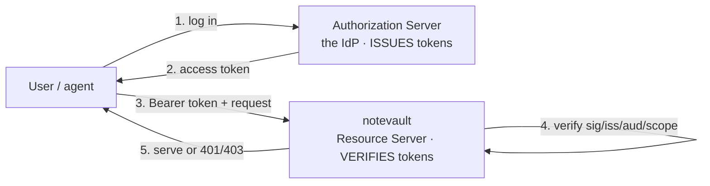

# 05-2 · OAuth 2.1 & the resource server

> **Level:** Intermediate→Advanced · **Prerequisites:** [05-1 · From stdio to streamable HTTP](01_streamable_http_and_stateless.md)
> **Time:** ~55 min · **Verified:** 2026-08-08 (MCP spec 2026-07-28 · MCP Python SDK OAuth · FastMCP · Python 3.12)

## Why this matters

The instant notevault is on a URL, it's reachable by anyone who finds the URL — and it has a `create_note` and (in the wrong hands) a `delete_all_notes`. An unauthenticated remote MCP server is an open write endpoint on the internet. The two failure modes are brutally simple: **missing verification** (you never check who's calling, so everyone is trusted) and **token forgery** (you check a token but not its signature, so an attacker signs their own). OAuth 2.1 with real token verification closes both — but only if you understand which role your server plays, because the most common mistake is a server that tries to *issue* tokens instead of *verifying* them.

---

## One rule: your server verifies, it never issues

OAuth has two server roles, and an MCP server is **exactly one** of them:

- **Authorization Server (the IdP)** — Auth0, Okta, Entra ID, Keycloak, your company SSO. It authenticates users, runs the login/consent flow, and **issues** access tokens. It holds the signing keys and the user store.
- **Resource Server** — **your MCP server.** It holds no user store and no signing keys. It receives a request with `Authorization: Bearer <token>`, **verifies** the token was issued by a trusted authorization server and grants the right scopes, and serves or refuses. That's the whole job.



If you catch yourself writing a `login` tool, minting a JWT, or storing password hashes **in the MCP server**, stop — you've built a second, unaudited authorization server. That's the flaw in the section's test task. Resource servers verify; authorization servers issue. Keep them separate.

> **Why the separation is a security control, not bureaucracy.** A token your server issues can be **replayed against a different resource server** if audiences aren't pinned — the **confused-deputy** problem. Concentrating issuance in one audited IdP, and having every resource server verify the token's *audience* is itself, is what prevents one server's token from being a skeleton key. Section 06 goes deep on confused-deputy attacks.

---

## The integration surface: `TokenVerifier`

The MCP Python SDK reduces the resource-server job to **one interface with one method**. You implement it; the SDK calls it on every request before any tool runs.

```python
# The contract (import paths can vary slightly by SDK version — the shape is stable).
from mcp.server.auth.provider import AccessToken, TokenVerifier

class MyVerifier(TokenVerifier):
    async def verify_token(self, token: str) -> AccessToken | None:
        # token in  -> AccessToken (verified, with scopes)  or  None (reject).
        ...
```

- Return an **`AccessToken`** (it carries `scopes`, `client_id`, `expires_at`) when the token is genuine → the request proceeds.
- Return **`None`** when the token is missing, expired, forged, or has the wrong audience → the SDK answers **401**.

One async method. Everything below is just *how* you implement `verify_token` honestly.

---

## A real JWT verifier (PyJWT — verify signature, issuer, audience, expiry)

Most IdPs issue **signed JWTs**. Verifying one means checking the signature against the IdP's published keys (JWKS) and validating the standard claims. Use **PyJWT** — never `python-jose` (it has a history of algorithm-confusion CVEs).

```python
# auth.py
import os
from typing import Annotated
import jwt                                   # PyJWT
from jwt import PyJWKClient
from mcp.server.auth.provider import AccessToken, TokenVerifier

class JWTVerifier(TokenVerifier):
    def __init__(self) -> None:
        # All trust anchors come from env — never hard-code an issuer or key.
        self._issuer = os.environ["OAUTH_ISSUER"]        # the trusted IdP
        self._audience = os.environ["OAUTH_AUDIENCE"]    # THIS server's identifier
        self._jwks = PyJWKClient(os.environ["OAUTH_JWKS_URL"])  # caches keys

    async def verify_token(self, token: str) -> AccessToken | None:
        try:
            key = self._jwks.get_signing_key_from_jwt(token).key
            claims = jwt.decode(
                token,
                key,
                algorithms=["RS256"],        # pin the algorithm — never trust the header's alg
                issuer=self._issuer,         # rejects tokens from any other issuer
                audience=self._audience,     # rejects tokens minted for a different server
                # exp is validated by default → expired tokens raise.
            )
        except jwt.InvalidTokenError:
            # Bad signature, wrong iss/aud, or expired → NOT verified.
            return None
        return AccessToken(
            token=token,
            client_id=claims.get("client_id", claims["sub"]),
            scopes=claims.get("scope", "").split(),   # OAuth scopes are space-delimited
            expires_at=claims.get("exp"),
        )
```

Three lines are doing the real security work, and each kills a named attack:

- **`algorithms=["RS256"]`** — pinning the algorithm defeats **token forgery** via the `alg: none` / algorithm-confusion trick, where an attacker downgrades verification to a symmetric key they control.
- **`issuer=`** — only your IdP's tokens are accepted; a token from some other issuer is refused.
- **`audience=`** — the token must have been minted *for this server*. This is your defense against the **confused-deputy** replay: a token scoped to another resource server won't validate here.

> **Opaque tokens?** Some IdPs issue random-string tokens, not JWTs. Then `verify_token` calls the IdP's **introspection** endpoint instead of decoding locally. If you ever compare a raw secret string yourself (a static internal token, an introspection shared secret), use `secrets.compare_digest(a, b)` — never `==` — to avoid a timing side-channel.

---

## Protected Resource Metadata (RFC 9728): telling clients where the IdP is

A client that hits your server with no token needs to discover *which* authorization server to get one from. **RFC 9728 Protected Resource Metadata (PRM)** is how: your resource server publishes a small JSON document at a well-known path, and points at it from every 401.

```jsonc
// GET /.well-known/oauth-protected-resource
{
  "resource": "https://notevault.example.com",              // this server's identifier (== OAUTH_AUDIENCE)
  "authorization_servers": ["https://idp.example.com"],     // where to go get a token
  "scopes_supported": ["notes:read", "notes:write"],
  "bearer_methods_supported": ["header"]
}
```

The flow is: unauthenticated request → **401** with a header pointing at the PRM → client reads the PRM → client goes to the named authorization server, logs the user in, gets a token → retries with the token.

```
HTTP/1.1 401 Unauthorized
WWW-Authenticate: Bearer resource_metadata="https://notevault.example.com/.well-known/oauth-protected-resource"
```

You don't hand-write the PRM route — configuring auth on FastMCP publishes it for you (next block). Your job is to make sure the values (`resource`, `authorization_servers`) come from env and match your IdP.

---

## Wiring it to FastMCP

You give FastMCP two things: the **verifier** (how to check a token) and the **auth settings** (what to publish in the PRM and the baseline scopes to require).

```python
# app.py
import os
from mcp.server.fastmcp import FastMCP
from mcp.server.auth.settings import AuthSettings   # name/path may vary by SDK version
from auth import JWTVerifier

mcp = FastMCP(
    "notevault",
    stateless_http=True,
    token_verifier=JWTVerifier(),                    # the one method from above
    auth=AuthSettings(
        issuer_url=os.environ["OAUTH_ISSUER"],       # the IdP, advertised in the PRM
        resource_server_url=os.environ["OAUTH_AUDIENCE"],  # this server's identifier
        required_scopes=["notes:read"],              # baseline: every call needs at least this
    ),
)
```

With this in place the SDK (a) serves `/.well-known/oauth-protected-resource` automatically, (b) rejects any request without a valid bearer token as **401** with the `WWW-Authenticate` pointer, and (c) enforces the baseline `required_scopes`. What it does *not* do is decide, per tool, whether read vs write is allowed — that's the next block.

---

## Scoping tools: read vs write, and 401 vs 403

Baseline scopes get you "is this caller authenticated at all." Real authorization is **per tool**: `list_notes` needs `notes:read`; `create_note` and `delete_all_notes` need `notes:write`. You check the *verified* token's scopes at the top of each write tool.

```python
# The verified AccessToken for the current request is available from the auth context.
# (Accessor name can vary by SDK version — the concept is: "the token the verifier returned.")
from mcp.server.auth.middleware.auth_context import get_access_token

class Forbidden(Exception):
    """Insufficient scope → the SDK maps this to HTTP 403."""

def require_scope(scope: str) -> None:
    token = get_access_token()                 # the AccessToken from verify_token()
    # token is guaranteed non-None here because required_scopes already forced auth (else 401).
    if scope not in token.scopes:
        raise Forbidden(f"token is missing required scope '{scope}'")

@mcp.tool()
async def list_notes(tag: str | None = None) -> list[dict[str, str]]:
    require_scope("notes:read")                # read tool
    ...

@mcp.tool()
async def create_note(title: str, body: str) -> dict[str, str]:
    require_scope("notes:write")               # WRITE tool — must be gated separately
    ...
```

The two status codes are not interchangeable, and getting them right is part of passing the gate:

| Situation | Status | Meaning |
|---|---|---|
| No token, or an invalid/expired/forged token | **401 Unauthorized** | *We don't know who you are.* Retry after authenticating. Carries the `WWW-Authenticate` → PRM pointer. |
| Valid token, but missing the tool's scope | **403 Forbidden** | *We know who you are; you're not allowed this.* Re-authenticating won't help — you need a token with the scope. |

**401 = authentication failed. 403 = authorization failed.** A caller with a good `notes:read` token calling `create_note` gets **403**, not 401 — they're authenticated fine, they just lack `notes:write`. Sending 401 there would tell them to log in again, which fixes nothing.

---

## The four attacks, named

Everything in this lesson exists to close a specific attack. Keep these straight — the test task asks you to name them:

| Attack | What it looks like | The defense in this lesson |
|---|---|---|
| **Missing verification** | Server never checks a token; the URL *is* the auth | A `TokenVerifier` runs on every request; no valid token → 401 |
| **Token forgery** | Attacker signs their own JWT (or exploits `alg:none`) | Verify the signature against the IdP's JWKS; **pin `algorithms`**; check `iss` |
| **Over-broad scopes** | One token can do everything, incl. destructive writes | Per-tool `require_scope`; write tools demand `notes:write` → 403 without it |
| **Header-trust identity** | Identity read from a client-set header like `X-User` | Identity comes from the **verified token's subject**, never a header |

The **header-trust** one is worth a second look: it's tempting to read `req.headers["X-User"]` for "who's calling," but the caller sets that header, so it's a spoof waiting to happen. The only trustworthy identity is the subject (`sub`) of a token whose signature you verified. Delete the header path.

---

## Recap & next

- ✅ An MCP server over HTTP is an OAuth 2.1 **resource server** — it **verifies** tokens and **never issues** them (a separate IdP issues). Writing a `login`/token-minting tool means you built a rogue auth server.
- ✅ The SDK's integration surface is a **`TokenVerifier`**: `async verify_token(token) -> AccessToken | None`. Implement it with **PyJWT**, pinning `algorithms` and checking `iss` + `aud` + `exp`.
- ✅ Publish **Protected Resource Metadata (RFC 9728)** so clients discover the authorization server; unauthenticated requests get **401** with a `WWW-Authenticate` → PRM pointer.
- ✅ **Scope tools:** `notes:read` for reads, `notes:write` for writes. **401 = who are you; 403 = not allowed** — never mix them.
- ✅ Four attacks closed: **missing verification, token forgery, over-broad scopes, header-trust identity.**
- ✅ Self-check: a caller presents a valid, unexpired token with only `notes:read` and calls `delete_all_notes`. Which status, and why not the other one?

→ Next: **[05-3 · Deployment shape & scaling](03_deploy_shape_and_infra.md)**

## Exercises

1. Your `verify_token` calls `jwt.decode(token, key)` with no `algorithms`, no `issuer`, no `audience`. Name three distinct attacks this enables.

<details>
<summary>Solution</summary>

(1) **Algorithm confusion / `alg:none`** — without a pinned `algorithms` list, an attacker can present a token with `alg:none` (no signature) or trick the library into verifying an RS256 token as HS256 using the public key as an HMAC secret → **forged tokens accepted**. (2) **Wrong-issuer acceptance** — without `issuer=`, a token minted by *any* issuer (including one the attacker controls) validates. (3) **Confused-deputy replay** — without `audience=`, a token minted for a *different* resource server is accepted here, so a token leaked from another service becomes a valid credential for notevault.
</details>

2. A teammate "adds auth" by reading `X-User` from the request and looking the user up in the DB — no tokens involved. Why is this worthless, and what's the one-line fix?

<details>
<summary>Solution</summary>

`X-User` is set by the caller, so anyone sends `X-User: admin` and becomes admin — it's not authentication, it's a suggestion. The only trustworthy identity is the **`sub` claim of a token whose signature you verified**. Fix: delete the header read; take identity from the `AccessToken` your `TokenVerifier` returned.
</details>

3. Design decision: should notevault expose a `refresh_my_token` tool so clients don't have to re-authenticate? Answer with the role model.

<details>
<summary>Solution</summary>

**No.** Refreshing/issuing tokens is the **authorization server's** job; notevault is a **resource server** and must only verify. A refresh tool would mean holding refresh tokens or signing keys in the resource server — exactly the issuance-in-the-wrong-place flaw. The client refreshes directly with the IdP (discovered via the PRM); notevault never touches issuance.
</details>
