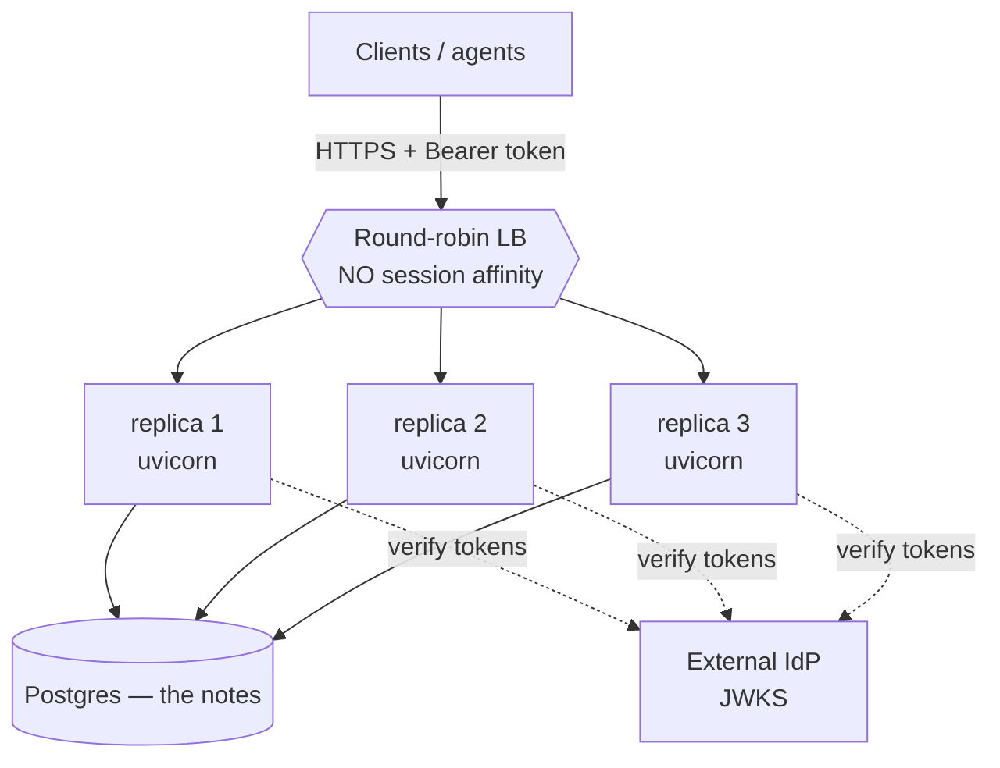

# 05-3 · Deployment shape & scaling

> **Level:** Intermediate→Advanced · **Prerequisites:** [05-2 · OAuth 2.1 & the resource server](02_oauth2_resource_server.md)
> **Time:** ~40 min · **Verified:** 2026-08-08 (MCP spec 2026-07-28 · MCP Python SDK · FastMCP · Python 3.12)

## Why this matters

You now have a stateless, authenticated MCP server. The good news is the deployment story is **boring** — and boring is exactly what you want. Because it's stateless (05-1) it deploys like any FastAPI service you've already shipped: an ASGI app, uvicorn workers, a health check, secrets from env, a Dockerfile, N replicas behind a load balancer. This lesson is the short checklist that turns "runs on my laptop" into "runs behind a round-robin LB with no surprises." Almost none of it is MCP-specific — that's the payoff of the stateless spec.

---

## The shape: stateless replicas behind a plain load balancer

This is the whole architecture, and it's the same picture as a stateless web API:



The rules that make it work:

- **No session affinity.** The load balancer is plain round-robin. Any replica serves any request because no replica holds session state (05-1). Don't enable sticky sessions — if you feel you need them, some state leaked into process memory; move it to Postgres.
- **Shared state lives in backing services only** — Postgres for the notes, the external IdP for identity. Replicas are interchangeable and disposable.
- **TLS terminates at the LB / ingress.** Bearer tokens must only travel over HTTPS; a token on plain HTTP is a token in someone's packet capture.

---

## CORS for browser-based hosts

Some MCP hosts run **in the browser** (a web app calling your server with `fetch`). Browsers enforce CORS, so those hosts can't reach your server unless you send the right headers. Native hosts (Claude Desktop, a server-side agent) don't care — this is only for browser callers.

```python
# app.py
import os
from starlette.middleware.cors import CORSMiddleware

app.add_middleware(
    CORSMiddleware,
    allow_origins=os.environ["CORS_ORIGINS"].split(","),  # explicit origins — NEVER "*" with auth
    allow_methods=["GET", "POST"],
    allow_headers=["Authorization", "Content-Type", "MCP-Protocol-Version"],
    # Let the browser READ these on the response:
    expose_headers=["WWW-Authenticate", "MCP-Protocol-Version"],
)
```

Two things that bite people:

- **Never `allow_origins=["*"]` on an authenticated server.** A wildcard origin plus credentials is both a spec contradiction and a security hole. List the exact host origins, from env.
- **Expose `WWW-Authenticate`.** That's the header carrying the 401 → Protected Resource Metadata pointer (05-2). If the browser can't read it, the client can't discover the IdP.

---

## Health checks (unauthenticated, cheap, outside the MCP path)

The load balancer needs a URL it can poll to decide if a replica is alive. Put it on the **parent ASGI app**, not behind the MCP auth layer — a health probe has no bearer token.

```python
@app.get("/healthz")           # liveness: is the process up? cheap, no auth, no DB.
async def healthz() -> dict[str, str]:
    return {"status": "ok"}

@app.get("/readyz")            # readiness: can it actually serve? check backing services.
async def readyz() -> dict[str, str]:
    await db.execute("SELECT 1")          # can we reach Postgres?
    # (optionally) confirm the IdP's JWKS is reachable/cached.
    return {"status": "ready"}
```

- **Liveness (`/healthz`)** answers "restart me if this fails" — keep it trivial so a slow DB doesn't cause a restart storm.
- **Readiness (`/readyz`)** answers "send me traffic only if this passes" — this is where you check Postgres and the IdP, so a replica that can't verify tokens gets pulled from rotation instead of 500-ing every call.

---

## Secrets from the environment

Everything trust-related — the issuer, the audience, the JWKS URL, the DB URL, CORS origins — is configuration, and configuration comes from **env vars**, never the image or the repo. Reuse the `pydantic-settings` pattern from the FastAPI courses:

```python
# config.py
from functools import lru_cache
from pydantic_settings import BaseSettings

class Settings(BaseSettings):
    oauth_issuer: str            # OAUTH_ISSUER — the trusted IdP
    oauth_audience: str          # OAUTH_AUDIENCE — this server's identifier
    oauth_jwks_url: str          # OAUTH_JWKS_URL
    database_url: str            # DATABASE_URL
    cors_origins: str            # comma-separated allowed origins

    class Config:
        env_file = ".env"        # local dev only — prod injects real env vars

@lru_cache
def get_settings() -> Settings:  # one instance per process
    return Settings()
```

The rule: **a secret in a Dockerfile or committed `.env` is a leaked secret.** Inject them at runtime (your orchestrator's secret store, CI secrets, the platform's env config). The image is public-shaped; the config is not.

---

## Dockerizing (you already know this)

The Dockerfile is the **same multi-stage `uv` image** you built in the FastAPI Docker section — nothing MCP-specific. The only line that differs from a REST API is the `CMD`, and even that's just uvicorn pointed at your ASGI app.

```dockerfile
# (Multi-stage uv build, non-root user, etc. — see the fastapi_complete Docker section.)
FROM python:3.12-slim
# ... uv sync --frozen, copy app, drop to a non-root user ...
EXPOSE 8080
# Stateless → run multiple workers per container AND multiple containers.
CMD ["uv", "run", "uvicorn", "app:app", "--host", "0.0.0.0", "--port", "8080", "--workers", "4"]
```

For the full multi-stage build, non-root user, layer caching, and Compose wiring, go back to **[fastapi_complete · 11 · Production Docker](../../fastapi_complete/11_production_docker_cicd/README.md)** — it all applies verbatim, because at the container level this *is* a FastAPI service.

---

## Horizontal scaling: the stateless payoff, cashed in

Because there's no session state, scaling is the easy kind:

- **Scale out, not just up.** Add replicas behind the round-robin LB; load spreads automatically since any replica serves any request. `--workers 4` uses a box's cores; more replicas use more boxes.
- **Rolling deploys are safe.** Drain and replace one replica at a time — no client "session" dies, because there are none. The old stateful SSE model couldn't do this without dropping live streams.
- **Autoscale on ordinary signals** — CPU or requests-per-second, exactly like a REST API. No session-count metric, no affinity to reason about.
- **Per-replica local state is fine** *if it's rebuildable* — e.g. each process's cached JWKS keys and its DB connection pool. That's not session state; it's a cache any replica can warm on its own. The line to hold: **nothing a client needs on its *next* request may live only in one replica's memory.**

That's the entire reason 05-1 spent so long on statelessness: it converts "scaling an MCP server" into "scaling a stateless web service," a solved problem you already have the skills for.

---

## Recap & next

- ✅ Deploy shape = **stateless replicas behind a round-robin LB, no affinity**; all shared state in Postgres + the external IdP; TLS at the edge.
- ✅ **CORS** only matters for browser hosts — list explicit origins (never `*` with auth) and **expose `WWW-Authenticate`** so clients can find the IdP.
- ✅ **Health checks** unauthenticated and outside the MCP path: trivial `/healthz` liveness, backing-service `/readyz` readiness.
- ✅ **Secrets from env** via `pydantic-settings`; never bake them into the image.
- ✅ **Dockerize** with the same multi-stage `uv` image as any FastAPI service; scale **out** with replicas + workers, roll deploys safely, autoscale on CPU/RPS.
- ✅ Self-check: your LB team asks whether they should turn on sticky sessions for your MCP server. What's your answer, and what would needing them reveal?

→ Next: **[06 · Security in depth](../06_security/README.md)**

## Exercises

1. A load-balancer engineer enables session affinity "to be safe" for your stateless MCP server. Is anything broken? Is anything wasted? Answer both.

<details>
<summary>Solution</summary>

Nothing is *broken* — a stateless server tolerates affinity, since every request is self-contained either way. But it's **wasted and harmful to scaling**: affinity concentrates a client's traffic on one replica, so load can't rebalance, that replica becomes a hot spot, and draining it for a deploy is now disruptive for no benefit. Turn affinity **off**; the whole point of stateless is that round-robin is correct. If a colleague insists it's *needed*, that's a signal some per-client state leaked into process memory — find it and move it to Postgres.
</details>

2. Your browser-based MCP host gets a CORS error and can't complete the OAuth discovery step, even though native clients work fine. Name the two header mistakes most likely responsible.

<details>
<summary>Solution</summary>

(1) **`WWW-Authenticate` not in `expose_headers`** — the browser receives the 401 but JS can't read the header carrying the Protected Resource Metadata pointer, so discovery stalls. (2) **`Authorization` not in `allow_headers`** (or origins wrong / set to `*` with credentials) — the browser's preflight fails, so the authenticated retry never leaves the browser. Fix both in the CORS middleware; native clients don't preflight, which is why only the browser host breaks.
</details>

3. Why can each replica safely keep its own in-memory JWKS cache, when in-memory *session* state was forbidden in 05-1? State the distinction precisely.

<details>
<summary>Solution</summary>

The JWKS cache is **derived, rebuildable, non-client-specific** state — any replica can fetch the same public keys from the IdP on its own, so a client whose next request lands on a different replica loses nothing. Session state was **client-specific and authoritative** — if only replica A knew it, a request routed to replica B would be wrong. The rule isn't "no in-memory state," it's "**nothing a client needs on its next request may live only in one replica's memory**." A shared, refetchable cache passes; a per-client session does not.
</details>
