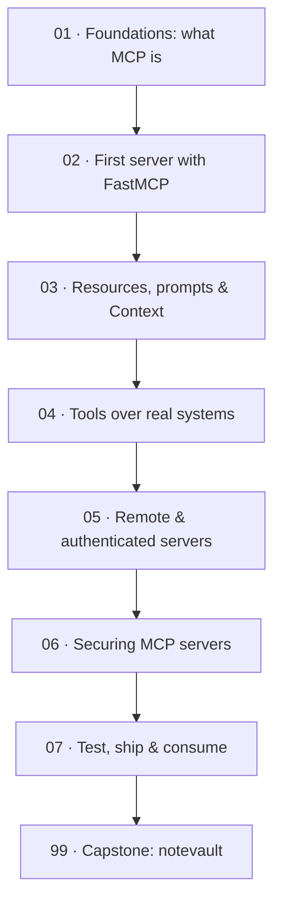

# 🔌 Build MCP Servers — expose your systems to any AI, in Python

> **What this is:** the course that teaches the skill most Python engineers *consume* but can't *build* — authoring **Model Context Protocol** servers. You'll build **notevault**, one MCP server grown from a 20-line stdio toy into an authenticated, stateless, load-balanced **streamable-HTTP** service with real database tools, OAuth 2.1, security hardening against prompt injection, a test suite, a container, and a live agent consuming it. By the end, any MCP-compatible host — Claude, an IDE, a LangGraph agent — can use the tools you wrote.

> **Written:** 2026-08-08 · Targets Python 3.12+ · **FastMCP** · MCP spec **2026-07-28** (stateless) · MCP Python SDK (OAuth 2.1 resource server) · aiosqlite/asyncpg · httpx · pytest · Docker · uv + ruff. **Current, not legacy**: the stateless streamable-HTTP transport, not the retired stateful SSE model; resource-server OAuth, not roll-your-own tokens.

## Why this course exists

The 2026 job market pays a premium for engineers who can bridge the gap between an AI demo and a production system. MCP is the standardized layer where that gap lives: it's how a model reaches your database, your API, your internal tools — portably, across any host, instead of via bespoke per-app glue (the "N×M" integration problem). Most tutorials teach you to *plug in* someone else's MCP server. This course teaches you to *build and ship your own*, safely — which is the scarce, hireable half of the skill.

It also assumes you can already build a backend. If you've done this repo's **[FastAPI — from first route to production](../fastapi_complete/)** course, you'll feel at home: FastMCP is FastAPI-shaped, the remote server is an ASGI app, and the deploy story reuses your Docker skills. If not, that course is the recommended prerequisite.

## Who this is for

A Python engineer comfortable with `async`/`await`, type hints, and HTTP APIs. **No prior MCP knowledge required** — Section 01 builds the mental model from zero. You do not need to know how to *train* or *serve* a model; MCP is about connecting the models that already exist to the systems you already run.

## What you'll be able to do

- Explain MCP precisely — resources vs tools vs prompts, who controls each, and why it beats per-app function calling.
- Build servers with **FastMCP**: turn typed Python functions into tools whose docstrings *are* the contract the model reads.
- Back tools with real async databases and APIs, with pagination, progress, and result-size discipline that respects the model's context window.
- Serve remotely over the **2026 stateless streamable-HTTP** transport, scaled behind a plain load balancer, protected as an **OAuth 2.1 resource server**.
- Defend against the MCP threat model: indirect **prompt injection** through tool outputs, supply-chain risk, SSRF, and destructive-tool abuse — with least privilege, sandboxing, and human-in-the-loop gates.
- Test servers in-memory, containerize them, and consume them from a real agent.

## The stack (and why)

| Concern | We use | Why |
|---------|--------|-----|
| Framework | **FastMCP** | the Pythonic way to build MCP servers; decorators + type hints → schema |
| Protocol | **MCP spec 2026-07-28** | stateless core: scales like any HTTP service, no session affinity |
| Transports | **stdio** + **streamable HTTP** | local desktop tools *and* shared remote services |
| Auth | **OAuth 2.1 resource server** (MCP SDK, RFC 9728) | verify tokens, never issue them; scope tools by permission |
| Data | **aiosqlite** (local) / **asyncpg** (prod) · **httpx** | real async backends without blocking the loop |
| Security | **OWASP LLM Top 10** · least privilege · HITL | the demo-to-production differentiator |
| Testing/ship | **pytest** · in-memory Client · **Docker** · uv | fast deterministic tests; one artifact to deploy |

## Learning path

## Course map

| # | Section | Lessons | You'll be able to… | Time |
|---|---------|---------|--------------------|------|
| 01 | [Foundations](01_foundations/) | 3 | Classify capabilities as resource/tool/prompt; explain the stateless spec | ~3 h |
| 02 | [First server with FastMCP](02_first_server_fastmcp/) | 3 | Build a stdio server; debug it in the Inspector; design tools a model can use | ~4 h |
| 03 | [Resources, prompts & Context](03_resources_and_prompts/) | 3 | Add URI resources, parameterized prompts, and server→host callbacks | ~4 h |
| 04 | [Tools over real systems](04_real_backends/) | 3 | Back tools with async DB/API; paginate; compose servers; expose a FastAPI app | ~5 h |
| 05 | [Remote & authenticated servers](05_remote_and_auth/) | 3 | Serve stateless HTTP; OAuth 2.1 resource server; scale behind a load balancer | ~5 h |
| 06 | [Securing MCP servers](06_security/) | 3 | Defend against injection, SSRF, and destructive-tool abuse in depth | ~5 h |
| 07 | [Test, ship & consume](07_test_ship_consume/) | 3 | In-memory tests; containerize; drive the server from a live agent | ~5 h |
| 99 | [Capstone: notevault](99_capstone_notevault.md) | spec | Ship a secured, authenticated, tested MCP server from a spec | ~20–30 h |

**Total:** ~31 h guided + the capstone. Every section gates the next with a build + a test task.

## Related guides in this repo

- **[FastAPI — from first route to production](../fastapi_complete/)** — the recommended prerequisite; the remote MCP server reuses its ASGI/Docker patterns.
- **[LangGraph](../langgraph/)** · **[Google ADK](../google_adk/)** — the natural *consumers* of the servers you build here (ADK covers using MCP tools; this course covers making them).
- **[LLM Evals & Observability](../llm_evals_observability/)** — evaluate the agents that call your tools.

→ Start here: **[00 · Introduction](00_introduction.md)**
