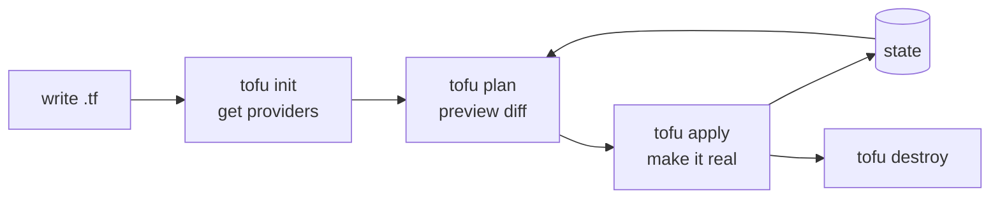

# 00 · Introduction

> **Level:** Beginner · **Time:** 15 min · **Verified:** 2026-07-16 (OpenTofu v1.12.4)

Clicking around a cloud console to create servers works — until you need to do it
again, identically, for staging and prod, and remember exactly what you clicked.
**Infrastructure as Code (IaC)** replaces the clicking with a file you commit to
git: describe what you want, and OpenTofu makes reality match.

---

## What you'll build

You'll provision the **`linkstash`** app from the [CI/CD course](../cicd_github_actions/)
— for real — from a few `.tf` files:

```bash
tofu apply
```

```
module.linkstash.docker_network.this: Creation complete
module.linkstash.docker_image.this: Creation complete
module.linkstash.docker_container.this: Creation complete
Apply complete! Resources: 3 added, 0 changed, 0 destroyed.

Outputs:
url = "http://127.0.0.1:8088"
```

```bash
curl http://127.0.0.1:8088/health
{"status":"ok","version":"1.2.0"}
```

> ☝️ Real output from running the capstone in this course's verified environment —
> a network, an image, and a running container, all declared in code and created
> by one command. `tofu destroy` removes them just as cleanly.

---

## Declarative, not imperative

The mental shift that makes IaC click:

| | Imperative (a script) | Declarative (OpenTofu) |
|---|---|---|
| You write | *steps*: "create X, then Y" | the *desired end state* |
| Run it twice | may fail or duplicate | no change (idempotent) |
| Drift | you re-check manually | `plan` shows the diff |

You don't tell OpenTofu *how* to create a container; you declare "a container like
this should exist," and it computes the steps — creating what's missing, changing
what differs, leaving alone what already matches. Running `apply` twice is safe:
the second time it reports **"No changes"** (verified).

---

## The workflow you'll live in



- **`init`** downloads the providers your config needs (once).
- **`plan`** shows exactly what will change — *read this every time*.
- **`apply`** makes it happen and records the result in **state**.
- **`destroy`** tears it down.

State is what lets OpenTofu know what already exists — it's the subject of
[01-4](01_foundations/04_state.md) and the thing you'll respect most.

---

## Terraform vs OpenTofu, briefly

OpenTofu forked from Terraform in 2023 after Terraform's license changed to the
non-open BUSL. OpenTofu is **MPL-2.0, open source, Linux-Foundation governed**, and
a drop-in replacement: same HCL, same commands (`tofu` where you'd type
`terraform`), same providers. Learn one, you know both. We use OpenTofu because
it's open.

---

## What you need

- **OpenTofu** ([install in 01-2](01_foundations/02_install_and_first_apply.md)) and
  **Docker** running locally.
- Comfort in a terminal. **No cloud account, no prior IaC.**
- The **[CI/CD course](../cicd_github_actions/)** app provides the image we
  provision (one `docker build`).

---

**Next → [01-1 · What is Infrastructure as Code?](01_foundations/01_what_is_iac.md)**
