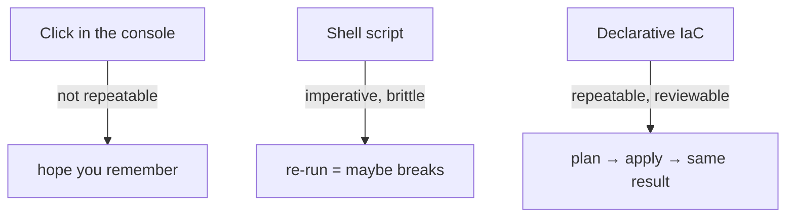

# 01-1 · What is Infrastructure as Code?

> **Level:** Beginner · **Prerequisites:** [00 Introduction](../00_introduction.md)
> **Time:** 20 min · **Verified:** 2026-07-16

Infrastructure as Code means **describing your infrastructure in text files you
version, review, and apply** — instead of clicking in a console or running
one-off scripts. It's the same discipline you already apply to application code,
now applied to servers, networks, and databases.

---

## Three ways to create a server



| Approach | Repeatable? | Reviewable? | Handles drift? |
|---|---|---|---|
| **ClickOps** (console) | ✗ | ✗ | ✗ |
| **Scripts** (bash + CLI) | ~ (if idempotent) | ✓ (it's code) | ✗ |
| **Declarative IaC** (OpenTofu) | ✓ | ✓ (it's code) | ✓ (`plan` shows the diff) |

---

## The benefits that matter

- **Repeatable & consistent** — staging and prod are built from the *same* code, so
  they don't drift apart. "Works in staging" means something.
- **Version-controlled** — infrastructure changes go through git: history, blame,
  pull-request review, rollback. Who added that firewall rule, and when? `git log`.
- **Self-documenting** — the `.tf` files *are* the documentation of what exists.
- **Reviewable diffs** — `plan` shows exactly what a change will do *before* it
  happens (you'll rely on this constantly).
- **Disaster recovery** — the whole environment can be recreated from code +
  data backups.

---

## Declarative: you describe the destination

The core idea again, because it's the one that trips people up: you don't script
*steps*, you declare the **desired state**. OpenTofu diffs desired-vs-actual and
does only what's needed.

```hcl
# "a container named linkstash should exist, from this image, on this port"
resource "docker_container" "app" {
  name  = "linkstash"
  image = docker_image.app.image_id
  ports {
    internal = 8000
    external = 8088
  }
}
```

Apply this when nothing exists → it's created. Apply again → **nothing happens**
(reality already matches). Change `external = 8090` and apply → OpenTofu replaces
just what's needed. That idempotency is the whole game.

---

## IaC vs config management

A quick boundary so terms don't blur:

- **Provisioning (OpenTofu/Terraform)** — creates the *infrastructure*: networks,
  VMs, containers, databases, DNS.
- **Configuration management (Ansible/Chef/Puppet)** — configures software *inside*
  existing machines: install packages, edit files, start services.

They compose: OpenTofu makes the box exist; Ansible sets it up. This course is
provisioning; with containers the "config" is baked into the image (the
[Docker course](../../docker/)), so OpenTofu alone gets us a running app.

---

## Recap & next

- ✅ IaC = infrastructure described in **version-controlled text**, applied
  reproducibly.
- ✅ **Declarative** = you state the desired end state; OpenTofu computes and makes
  only the needed changes (**idempotent**).
- ✅ It beats ClickOps/scripts on repeatability, review, and drift; it
  **provisions** infra (vs config management, which configures inside it).

**Self-check:** You `apply` a config, then run `apply` again without changing
anything. What happens, and what does that property tell you about IaC?

<details>
<summary>Answer</summary>

Nothing changes — OpenTofu reports **"No changes"** because reality already matches
the declared state. That's **idempotency**: applying the same declaration any
number of times converges to the same result, which is what makes IaC safe to run
repeatedly (in CI, on a schedule, after a failure).

</details>

**→ Next: [01-2 · Install & your first apply](02_install_and_first_apply.md)**
