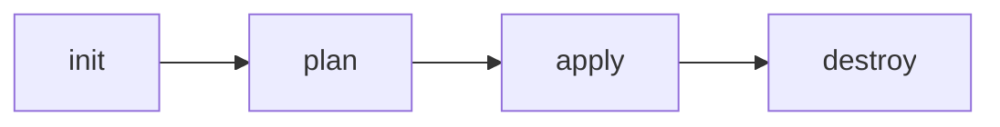

# 01-2 · Install & your first apply

> **Level:** Beginner · **Prerequisites:** [01-1 What is IaC?](01_what_is_iac.md)
> **Time:** 25 min · **Verified:** 2026-07-16 (OpenTofu v1.12.4, Docker 29.6.1)

Install OpenTofu, then run the full workflow — `init → plan → apply → destroy` —
against the real capstone so the commands stop being abstract.

---

## Install OpenTofu

The official way is the standalone installer:

```bash
curl -fsSL https://get.opentofu.org/install-opentofu.sh -o install.sh
chmod +x install.sh
./install.sh --install-method standalone
```

Or grab the binary straight from GitHub releases into your `~/.local/bin` (no root):

```bash
ver=1.12.4; arch=amd64
curl -fsSL -o tofu.zip \
  "https://github.com/opentofu/opentofu/releases/download/v${ver}/tofu_${ver}_linux_${arch}.zip"
unzip tofu.zip tofu -d ~/.local/bin
tofu version
```

Verified:

```
OpenTofu v1.12.4
on linux_amd64
```

> Everything is `tofu ...` where Terraform tutorials say `terraform ...`. If you
> prefer Terraform, the commands and files are identical.

---

## The four commands



| Command | Does | Run it |
|---|---|---|
| `tofu init` | Downloads providers, prepares the working dir | once per config (and when providers change) |
| `tofu plan` | Shows the diff between desired and actual | every time — **read it** |
| `tofu apply` | Makes reality match the config | to create/update |
| `tofu destroy` | Removes everything the config manages | to tear down |

---

## Run the capstone — verified output

Build the app image (from the CI/CD course), then walk the workflow:

```bash
docker build --load -t linkstash:local ../cicd_github_actions/99_project_cicd_pipeline
cd 99_project_tofu_linkstash
```

**init** — fetches the Docker provider:

```
$ tofu init
OpenTofu has been successfully initialized!
```

**plan** — previews without changing anything:

```
$ tofu plan
  # module.linkstash.docker_container.this will be created
  # module.linkstash.docker_image.this will be created
  # module.linkstash.docker_network.this will be created
Plan: 3 to add, 0 to change, 0 to destroy.
```

**apply** — creates them, and the app serves:

```
$ tofu apply
Apply complete! Resources: 3 added, 0 changed, 0 destroyed.
Outputs:
url = "http://127.0.0.1:8088"

$ curl http://127.0.0.1:8088/health
{"status":"ok","version":"1.2.0"}
```

**plan again** — proves idempotency:

```
$ tofu plan
No changes. Your infrastructure matches the configuration.
```

**destroy** — cleans up:

```
$ tofu destroy
Destroy complete! Resources: 3 destroyed.
```

That whole sequence ran in this course's verified environment. You just
provisioned and de-provisioned a running app with four commands.

---

## Read the plan, always

`apply` will ask you to confirm and shows the same diff `plan` does. **Read it.**
The number that matters is the summary line — `3 to add, 0 to change, 0 to
destroy`. An unexpected `destroy` there is your warning that a change is more
drastic than you thought.

---

## Recap & next

- ✅ Install `tofu` (standalone installer or a release binary); commands mirror
  Terraform.
- ✅ The workflow is **`init → plan → apply → destroy`**; verified against the
  capstone (3 added, serves, idempotent, 3 destroyed).
- ✅ **Always read the plan** — especially the `add/change/destroy` summary.

**Self-check:** You edit a `.tf` file and run `tofu apply`. It says
`Plan: 0 to add, 1 to change, 1 to destroy`. Should you type "yes"?

<details>
<summary>Answer</summary>

Not reflexively — **read what's being destroyed first**. A `1 to destroy` may be a
harmless in-place replacement, or it may be deleting a database. Expand the plan,
confirm the destroyed resource is one you're okay losing (or is being recreated
safely), *then* proceed.

</details>

**→ Next: [01-3 · The HCL language](03_hcl_language.md)**
