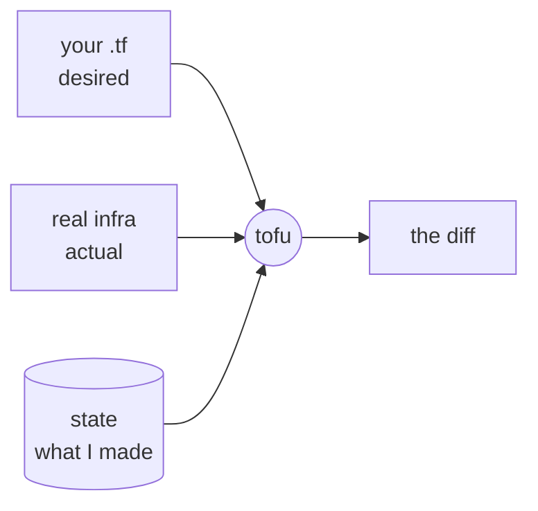

# 01-4 · State: the heart of OpenTofu

> **Level:** Beginner · **Prerequisites:** [01-3 The HCL language](03_hcl_language.md)
> **Time:** 25 min · **Verified:** 2026-07-16

State is the single most important — and most dangerous — concept in OpenTofu. Get
it right and everything works; mishandle it and you corrupt or lose track of real
infrastructure. Worth 25 focused minutes.

---

## What state is

When you `apply`, OpenTofu records **what it created** in a state file
(`terraform.tfstate`, JSON). State is the **map between your code and reality**:



To compute a `plan`, OpenTofu needs three things: what you **want** (config), what
**exists** (refreshed from the provider), and what it **previously made** (state).
Without state it couldn't tell "create a new container" from "update the one I
already made."

After the capstone apply, `tofu state list` showed exactly what it tracks:

```
$ tofu state list
module.linkstash.docker_container.this
module.linkstash.docker_image.this
module.linkstash.docker_network.this
```

---

## Why state is sensitive

- **It can contain secrets.** Resource attributes (passwords, keys) are stored in
  state **in plaintext**. Never commit `terraform.tfstate` to git — the capstone's
  [`.gitignore`](../99_project_tofu_linkstash/.gitignore) excludes it.
- **It's the source of truth for deletes.** `destroy` removes what's *in state*. If
  state is lost, OpenTofu forgets those resources exist — they keep running,
  orphaned, and a fresh apply may try to create duplicates.
- **It must not be edited by hand.** Hand-editing JSON state is how you corrupt it.
  Use `tofu state` subcommands (`mv`, `rm`, `import`) instead.

---

## Local vs remote state

By default state is a **local file**. That's fine solo, but breaks for teams:

| | Local state | Remote state (a backend) |
|---|---|---|
| Where | `./terraform.tfstate` | S3, GCS, Azure Blob, HTTP, TF Cloud |
| Team use | ✗ everyone has a different copy | ✓ one shared source of truth |
| Locking | ✗ two applies can collide | ✓ locks prevent concurrent applies |
| Secrets | plaintext on your disk | encrypted at rest (server-side) |

For anything beyond a solo experiment you use a **remote backend** with
**locking** — that's [04-1](../04_production/01_remote_state_and_locking.md).

---

## Drift: when reality diverges

If someone changes infrastructure outside OpenTofu (a hotfix in the console),
reality no longer matches state — **drift**. `plan` detects it by refreshing actual
state and showing the difference, so the fix is: run `plan`, see the drift, and
either `apply` to reassert the config or update the config to match intent.

---

## Recap & next

- ✅ **State** maps your code to real resources; OpenTofu needs it to diff and to
  know what to update/delete.
- ✅ It's **sensitive** — contains plaintext secrets, is the truth for `destroy`,
  and must **never be committed or hand-edited**.
- ✅ Teams use a **remote backend with locking**; `plan` detects **drift** when
  reality diverges from state.

**Self-check:** A teammate deletes `terraform.tfstate` because "it's just a
generated file." What's the consequence?

<details>
<summary>Answer</summary>

OpenTofu **forgets the resources it created** — they keep running but are no longer
tracked. `destroy` can't remove them (they're not in state), and the next `apply`
may try to **create duplicates**. State is not disposable; it's the record of what
you own. This is exactly why teams keep it in a remote backend, not on one laptop.

</details>

**→ Next: [02-1 · Providers & resources](../02_core_workflow/01_providers_and_resources.md)**
