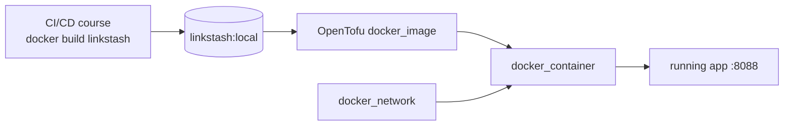

# 02-4 · Provisioning linkstash

> **Level:** Intermediate · **Prerequisites:** [02-3 Dependencies & lifecycle](03_dependencies_and_lifecycle.md)
> **Time:** 25 min · **Verified:** 2026-07-16 (applied end to end)

Everything so far, assembled: take the `linkstash` app from the CI/CD course and
stand up a running instance with OpenTofu — image, network, container — then prove
it serves.

---

## The whole config

Root [`main.tf`](../99_project_tofu_linkstash/main.tf) — it just calls the module
([03-1](../03_modularizing/01_modules.md) explains modules; for now read it as
"provision one web service"):

```hcl
module "linkstash" {
  source        = "./modules/webservice"
  name          = "linkstash-${var.environment}"
  image         = var.image           # linkstash:local
  internal_port = 8000
  external_port = var.external_port   # 8088
  env = {
    HOST = "0.0.0.0"   # bind all interfaces so the published port is reachable
    PORT = "8000"
  }
}
```

That `HOST = "0.0.0.0"` isn't incidental — see the box below.

---

## Apply and verify — real run

```bash
# build the image the config references (from the CI/CD course)
docker build --load -t linkstash:local ../cicd_github_actions/99_project_cicd_pipeline

tofu init && tofu apply
```

Verified:

```
Plan: 3 to add, 0 to change, 0 to destroy.
...
module.linkstash.docker_network.this:   Creation complete
module.linkstash.docker_image.this:     Creation complete
module.linkstash.docker_container.this: Creation complete
Apply complete! Resources: 3 added, 0 changed, 0 destroyed.

Outputs:
url = "http://127.0.0.1:8088"
```

```bash
$ curl http://127.0.0.1:8088/health
{"status":"ok","version":"1.2.0"}
```

The app the CI/CD pipeline builds is now **running, provisioned entirely from
code**. `tofu destroy` removes all three resources cleanly (verified: `Destroy
complete! Resources: 3 destroyed.`).

---

> ### A real bug this caught
> On the first attempt, `apply` failed with:
> `unable to pull image linkstash:local ... repository does not exist`.
> The image had been built with buildx but not **loaded** into the local image
> store, so the Docker provider tried to *pull* it. Fix: `docker build --load`.
> Lesson: `docker_image` with `keep_locally = true` still needs the image
> **present locally**, or it falls back to pulling.

---

## How the pieces connect back to the pipeline



The CI/CD course *produced* the image; OpenTofu *provisions a running instance* of
it. In a real setup the pipeline pushes the image to a registry and OpenTofu (or a
`tofu apply` step in the pipeline — [04-2](../04_production/02_cicd_integration.md))
provisions it to the cloud. Same shape, bigger provider.

---

## Recap & next

- ✅ One `module` call provisions `linkstash` as **network + image + container**;
  `apply` created all 3 and the app served `{"status":"ok","version":"1.2.0"}`.
- ✅ `env = { HOST = "0.0.0.0" }` matters — the same bind fix from the CI/CD course.
- ✅ `docker_image` needs the image **present locally** (`docker build --load`) or
  it tries to pull — a real error the run surfaced.

## Exercise

Change `external_port` to `8090` and run `tofu plan`. Does the container get
**updated in place** or **replaced**? Why?

<details>
<summary>Solution</summary>

The plan shows the container **replaced** (`-/+`): a published port mapping can't be
changed on a live container, so the provider must destroy and recreate it. (The
network and image are unchanged.) It's the change-vs-replace distinction from
[02-3](03_dependencies_and_lifecycle.md) — and a reason to read the plan before
applying to something stateful.

</details>

**→ Next: [03-1 · Modules](../03_modularizing/01_modules.md)**
