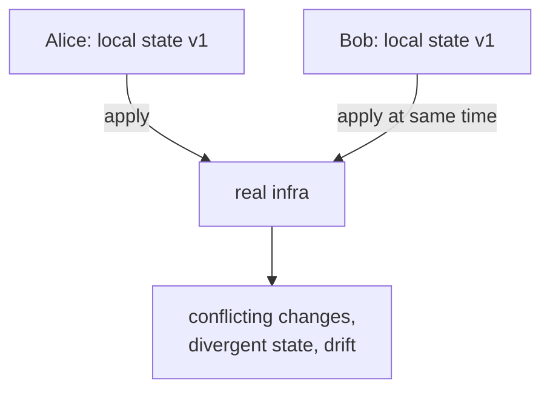

# 04-1 · Remote state & locking

> **Level:** Intermediate · **Prerequisites:** [01-4 State](../01_foundations/04_state.md)
> **Time:** 25 min · **Verified:** 2026-07-16

Local state ([01-4](../01_foundations/04_state.md)) is fine for one person
experimenting. The moment a second person — or a CI pipeline — runs `apply`, you
need **remote state** with **locking**, or you *will* corrupt it.

---

## The problem with local state on a team



Two people with two copies of `terraform.tfstate` will overwrite each other's
record of reality. State must live in **one shared place**, and only one apply may
touch it at a time.

---

## Remote backends

A **backend** stores state remotely. Configure it in the `terraform` block:

```hcl
terraform {
  backend "s3" {
    bucket       = "my-tofu-state"
    key          = "linkstash/production.tfstate"
    region       = "us-east-1"
    use_lockfile = true          # native S3 locking (no DynamoDB needed on modern versions)
  }
}
```

Common backends: **S3** (AWS), **GCS** (Google), **azurerm** (Azure), **http**
(GitLab's managed state), or **Terraform/Scalr/Spacelift** cloud. OpenTofu also
supports **state encryption** so secrets in state are encrypted at rest.

After adding a backend, `tofu init` migrates your local state up to it (it asks
first).

---

## Locking

A **lock** ensures only one `apply` runs at a time. When you apply, OpenTofu takes
the lock; a second apply waits (or fails fast) rather than racing:

```
$ tofu apply
Acquiring state lock. This may take a few moments...
```

If a run crashes and leaves a stale lock, `tofu force-unlock <LOCK_ID>` clears it —
carefully, only when you're sure no apply is actually running. Backends provide
locking differently (S3 lockfile, GCS native, DynamoDB on older setups), but the
guarantee is the same: **no concurrent applies**.

---

## Keys separate environments

Note the backend `key` includes the environment
(`linkstash/production.tfstate`). Staging uses a different key →
different state file → isolated ([03-2](../03_modularizing/02_workspaces_and_environments.md)).
One bucket, many keys, no collisions.

---

## Recap & next

- ✅ Teams and CI **must** use a **remote backend** (S3/GCS/azurerm/http) — one
  shared state, not per-laptop copies.
- ✅ **Locking** prevents concurrent applies from corrupting state; `force-unlock`
  clears a stale lock (carefully).
- ✅ Separate environments by **backend `key`** (or workspace); enable **state
  encryption** for secrets at rest.

**Self-check:** Your CI pipeline and a teammate both trigger `tofu apply` within
seconds. With a locking remote backend, what happens?

<details>
<summary>Answer</summary>

The first to acquire the **lock** proceeds; the second **waits** (or fails fast)
until the lock is released, then runs against the now-updated state. Without
locking they'd race and could corrupt state or make conflicting changes — which is
exactly why locking is non-negotiable once more than one actor can apply.

</details>

**→ Next: [04-2 · OpenTofu in CI/CD](02_cicd_integration.md)**
