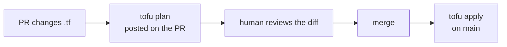
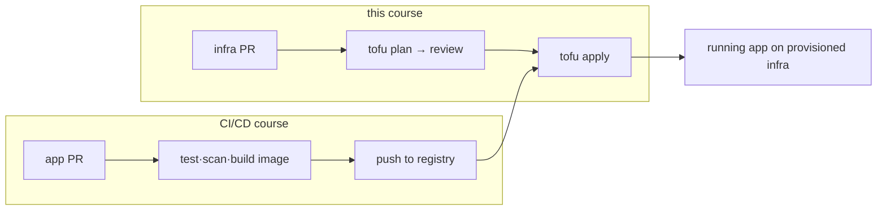

# 04-2 · OpenTofu in CI/CD

> **Level:** Intermediate · **Prerequisites:** [04-1 Remote state & locking](01_remote_state_and_locking.md), [CI/CD course](../../cicd_github_actions/)
> **Time:** 25 min · **Verified:** 2026-07-16 (workflow syntax)

This is where the two courses meet. Infrastructure changes should go through the
**same PR-review-then-merge flow** as app code: `tofu plan` on the PR (so reviewers
see the diff), `tofu apply` on merge. The GitHub Actions skills from the
[CI/CD course](../../cicd_github_actions/) apply directly.

---

## The pattern: plan on PR, apply on merge



The plan is the review artifact — a teammate approves the *actual changes to
infrastructure* before they happen, exactly like reviewing a code diff.

---

## The workflow

```yaml
name: infra
on:
  pull_request:
    paths: ["**.tf"]
  push:
    branches: [main]
    paths: ["**.tf"]

permissions:
  contents: read
  id-token: write        # OIDC → cloud creds, no stored keys (CI/CD course 04-1)

jobs:
  tofu:
    runs-on: ubuntu-latest
    defaults:
      run: { working-directory: 99_project_tofu_linkstash }
    steps:
      - uses: actions/checkout@v4
      - uses: opentofu/setup-opentofu@v1        # installs tofu
      # keyless auth to the cloud that holds state + resources
      - uses: aws-actions/configure-aws-credentials@v4
        with: { role-to-assume: arn:aws:iam::123:role/tofu, aws-region: us-east-1 }
      - run: tofu init
      - run: tofu fmt -check -recursive          # formatting gate
      - run: tofu validate
      # PR: show the plan. main: apply it.
      - if: github.event_name == 'pull_request'
        run: tofu plan -no-color
      - if: github.ref == 'refs/heads/main' && github.event_name == 'push'
        run: tofu apply -auto-approve
```

Everything you learned in the CI/CD course carries over: **least-privilege
`permissions`**, **OIDC instead of stored cloud keys**, **`paths` filters**, and
**branch protection** so the plan must be reviewed before merge.

---

## Guardrails specific to infra pipelines

Infra applies are higher-stakes than app deploys — they can delete databases. Add:

- **Save the reviewed plan, apply exactly that.** `tofu plan -out=tf.plan` on the
  PR, then `tofu apply tf.plan` on merge, so you apply the *reviewed* diff, not a
  freshly-recomputed one.
- **A manual approval** (GitHub **Environment** with a required reviewer — CI/CD
  course [04-1](../../cicd_github_actions/04_delivery_and_deployment/01_environments_secrets_oidc.md))
  before `apply` to production infra.
- **Locking** ([04-1](01_remote_state_and_locking.md)) so the pipeline and a human
  can't apply at once.
- **`fmt -check` + `validate`** as cheap gates, plus a security scan
  ([04-3](03_best_practices_and_gotchas.md)).

---

## The full loop, across courses



App pipeline builds the image; infra pipeline provisions where it runs. That's the
complete path from a commit to running software.

---

## Recap & next

- ✅ Treat infra changes like code: **`plan` on the PR** (the review artifact),
  **`apply` on merge**.
- ✅ Reuse CI/CD skills — **OIDC**, **least-privilege permissions**, **`paths`**,
  **branch protection**; use `opentofu/setup-opentofu`.
- ✅ Add infra-grade guardrails: **apply the saved reviewed plan**, **manual prod
  approval**, **state locking**.

**Self-check:** Why run `tofu plan -out=tf.plan` on the PR and `tofu apply tf.plan`
on merge, rather than a plain `tofu apply` on merge?

<details>
<summary>Answer</summary>

So you apply **exactly the diff a human reviewed**. A plain `apply` recomputes the
plan at merge time — if the world changed in between (drift, a new resource), it
could apply something *different* from what was approved. Applying the saved plan
file guarantees the reviewed change is the change that happens.

</details>

**→ Next: [04-3 · Best practices & gotchas](03_best_practices_and_gotchas.md)**
