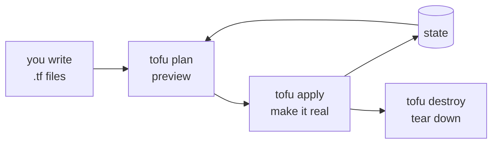
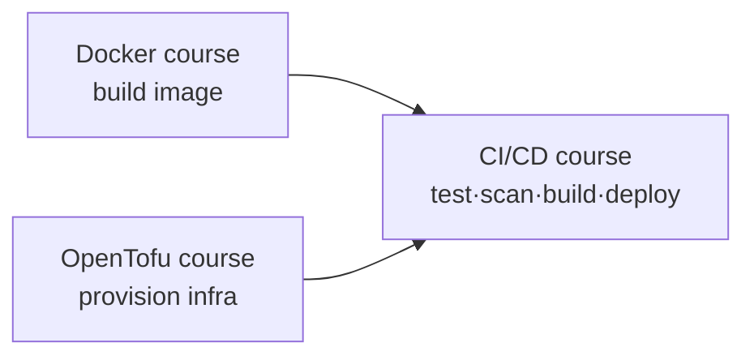

# Infrastructure as Code with OpenTofu

> **What you build:** real infrastructure, declared in code. You write OpenTofu
> (HCL), run `init → plan → apply`, and watch it **actually provision the
> `linkstash` app from the CI/CD course** — a Docker image, network, and container
> — then `destroy` it, all reproducibly. No cloud account needed; it runs against
> your local Docker daemon.

> **Verified:** 2026-07-16 with **OpenTofu v1.12.4** and **Docker 29.6.1**. The
> capstone was executed end to end in this environment: `tofu init` succeeds,
> `validate` passes, `plan` shows **3 to add**, `apply` creates them and the
> container serves `{"status":"ok","version":"1.2.0"}` on its published port, a
> second `plan` reports **"No changes"** (idempotent), and `destroy` removes all
> **3** resources. Every output shown is real.

---

## Why OpenTofu (and what about Terraform)?

**OpenTofu** is the open-source infrastructure-as-code tool that forked from
Terraform in 2023 when Terraform moved to the non-open BUSL license. It's a
drop-in, MPL-licensed, community/Linux-Foundation-governed alternative — same HCL
language, same workflow, same provider ecosystem. Everything you learn here
applies to Terraform too; we use OpenTofu because it's **open source and
`tofu`-for-`terraform` compatible**.



---

## Where this fits in the collection

The [CI/CD course](../cicd_github_actions/) builds and *deploys* the `linkstash`
app but leaves "where does it deploy *to*?" as a mock. **This course answers
that**: OpenTofu provisions the infrastructure the pipeline targets. Together:



We provision with the **Docker provider** so it's fully local and free — but the
concepts (providers, resources, state, modules, remote backends) are exactly what
you'd use for AWS/GCP/Azure. Swapping the Docker provider for `aws` is a change of
resources, not of workflow.

---

## Course map

| # | Module | Time |
|---|---|---|
| 00 | [Introduction](00_introduction.md) | 15 min |
| **01** | **Foundations** | |
| 01-1 | [What is Infrastructure as Code?](01_foundations/01_what_is_iac.md) | 20 min |
| 01-2 | [Install & your first apply](01_foundations/02_install_and_first_apply.md) | 25 min |
| 01-3 | [The HCL language](01_foundations/03_hcl_language.md) | 25 min |
| 01-4 | [State: the heart of OpenTofu](01_foundations/04_state.md) | 25 min |
| **02** | **The core workflow** | |
| 02-1 | [Providers & resources](02_core_workflow/01_providers_and_resources.md) | 25 min |
| 02-2 | [Variables & outputs](02_core_workflow/02_variables_and_outputs.md) | 20 min |
| 02-3 | [Dependencies & lifecycle](02_core_workflow/03_dependencies_and_lifecycle.md) | 20 min |
| 02-4 | [Provisioning linkstash](02_core_workflow/04_provisioning_linkstash.md) | 25 min |
| **03** | **Modularising** | |
| 03-1 | [Modules](03_modularizing/01_modules.md) | 25 min |
| 03-2 | [Workspaces & environments](03_modularizing/02_workspaces_and_environments.md) | 20 min |
| **04** | **Production** | |
| 04-1 | [Remote state & locking](04_production/01_remote_state_and_locking.md) | 25 min |
| 04-2 | [OpenTofu in CI/CD](04_production/02_cicd_integration.md) | 25 min |
| 04-3 | [Best practices & gotchas](04_production/03_best_practices_and_gotchas.md) | 20 min |
| **99** | [Capstone: provision linkstash](99_project_tofu_linkstash/README.md) | — |

**Total: ~5.5 hours** | Prerequisites: basic terminal + a little Docker (see the
[Docker course](../docker/)); the [CI/CD course](../cicd_github_actions/) provides
the app we provision.

---

## Quick start (local, no cloud account)

```bash
# 1. build the app image the config runs (from the CI/CD course)
docker build --load -t linkstash:local ../cicd_github_actions/99_project_cicd_pipeline

cd 99_project_tofu_linkstash
tofu init          # download the docker provider
tofu plan          # preview: 3 to add
tofu apply         # create the network, image, container
curl localhost:8088/health     # {"status":"ok","version":"1.2.0"}
tofu destroy       # tear it all down
```

Verified output of that sequence is shown throughout the course.

---

## Related guides

- [CI/CD with GitHub Actions](../cicd_github_actions/) — deploys the app this course provisions the home for
- [Docker](../docker/) — the container runtime OpenTofu drives here
- [Secure Code Audit](../secure_code_audit/) — scan your `.tf` too (tfsec/checkov — see 04-3)

→ Start here: **[00 · Introduction](00_introduction.md)**
