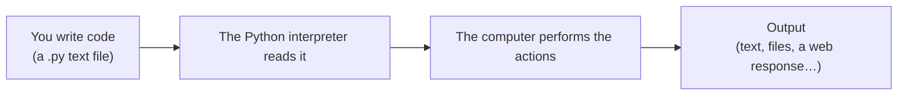

# 00 · Introduction to Python

> **Level:** Absolute beginner · **Prerequisites:** none
> **Time:** ~20 min · **Verified:** 2026-06-04 (Python 3.12.13)

## Welcome 👋

You're about to learn one of the world's most popular programming languages — from zero. No prior coding knowledge is assumed. We'll go one small step at a time, explain every new word the first time it appears, and back up everything with code you can run yourself.

Take your time. Programming is a skill, like playing an instrument: you get good by *doing*, not by reading. So keep a terminal open and type along.

## What is programming?

A **program** is a list of precise instructions that tells a computer what to do. A **programming language** is the vocabulary and grammar you use to write those instructions in a way both you and the computer can understand.

- **Analogy:** A recipe is a "program" for a cook. "Crack 2 eggs, whisk for 30 seconds, pour into the pan." The cook (the computer) follows each step exactly, in order. If a step is ambiguous or out of order, you get a mess. Computers are *extremely* literal cooks.

## What is Python?

**Python** is a programming language created by Guido van Rossum and first released in 1991. It's designed to be **readable** — Python code often looks close to plain English — which is exactly why it's the most recommended first language.

- **In simple terms:** Python lets you write instructions in a clean, English-like syntax, and a piece of software called the **Python interpreter** reads them and makes your computer do the work.
- **Interpreter:** the program that *runs* your Python code. You'll install it in the next section. When people say "run this in Python," they mean "feed this file to the interpreter."
- **Why learn it:**
  - **Beginner-friendly:** less punctuation and ceremony than most languages.
  - **Everywhere:** web back-ends, data science, AI/machine learning, automation, scripting, scientific computing, finance.
  - **In demand:** consistently among the top languages employers ask for.
  - **Batteries included:** a huge "standard library" of ready-made tools ships with it.



## What this course covers (and the shape of the journey)

We climb a ladder. Each rung needs the one below it:

1. **Fundamentals** — the raw vocabulary: values, variables, decisions, repetition.
2. **Data structures** — holding *collections* of values (lists, dictionaries…).
3. **Functions & modules** — packaging instructions so you can reuse and organise them.
4. **Object-oriented programming** — modelling real-world *things* as code objects.
5. **Exceptions & Errors ⭐** — what happens when things go wrong, and how to handle it gracefully. (Our special, in-depth topic.)
6. **Pythonic intermediate** — the elegant, efficient idioms that make code *good*, not just working.
7. **Concurrency** — doing several things at once with threads and processes.
8. **Async** — a modern, high-efficiency way to handle lots of waiting (network, disk).
9. **FastAPI** — using everything above to build a real web API.
10. **Capstone** — one project that ties it all together.

## A first taste

Here's a complete Python program. Don't worry about understanding every detail yet — just notice how *readable* it is.

```python
# greet.py — our very first program.
# Lines starting with '#' are COMMENTS: notes for humans, ignored by Python.

name = "world"           # store the text "world" in a labelled box called `name`
print(f"Hello, {name}!") # display a greeting, inserting the value of `name`
```

When run, this prints:

```text
Hello, world!
```

That's it — you read a value, built a message, and showed it. Everything else in this course is built from small, understandable steps like these.

## Key terms (your starter glossary)

- **Code / source code:** the text instructions you write.
- **Interpreter:** the program that runs your Python code.
- **Script:** a file of Python code (ends in `.py`) that you run from start to finish.
- **REPL:** *Read–Eval–Print Loop* — an interactive prompt where you type one line and immediately see the result. Great for experimenting.
- **Syntax:** the grammar rules of the language (where commas, colons, and indentation go).
- **Output:** whatever your program produces — usually text printed to the screen.
- **Comment:** text in your code (after `#`) that Python ignores; it's there to explain things to humans.
- **Bug:** a mistake in your code. **Debugging:** finding and fixing bugs.

## How each module is structured

Every module follows the same rhythm so you always know where you are:

- **Why this matters** — the real-world payoff.
- **Concepts** — one new idea at a time, with *what / why / how*.
- **Worked example** — a small, real program with its actual output.
- **Common mistakes** — the errors beginners really hit, and the fix.
- **Practice** — an exercise with a hidden solution. *Try it before opening the solution.*
- **Recap & next** — what you learned and where to go.

---

→ Next: **[Section 01 · Fundamentals](01_fundamentals/README.md)** — install Python and write your first program.
