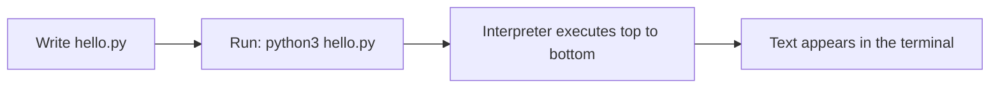

# 01 · Setup & Your First Program

> **Level:** Beginner · **Prerequisites:** [Introduction](../00_introduction.md)
> **Time:** ~1 hour · **Verified:** 2026-06-04 (Python 3.12.13)

## Why this matters

You can't learn to swim from the side of the pool. Before any concept, you need a working Python and the ability to run code. This module gets you there and ends with you running real programs two different ways.

## Concept: installing Python

- **What:** the Python **interpreter** is the program that runs your code. You install it once.
- **Why:** without it, a `.py` file is just text.

Pick your operating system:

**Windows**
1. Go to <https://www.python.org/downloads/> and download the latest **Python 3.12** (or newer) installer.
2. Run it. **Tick "Add python.exe to PATH"** at the bottom of the first screen — this is the most-missed step. (PATH is the list of places your terminal looks for programs; ticking it lets you type `python` anywhere.)
3. Click *Install Now*.

**macOS**
- The cleanest route is [Homebrew](https://brew.sh): `brew install python@3.12`.
- Or download the macOS installer from python.org.

**Linux (Debian/Ubuntu)**
- Often pre-installed. If not: `sudo apt update && sudo apt install python3 python3-venv python3-pip`.

### Verify the install

Open a **terminal** (Windows: *Command Prompt* or *PowerShell*; macOS/Linux: *Terminal*) and run:

```bash
python3 --version
```

On Windows you may need `python` instead of `python3`. You should see something like:

```text
Python 3.12.13
```

> ⚠️ **Common mistake:** "`python` is not recognised." On Windows this almost always means PATH wasn't ticked during install. Re-run the installer, choose *Modify*, and enable *Add to PATH*.

## Concept: the REPL (interactive mode)

- **What:** **REPL** = Read–Eval–Print Loop. Type one line, press Enter, see the result immediately.
- **Why:** it's the fastest way to experiment and check "what does this do?"

Start it by running `python3` (or `python`) with no file:

```text
$ python3
Python 3.12.13 (main) [GCC] on linux
Type "help", "copyright", "credits" or "license" for more information.
>>> 2 + 2
4
>>> "hello".upper()
'HELLO'
>>> exit()
```

`>>>` is the prompt — it means "type here". The line below your input is the result. `exit()` (or Ctrl-D on macOS/Linux, Ctrl-Z then Enter on Windows) quits.

## Concept: running a script

- **What:** a **script** is a `.py` file you run from start to finish.
- **Why:** real programs are saved files you can re-run, share, and edit — not lines retyped into the REPL.

Create a file named `hello.py` in a folder you'll remember (use any text editor; [VS Code](https://code.visualstudio.com/) is a great free choice):

```python
# hello.py — your first script.

print("Hello, world!")          # print() displays text on the screen
print("I am learning Python.")
```

`print(...)` is a **function** — a named action. We'll cover functions properly in Section 03; for now, "`print(x)` shows `x` on screen" is all you need.

Run it from the terminal **in the same folder as the file**:

```bash
python3 hello.py
```

Output:

```text
Hello, world!
I am learning Python.
```

🎉 You just ran a program.



## Worked example: a tiny calculator

Save as `add.py`:

```python
# add.py — show that print can display the result of a calculation.

print("2 + 2 =", 2 + 2)        # commas put a space between items
print("10 / 4 =", 10 / 4)
```

Run it:

```bash
python3 add.py
```

Output:

```text
2 + 2 = 4
10 / 4 = 2.5
```

Notice Python did the maths *before* printing, and that division gave a decimal (`2.5`). We'll dig into numbers next module.

## Common mistakes

**Mistake: running the file from the wrong folder**
```text
$ python3 hello.py
python3: can't open file '/home/you/hello.py': [Errno 2] No such file or directory
```
**Why:** the terminal is not in the folder where `hello.py` lives. Use `cd path/to/folder` to change directory first, or pass the full path. `cd` = *change directory*.

**Mistake: a missing closing quote or bracket**
```python
print("Hello)   # quote never closed
```
```text
  File "hello.py", line 1
    print("Hello)
          ^
SyntaxError: unterminated string literal (detected at line 1)
```
**Why:** Python reached the end of the line still "inside" the string. The fix is to close the quote: `print("Hello")`. A **SyntaxError** means the *grammar* is wrong, so Python won't even start running. We'll learn to read these messages deeply in [Section 05](../05_exceptions_and_errors/README.md).

## Practice

**Exercise:** Write a script `about_me.py` that prints three lines: your name, your favourite food, and the result of `365 * 24` (hours in a year) labelled clearly. Run it.

<details><summary>Solution</summary>

```python
# about_me.py
print("Name: Sam")
print("Favourite food: ramen")
print("Hours in a year:", 365 * 24)
```

Output:

```text
Name: Sam
Favourite food: ramen
Hours in a year: 8760
```

It works because `print` shows each line in order, and the `*` does multiplication before printing.
</details>

## Recap & next

- ✅ Installed Python and verified the version.
- ✅ Used the REPL for quick experiments.
- ✅ Wrote and ran a `.py` script; saw your first `SyntaxError`.
- Self-check: can you create a new `.py` file, print two lines, and run it from the terminal?

→ Next: **[02 · Variables & types](02_variables_and_types.md)**
