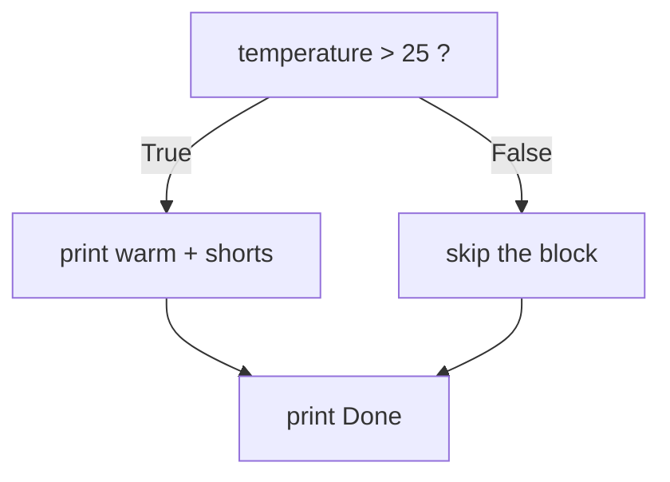

# 06 · Control Flow

> **Level:** Beginner · **Prerequisites:** [05 · Input & output](05_input_output.md)
> **Time:** ~1.5 hours · **Verified:** 2026-06-04 (Python 3.12.13)

## Why this matters

So far programs run straight through, top to bottom. Real programs make **decisions**: charge tax only in some regions, show "low stock" only when stock is low. **Control flow** lets your code branch — do this *or* that depending on conditions.

## Concept: `if`

- **What:** run a block of code *only if* a condition is `True`.
- **Why:** decisions are the essence of useful programs.

```python
temperature = 30
if temperature > 25:
    print("It's warm.")        # runs only when the condition is True
    print("Wear shorts.")
print("Done.")                 # NOT indented -> always runs
```

Output (`temperature = 30`):

```text
It's warm.
Wear shorts.
Done.
```

### Indentation is the syntax

This is Python's most distinctive rule, and it trips up everyone once: **the indented block is the body of the `if`.** There are no `{ }` braces. The colon `:` starts the block; the indentation (conventionally **4 spaces**) shows what's inside it.



## Concept: `else` and `elif`

- `else` runs when the `if` condition is `False`.
- `elif` ("else if") chains more conditions; the **first** true branch wins, and the rest are skipped.

```python
score = 72

if score >= 90:
    grade = "A"
elif score >= 60:
    grade = "B"
else:
    grade = "F"

print(grade)
```

Output (verified, `score = 72`):

```text
B
```

Order matters: Python checks top to bottom and stops at the first match. With `score = 95`, the `>= 90` branch wins before `>= 60` is ever tested.

## Concept: truthiness

Conditions don't have to be explicit comparisons. Python treats many values as "truthy" or "falsy":

```python
print(bool(0), bool(""), bool([]), bool("x"), bool([1]))
```

Output (verified):

```text
False False False True True
```

**Falsy values:** `False`, `None`, `0`, `0.0`, `""` (empty string), `[]` (empty list), `{}` (empty dict), and other empty collections. **Everything else is truthy.**

This enables clean checks:

```python
name = input("Name (optional): ").strip()
if name:                          # truthy only if they typed something
    print(f"Hi {name}")
else:
    print("Hi stranger")
```

> 💡 Prefer `if items:` over `if len(items) > 0:` and `if not name:` over `if name == "":`. It's idiomatic and reads naturally.

## Concept: nesting and combining conditions

You can put `if` inside `if`, but combining with `and`/`or` is usually clearer:

```python
age = 20
has_ticket = True

# combined (preferred)
if age >= 18 and has_ticket:
    print("Welcome in.")

# nested (sometimes clearer for distinct messages)
if age >= 18:
    if has_ticket:
        print("Welcome in.")
    else:
        print("You need a ticket.")
else:
    print("Too young.")
```

## Concept: the conditional expression (ternary)

A compact one-line choice when you're picking between two *values*:

```python
n = 7
label = "even" if n % 2 == 0 else "odd"
print(label)        # odd
```

Read it as: *"`label` is 'even' if the condition holds, else 'odd'."* Use it for simple value choices; for anything with multiple steps, a full `if` block is clearer.

## Concept: `match` (structural pattern matching, Python 3.10+)

For comparing one value against several shapes/patterns, `match` is cleaner than a long `if/elif` chain.

```python
def describe(x):
    match x:
        case 0:
            return "zero"
        case int() if x < 0:           # a "guard": pattern + extra condition
            return "negative int"
        case [a, b]:                   # matches a 2-item list, binding a and b
            return f"pair {a},{b}"
        case _:                        # the wildcard: "anything else"
            return "something else"

print(describe(0), describe(-5), describe([1, 2]), describe("hi"))
```

Output (verified):

```text
zero negative int pair 1,2 something else
```

- `case _:` is the catch-all (like `else`).
- `match` can destructure lists, tuples, and even objects — powerful for later sections. For simple equality, plain `if`/`elif` is still fine.

> 📌 **Version note:** `match`/`case` exists from **Python 3.10** onward. On 3.9 or older it's a `SyntaxError`.

## Worked example: a grading function

```python
# grade.py — turn a numeric score into a letter and a comment.

def grade_for(score):
    if not (0 <= score <= 100):              # guard against bad input
        return "invalid"
    if score >= 90:
        return "A — excellent"
    elif score >= 75:
        return "B — good"
    elif score >= 60:
        return "C — passing"
    else:
        return "F — see me"

for s in [95, 80, 61, 40, 150]:
    print(f"{s:>3} -> {grade_for(s)}")
```

Output (verified):

```text
 95 -> A — excellent
 80 -> B — good
 61 -> C — passing
 40 -> F — see me
150 -> invalid
```

(We sneak in a `for` loop to test several inputs — that's the next module.)

## Common mistakes

**Mistake: inconsistent indentation**
```python
if True:
    print("a")
      print("b")    # extra spaces
```
```text
IndentationError: unexpected indent
```
**Why:** every line in the same block must be indented the same amount. Pick 4 spaces and never mix spaces with tabs.

**Mistake: forgetting the colon**
```python
if x > 0
    print("positive")
```
```text
SyntaxError: expected ':'
```
**Why:** `if`, `elif`, `else`, `for`, `while`, `def` — all end their header line with `:`.

**Mistake: using `=` instead of `==` in a condition**
```python
if score = 90:        # assignment, not comparison
```
```text
SyntaxError: invalid syntax. Maybe you meant '==' or ':=' instead of '='?
```
**Why:** `==` compares. Helpfully, Python's error even suggests the fix.

## Practice

**Exercise:** Write a function `ticket_price(age)` that returns: `0` for under 5, `8` for 5–17, `12` for 18–64, and `6` for 65+. Print the price for ages 3, 10, 30, and 70.

<details><summary>Solution</summary>

```python
def ticket_price(age):
    if age < 5:
        return 0
    elif age <= 17:
        return 8
    elif age <= 64:
        return 12
    else:
        return 6

for a in [3, 10, 30, 70]:
    print(f"Age {a}: ${ticket_price(a)}")
```

Output:

```text
Age 3: $0
Age 10: $8
Age 30: $12
Age 70: $6
```

Because `elif` stops at the first true branch, by the time we reach `<= 17` we already know the age is `>= 5`, so the ranges don't overlap.
</details>

## Recap & next

- ✅ Branched with `if` / `elif` / `else`; understood the first-match rule.
- ✅ Learned that **indentation defines blocks** (and the `:` that starts them).
- ✅ Used **truthiness** for clean conditions.
- ✅ Met the conditional expression and `match` (3.10+).
- Self-check: in an `if/elif/elif/else`, how many branches run at most?

→ Next: **[07 · Loops](07_loops.md)**
