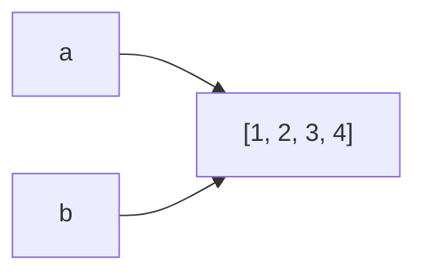

# 01 · Lists

> **Level:** Beginner · **Prerequisites:** [Section 01](../01_fundamentals/README.md)
> **Time:** ~1.5 hours · **Verified:** 2026-06-04 (Python 3.12.13)

## Why this matters

A **list** holds many values in order, and you can change it: add, remove, sort, reorder. It's the most-used collection in Python — a shopping cart, search results, lines from a file are all naturally lists.

## Concept: creating and reading lists

- **What:** an ordered, **mutable** (changeable) sequence of values, written in square brackets.
- **Why:** whenever you have "several of something" in a meaningful order.

```python
nums = [3, 1, 4, 1, 5]      # a list of ints
mixed = ["a", 1, True]      # lists CAN hold mixed types (but usually shouldn't)
empty = []                  # an empty list

print(len(nums))            # 5    how many items
print(nums[0])              # 3    indexing, 0-based (just like strings)
print(nums[-1])             # 5    last item
print(nums[1:3])            # [1, 4]  slicing returns a NEW list
```

Lists index and slice exactly like strings (Section 01.04) — same 0-based, stop-exclusive rules.

## Concept: changing a list (mutating)

Unlike strings, lists can be modified in place.

```python
nums = [3, 1, 4, 1, 5]
nums.append(9)        # add to the end          -> [3, 1, 4, 1, 5, 9]
nums.insert(0, 0)     # insert at index 0       -> [0, 3, 1, 4, 1, 5, 9]
nums.remove(1)        # remove FIRST value == 1 -> [0, 3, 4, 1, 5, 9]
print(nums)
```

Output (verified):

```text
[0, 3, 4, 1, 5, 9]
```

Common mutating methods:

| Method | Does |
|--------|------|
| `append(x)` | add `x` to the end |
| `insert(i, x)` | insert `x` at index `i` |
| `remove(x)` | remove the first item equal to `x` (errors if absent) |
| `pop()` / `pop(i)` | remove & **return** the last item (or item at `i`) |
| `sort()` | sort in place (ascending) |
| `reverse()` | reverse in place |
| `extend(other)` | append all items from another list |

```python
nums = [0, 3, 4, 1, 5, 9]
nums.sort()
print(nums)                       # [0, 1, 3, 4, 5, 9]
print(sum(nums), min(nums), max(nums))  # built-ins that work on lists
```

Output (verified):

```text
[0, 1, 3, 4, 5, 9]
22 0 9
```

> 🧠 **`sort()` vs `sorted()`:** `nums.sort()` changes `nums` and returns `None`. `sorted(nums)` leaves `nums` alone and returns a *new* sorted list. A classic bug is `nums = nums.sort()` — which sets `nums` to `None`!

## Concept: list as a stack

`append` + `pop` together give you a **stack** (last-in, first-out) — useful for undo histories, parsers, etc.

```python
stack = []
stack.append("a")
stack.append("b")
print(stack.pop(), stack)     # b ['a']   -> pop removes & returns the last
```

Output (verified):

```text
b ['a']
```

## Concept: the aliasing trap (very important)

A variable holds a *reference* to a list, not the list itself. Assigning with `=` copies the **reference**, not the data — both names point at the *same* list.

```python
a = [1, 2, 3]
b = a            # b and a refer to the SAME list
b.append(4)
print(a)         # [1, 2, 3, 4]  -> changing b changed a!
```

Output (verified):

```text
[1, 2, 3, 4]
```



To get an independent copy, use `.copy()` (or `list(a)`, or `a[:]`):

```python
a = [1, 2, 3]
c = a.copy()
c.append(5)
print(a, c)      # [1, 2, 3] [1, 2, 3, 5]  -> now independent
```

Output (verified):

```text
[1, 2, 3] [1, 2, 3, 5]
```

This reference behaviour underlies a *lot* of beginner confusion. Remember: **`=` shares; `.copy()` duplicates.**

## Worked example: top scores

```python
# scores.py — track and summarise a list of scores.

scores = [88, 72, 95, 60, 95, 81]

scores.sort(reverse=True)            # highest first
print("Ranked:", scores)
print("Highest:", scores[0])
print("Average:", sum(scores) / len(scores))
print("Top 3:", scores[:3])
```

Output (verified):

```text
Ranked: [95, 95, 88, 81, 72, 60]
Highest: 95
Average: 81.83333333333333
Top 3: [95, 95, 88]
```

## Common mistakes

**Mistake: `list.sort()` returns `None`**
```python
nums = [3, 1, 2]
nums = nums.sort()     # BUG: sort() returns None
print(nums)            # None
```
**Why:** `sort()` mutates in place and returns nothing. Either `nums.sort()` (no reassignment) or `nums = sorted(nums)`.

**Mistake: `IndexError` past the end**
```python
items = ["a", "b"]
print(items[2])
```
```text
IndexError: list index out of range
```
**Why:** valid indices are `0` and `1` for a 2-item list. Check `len(items)` or loop instead of guessing indices.

**Mistake: accidental aliasing** — see above; use `.copy()` when you need independence.

## Practice

**Exercise:** Given `temps = [18, 21, 19, 24, 22, 17]`, print the warmest, the coldest, the average (1 decimal), and a new list of only the temps above the average. Don't mutate the original order until the end.

<details><summary>Solution</summary>

```python
temps = [18, 21, 19, 24, 22, 17]
average = sum(temps) / len(temps)
above = [t for t in temps if t > average]   # a comprehension (Module 05)

print(f"Warmest: {max(temps)}")
print(f"Coldest: {min(temps)}")
print(f"Average: {average:.1f}")
print(f"Above average: {above}")
```

Output:

```text
Warmest: 24
Coldest: 17
Average: 20.2
Above average: [21, 24, 22]
```

`max`/`min`/`sum` work directly on the list; the comprehension keeps only items greater than the average.
</details>

## Recap & next

- ✅ Created, indexed, and sliced lists.
- ✅ Mutated with `append`, `insert`, `remove`, `pop`, `sort`.
- ✅ Used a list as a stack.
- ✅ Understood **aliasing** (`=` shares the same list) vs `.copy()`.
- ✅ Remembered `sort()` returns `None`.
- Self-check: how do you make a truly independent copy of a list?

→ Next: **[02 · Tuples](02_tuples.md)**
