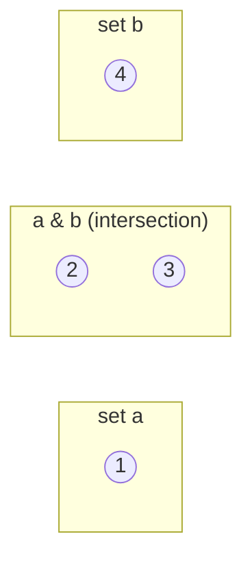

# 04 · Sets

> **Level:** Beginner · **Prerequisites:** [03 · Dictionaries](03_dicts.md)
> **Time:** ~45 min · **Verified:** 2026-06-04 (Python 3.12.13)

## Why this matters

A **set** is an unordered collection of **unique** items. Two everyday superpowers: instantly removing duplicates, and answering "is X in here?" very fast. Plus it does real mathematical set operations (union, intersection) that would be fiddly with lists.

## Concept: creating sets

- **What:** an unordered collection with no duplicates, written in braces.
- **Why:** uniqueness and fast membership tests.

```python
s = {1, 2, 2, 3}      # duplicates collapse automatically
print(s)              # {1, 2, 3}
print(2 in s)         # True   -> membership test (very fast)

empty = set()         # NOTE: {} is an empty DICT, not a set!
```

Output (verified):

```text
{1, 2, 3}
True
```

> ⚠️ `{}` makes an empty **dict**, not a set. For an empty set you must write `set()`.

Sets are unordered, so they have **no indexing**: `s[0]` raises `TypeError`. If you need order or positions, use a list.

## Concept: the killer use — removing duplicates

```python
nums = [1, 1, 2, 3, 3, 3, 4]
unique = set(nums)            # collapse to unique items
print(unique)                 # {1, 2, 3, 4}
print(list(unique))           # back to a list if you need one
```

Output (verified):

```text
{1, 2, 3, 4}
```

> 🧠 `set()` loses order. If you need *unique but in original order*, use `list(dict.fromkeys(nums))` — dicts preserve insertion order.

## Concept: adding and removing

```python
tags = {"python", "web"}
tags.add("api")           # add one item (no-op if already present)
tags.discard("web")       # remove if present (no error if absent)
print(tags)               # {'python', 'api'}  (order may vary)
print("python" in tags)   # True
```

- `add(x)` / `discard(x)` — discard is the safe remover (no `KeyError`).
- `remove(x)` also removes but raises `KeyError` if `x` isn't there.

## Concept: set maths

This is where sets really pay off. Given two sets:

```python
a = {1, 2, 3}
b = {2, 3, 4}

print(a | b)   # union: in a OR b        -> {1, 2, 3, 4}
print(a & b)   # intersection: in BOTH   -> {2, 3}
print(a - b)   # difference: in a NOT b  -> {1}
print(a ^ b)   # symmetric diff: in one but not both -> {1, 4}
```

Output (verified):

```text
{1, 2, 3, 4}
{2, 3}
{1}
{1, 4}
```



Real example — which tags are shared between two articles?

```python
article1 = {"python", "async", "web"}
article2 = {"python", "web", "testing"}
print("Shared:", article1 & article2)        # {'python', 'web'}
print("Unique to #1:", article1 - article2)  # {'async'}
```

## Worked example: finding common interests

```python
# interests.py — match two people by shared and combined interests.

alice = {"hiking", "python", "chess", "coffee"}
bob = {"python", "coffee", "running", "chess"}

shared = alice & bob
all_interests = alice | bob
only_alice = alice - bob

print(f"Shared ({len(shared)}): {sorted(shared)}")
print(f"Combined ({len(all_interests)}): {sorted(all_interests)}")
print(f"Only Alice: {sorted(only_alice)}")
```

Output (verified):

```text
Shared (3): ['chess', 'coffee', 'python']
Combined (5): ['chess', 'coffee', 'hiking', 'python', 'running']
Only Alice: ['hiking']
```

> Because sets are unordered, we wrap each result in `sorted(...)` before printing — that turns an unpredictable order into a stable, readable list.

## Common mistakes

**Mistake: `{}` is not an empty set**
```python
s = {}
print(type(s))    # <class 'dict'>
```
**Why:** braces with nothing inside default to a dict. Use `set()`.

**Mistake: expecting order or indexing**
```python
s = {"a", "b", "c"}
print(s[0])
```
```text
TypeError: 'set' object is not subscriptable
```
**Why:** sets are unordered and have no positions. Convert to a list first (`list(s)[0]`) if you truly need indexing — but ask whether a list was the right type all along.

## Practice

**Exercise:** Given two lists of email addresses, `signups` and `unsubscribed`, print how many people are *active* (signed up but not unsubscribed), and list them sorted.

```python
signups = ["a@x.io", "b@x.io", "c@x.io", "a@x.io"]
unsubscribed = ["b@x.io"]
```

<details><summary>Solution</summary>

```python
signups = ["a@x.io", "b@x.io", "c@x.io", "a@x.io"]
unsubscribed = ["b@x.io"]

active = set(signups) - set(unsubscribed)   # dedupe signups, then subtract
print(f"Active: {len(active)}")
print(sorted(active))
```

Output:

```text
Active: 2
['a@x.io', 'c@x.io']
```

`set(signups)` removes the duplicate `a@x.io`; subtracting the unsubscribed set leaves the active addresses.
</details>

## Recap & next

- ✅ Created sets for unique, unordered items.
- ✅ Removed duplicates with `set(...)`.
- ✅ Used `add`/`discard` and membership tests.
- ✅ Did set maths: `|` union, `&` intersection, `-` difference, `^` symmetric difference.
- Self-check: how do you get the items common to two lists?

→ Next: **[05 · Comprehensions](05_comprehensions.md)**
