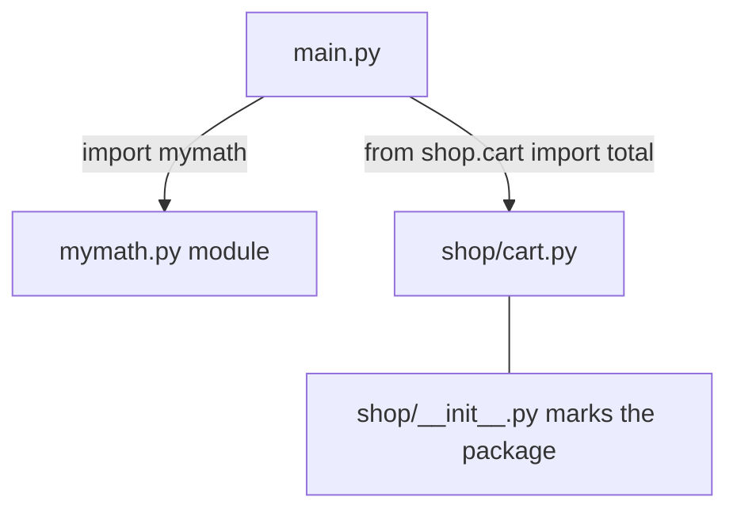

# 04 · Modules & Packages

> **Level:** Intermediate · **Prerequisites:** [01 · Functions](01_functions.md)
> **Time:** ~1 hour · **Verified:** 2026-06-04 (Python 3.12.13)

## Why this matters

One giant file becomes unmaintainable fast. **Modules** (single `.py` files) and **packages** (folders of modules) let you split a program into focused pieces and reuse them. Every real Python project — and every library you `import` — is organised this way.

## Concept: a module is just a `.py` file

- **What:** any `.py` file is a **module**. Its functions, classes, and variables become importable.
- **Why:** group related code; reuse it across files.

Create `mymath.py`:

```python
# mymath.py — a tiny math helper module.
"""A tiny math helper module."""     # module-level docstring

PI = 3.14159

def square(n):
    return n * n

def circle_area(r):
    return PI * square(r)
```

Now use it from another file in the same folder, `main.py`:

```python
# main.py
import mymath                              # import the whole module

print(mymath.square(5))                    # access with module.name
print(mymath.circle_area(2))
print(mymath.PI)
```

Run `python3 main.py`:

```text
25
12.56636
3.14159
```

`import mymath` runs the module once and gives you a namespace; you reach its contents with the dot: `mymath.square`.

## Concept: the forms of `import`

```python
import mymath                       # whole module: use mymath.square
from mymath import circle_area, PI  # specific names: use circle_area, PI directly
import mymath as mm                 # alias: use mm.square (common for long names)
from mymath import *                # everything — AVOID (pollutes your namespace)
```

| Form | Use it for |
|------|-----------|
| `import module` | clear, explicit — you always see where a name came from |
| `from module import name` | when you use a few names a lot |
| `import module as alias` | long names (`import numpy as np`) |
| `from module import *` | almost never — hides the origin of names and can clash |

> 🧭 **Guideline:** prefer `import module` or `from module import specific_name`. Avoid `import *`; it makes it impossible to tell where a name was defined.

## Concept: `if __name__ == "__main__"`

Every module has a built-in variable `__name__`. When you **run** a file directly, its `__name__` is `"__main__"`. When the file is **imported**, `__name__` is the module's name (`"mymath"`). This lets a file act as both a runnable script *and* an importable library:

```python
# mymath.py (continued)
if __name__ == "__main__":
    print("Self-test:", circle_area(2))    # runs ONLY when executed directly
```

```text
$ python3 mymath.py
Self-test: 12.56636

$ python3 -c "import mymath"
# (no output — the self-test block is skipped on import)
```

Output of running `main.py` (which imports `mymath`) shows `__name__` is `"__main__"` *in main.py* but not in the imported module:

```text
__main__
```

> 🧠 **Why this matters:** without the guard, your module's demo/test code would run every time someone *imports* it — usually not what you want. The `if __name__ == "__main__":` block is the standard "this is the entry point" marker.

## Concept: packages (folders of modules)

A **package** is a directory containing modules. The presence of an `__init__.py` file marks it as a package (it can be empty; it runs when the package is first imported).

```text
project/
├── main.py
├── mymath.py
└── shop/                  ← a package
    ├── __init__.py        ← marks `shop` as a package
    └── cart.py            ← a module inside the package
```

`shop/cart.py`:

```python
def total(prices):
    return sum(prices)
```

Import using **dotted paths**:

```python
# main.py
from shop.cart import total       # reach into the package
import shop.cart as cart          # or alias the submodule

print(total([1.0, 2.5, 3.0]))     # 6.5
print(cart.total([10, 20]))       # 30
```

Output (verified):

```text
6.5
30
```



## Concept: where Python looks for modules

When you `import x`, Python searches, in order: the current script's folder, then installed packages (the standard library and anything you've `pip install`-ed — next module). It does **not** search arbitrary folders, which is why imports work cleanly when files sit together or are properly installed.

> ⚠️ **Don't name your file the same as a library** (e.g. `random.py`, `json.py`, `email.py`). Python will import *your* file instead of the real library and produce baffling errors. This is a very common beginner trap.

## Worked example: a structured mini-project

The layout above, all together, run from `project/`:

```text
$ python3 main.py
25
12.56636
3.14159
6.5
30
```

Each piece is small and focused: `mymath` does geometry, `shop.cart` does totals, `main` wires them together. This separation is exactly how larger programs (and the FastAPI app in Section 09) are organised.

## Common mistakes

**Mistake: shadowing a standard-library module**
```python
# You create a file called random.py, then elsewhere:
import random
random.randint(1, 6)
```
```text
AttributeError: module 'random' has no attribute 'randint'
```
**Why:** your `random.py` was imported instead of the standard library's. Rename your file (e.g. `dice.py`).

**Mistake: `ModuleNotFoundError`**
```python
import shop.cart
```
```text
ModuleNotFoundError: No module named 'shop'
```
**Why:** you're running from a folder where `shop/` isn't visible, or `__init__.py` is missing, or you mistyped the path. Run from the project root and check the folder structure.

**Mistake: running demo code on import** — forgetting the `if __name__ == "__main__":` guard, so importing the module triggers its prints/tests.

## Practice

**Exercise:** Create a module `temperature.py` with `c_to_f(c)` and `f_to_c(f)` functions and a `__main__` self-test that prints `c_to_f(100)`. Then write `app.py` that imports both functions and prints the boiling and freezing points converted. Confirm the self-test does *not* run when imported.

<details><summary>Solution</summary>

`temperature.py`:
```python
"""Temperature conversion helpers."""

def c_to_f(c):
    return c * 9 / 5 + 32

def f_to_c(f):
    return (f - 32) * 5 / 9

if __name__ == "__main__":
    print("Self-test, 100C =", c_to_f(100), "F")
```

`app.py`:
```python
from temperature import c_to_f, f_to_c

print("Boiling:", c_to_f(100), "F")
print("Freezing:", f_to_c(32), "C")
```

Running `python3 app.py`:
```text
Boiling: 212.0 F
Freezing: 0.0 C
```

The self-test line is absent because `temperature` was *imported*, so its `__name__` was `"temperature"`, not `"__main__"`.
</details>

## Recap & next

- ✅ A module is a `.py` file; import it with `import`/`from ... import`.
- ✅ Chose the right import form; avoid `import *`.
- ✅ Used `if __name__ == "__main__":` so files work as both script and library.
- ✅ Built a package (folder + `__init__.py`) and imported with dotted paths.
- ✅ Learned not to shadow standard-library names.
- Self-check: what is `__name__` when a file is imported vs run directly?

→ Next: **[05 · Virtual environments & pip](05_virtualenv_and_pip.md)**
