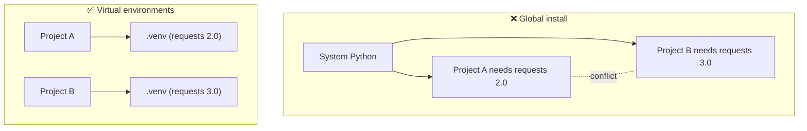

# 05 · Virtual Environments & pip

> **Level:** Intermediate · **Prerequisites:** [04 · Modules & packages](04_modules_and_packages.md)
> **Time:** ~1 hour · **Verified:** 2026-06-04 (Python 3.12.13)

## Why this matters

Python's real power is the **hundreds of thousands of free packages** on [PyPI](https://pypi.org) (the Python Package Index): web frameworks, data tools, API clients. You install them with **pip**. But installing everything globally leads to chaos — Project A needs version 1 of a library, Project B needs version 2, and they fight. A **virtual environment** gives each project its own isolated set of packages. This is non-negotiable professional practice, and you'll use it for the FastAPI section.

## Concept: the problem virtual environments solve



A **virtual environment** (venv) is a self-contained folder holding a copy of Python and its own `site-packages`. Activate it, and `python`/`pip` point at *that* environment, leaving your system untouched.

## Concept: creating and activating a venv

The `venv` module ships with Python. From your project folder:

```bash
# 1. Create a venv in a folder called .venv
python3 -m venv .venv

# 2. Activate it
#    macOS / Linux:
source .venv/bin/activate
#    Windows (PowerShell):
.venv\Scripts\Activate.ps1
#    Windows (Command Prompt):
.venv\Scripts\activate.bat
```

Once activated, your prompt usually shows `(.venv)`, and:

```bash
which python        # -> .../.venv/bin/python  (the venv's Python)
python --version    # the version you created it with
```

To leave the environment:

```bash
deactivate
```

> 🧠 **Convention:** name it `.venv` (a leading dot hides it) and **never commit it to git** — add `.venv/` to `.gitignore`. The venv is rebuildable; only your code and the list of dependencies belong in version control.

## Concept: installing packages with pip

**pip** is Python's package installer. With your venv active:

```bash
pip install requests              # install the latest version
pip install "fastapi==0.136.3"    # pin an exact version
pip install "httpx>=0.28,<0.29"   # a version range
pip install --upgrade requests    # upgrade to the newest
pip uninstall requests            # remove it
pip list                          # show everything installed
pip show fastapi                  # details about one package
```

Because the venv is active, these land inside `.venv` — not on your system.

> 💡 Prefer `python -m pip install ...` over bare `pip install ...`. It guarantees you're using *this* environment's pip, avoiding "I installed it but Python can't find it" confusion.

## Concept: recording dependencies (`requirements.txt`)

So others (and future-you) can recreate the exact environment, freeze your installed packages to a file:

```bash
pip freeze > requirements.txt
```

`requirements.txt` then lists pinned versions, e.g.:

```text
fastapi==0.136.3
httpx==0.28.1
pydantic==2.13.4
```

Anyone can recreate the environment with:

```bash
python3 -m venv .venv
source .venv/bin/activate
pip install -r requirements.txt     # install everything from the file
```

This is how a teammate goes from "fresh clone" to "running" in three commands.

## Concept: `pyproject.toml` (the modern project file)

For real projects, dependencies increasingly live in a **`pyproject.toml`** file instead of (or alongside) `requirements.txt`. A minimal one:

```toml
[project]
name = "my-app"
version = "0.1.0"
requires-python = ">=3.12"
dependencies = [
    "fastapi>=0.136",
    "uvicorn>=0.49",
]
```

Then `pip install -e .` ("editable install") installs your project *and* its dependencies. You'll see `pyproject.toml` in the FastAPI section and the capstone. (Tools like **uv** and **Poetry** build on this same file — but plain `venv` + `pip` is all you need to learn first.)

## A note on `uv` (modern, optional)

[`uv`](https://docs.astral.sh/uv/) is a fast, increasingly popular tool that replaces `venv` + `pip` with one command (`uv venv`, `uv pip install`, `uv add`). It's worth knowing about, but **everything in this course works with the built-in `venv` + `pip`**, so we stick to those — no extra installs required.

## Worked example: setting up a project (the real commands)

This is the exact workflow you'll repeat for every project, including the FastAPI app later:

```bash
mkdir weather-app && cd weather-app
python3 -m venv .venv
source .venv/bin/activate          # (Windows: .venv\Scripts\activate)
python -m pip install --upgrade pip
python -m pip install requests
python -m pip freeze > requirements.txt
echo ".venv/" > .gitignore
```

> ℹ️ **Verified note:** this course's own code was verified in a venv created exactly this way — `python3.12 -m venv env312` followed by `pip install fastapi uvicorn httpx pytest pytest-asyncio pydantic`. The version banner at the top of each module lists what landed in it.

After this, `pip list` shows your packages isolated in `.venv`, and `requirements.txt` records them for reproducibility.

## Common mistakes

**Mistake: forgetting to activate the venv**
```bash
pip install requests       # installs globally or fails — not in your project!
```
**Why:** without activation, `pip` is the system pip. Activate first (`source .venv/bin/activate`), or use the venv's pip explicitly. The `(.venv)` prefix in your prompt is your confirmation.

**Mistake: committing `.venv/` to git**
**Why:** it's large, machine-specific, and rebuildable. Add `.venv/` to `.gitignore`; commit `requirements.txt`/`pyproject.toml` instead.

**Mistake: `pip install` permission errors / `sudo pip`**
```text
error: externally-managed-environment
```
**Why:** modern systems block global installs to protect the OS Python. The fix is *exactly* a virtual environment — create and activate one, then install there. Never `sudo pip install`.

## Practice

**Exercise (do this for real):** Create a folder `practice-env`, make and activate a virtual environment in it, install the `rich` package (a library for colourful terminal output), confirm it's installed with `pip show rich`, freeze to `requirements.txt`, then `deactivate`. Inspect `requirements.txt`.

<details><summary>Solution</summary>

```bash
mkdir practice-env && cd practice-env
python3 -m venv .venv
source .venv/bin/activate            # Windows: .venv\Scripts\activate
python -m pip install rich
pip show rich                        # shows name, version, location (inside .venv)
pip freeze > requirements.txt
cat requirements.txt                 # rich==... plus its dependencies
deactivate
```

`pip show rich` reports a `Location:` path *inside* your `.venv`, proving the install is isolated. `requirements.txt` now lists `rich` and the packages it depends on, pinned to exact versions — recreatable anywhere with `pip install -r requirements.txt`.
</details>

## Recap & next

- ✅ Understood why per-project isolation matters.
- ✅ Created, activated, and deactivated a virtual environment with `venv`.
- ✅ Installed, upgraded, listed, and removed packages with `pip`.
- ✅ Recorded dependencies in `requirements.txt` (and met `pyproject.toml`).
- ✅ Learned the rules: don't commit `.venv/`, never `sudo pip`.
- Self-check: what three commands recreate a project's environment from a `requirements.txt`?

→ Next: **[06 · Standard library tour](06_standard_library_tour.md)**
