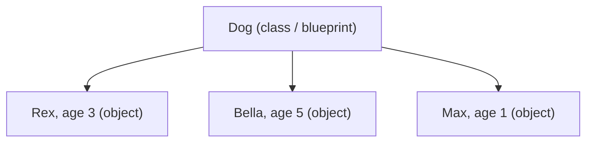

# 01 · Classes & Objects

> **Level:** Intermediate · **Prerequisites:** [Section 03](../03_functions_and_modules/README.md)
> **Time:** ~1.5 hours · **Verified:** 2026-06-04 (Python 3.12.13)

## Why this matters

A **class** lets you create your own data type that bundles related data *and* the functions that act on it. Instead of passing a loose dict of dog facts to standalone functions, you make a `Dog` that *knows its own name* and *can bark*. This bundling — called **encapsulation** — keeps related things together and is the foundation of all the OOP that follows.

## Concept: class vs object

- **Class:** the blueprint/template (e.g. "what a Dog is").
- **Object (instance):** a concrete thing built from the blueprint (e.g. "Rex, age 3").

One class, many objects — like one cookie cutter, many cookies.



## Concept: defining a class

```python
class Dog:
    species = "Canis familiaris"      # class attribute: shared by ALL dogs

    def __init__(self, name, age):    # the initialiser ("constructor")
        self.name = name              # instance attribute: unique per dog
        self.age = age

    def bark(self):                   # a method: a function bound to the object
        return f"{self.name} says woof!"
```

Three things to unpack:

1. **`class Dog:`** starts the blueprint. Class names use `CapWords` by convention.
2. **`__init__`** is a special method (a "dunder" — double underscore) Python calls automatically when you create an object. It sets up the initial state.
3. **`self`** is the object itself, passed automatically as the first parameter of every method. `self.name = name` stores the value *on this particular dog*.

## Concept: creating and using objects

```python
d = Dog("Rex", 3)        # calls __init__(self=d, name="Rex", age=3)

print(d.name)            # Rex     -> read an instance attribute
print(d.age)             # 3
print(d.species)         # Canis familiaris -> class attribute, seen by every dog
print(d.bark())          # Rex says woof!   -> call a method (self is automatic)
```

Output (verified):

```text
Rex
3
Canis familiaris
Rex says woof!
```

- You create an object by calling the class like a function: `Dog("Rex", 3)`.
- `d.bark()` — you do **not** pass `self`; Python passes `d` as `self` for you.
- Each object has its own attributes: `Dog("Bella", 5)` is a completely separate dog.

## Concept: `self`, explained

`self` is the single most confusing thing for OOP beginners, so let's be precise. When you write `d.bark()`, Python translates it to `Dog.bark(d)` — it passes the object as the first argument. Inside the method, that argument is called `self`, so `self` *is* the specific object the method was called on.

```python
rex = Dog("Rex", 3)
bella = Dog("Bella", 5)

print(rex.bark())     # "Rex says woof!"   -> self is rex
print(bella.bark())   # "Bella says woof!" -> self is bella
```

Same method, different `self`, different result. `self` is how an object refers to *its own* data.

## Concept: class vs instance attributes

- **Instance attributes** (set with `self.x = ...`) are unique to each object.
- **Class attributes** (defined directly in the class body) are shared by all instances.

```python
print(rex.species, bella.species)    # both: Canis familiaris (shared)
rex.age = 4                          # changes only rex
print(rex.age, bella.age)            # 4 5
```

Use class attributes for things that are genuinely the same for every instance (a constant, a default), and instance attributes for per-object data.

> ⚠️ **Pitfall:** never use a *mutable* class attribute (like a list) as shared state unless you mean to share it — every instance would see the same list (the same trap as mutable default arguments). Put per-object lists in `__init__` with `self.items = []`.

## Concept: inspecting objects

```python
print(isinstance(rex, Dog))     # True  -> is rex a Dog?
print(type(rex).__name__)       # Dog   -> the class name
```

Output (verified):

```text
True
Dog
```

`isinstance(obj, Class)` is the right way to check an object's type (it also respects inheritance, Module 03).

## Worked example: a bank account

```python
# account.py — an object that knows its own balance and how to change it.

class BankAccount:
    """A simple bank account with deposit and withdraw."""

    def __init__(self, owner, balance=0):
        self.owner = owner
        self.balance = balance        # starts at 0 unless given

    def deposit(self, amount):
        self.balance += amount
        return self.balance

    def withdraw(self, amount):
        if amount > self.balance:
            return f"Declined: {self.owner} has only {self.balance}"
        self.balance -= amount
        return self.balance

    def statement(self):
        return f"{self.owner}'s balance: ${self.balance}"

acc = BankAccount("Ada", 100)
acc.deposit(50)
print(acc.statement())          # 150
print(acc.withdraw(200))        # declined
print(acc.withdraw(120))        # ok -> 30
print(acc.statement())
```

Output (verified):

```text
Ada's balance: $150
Declined: Ada has only 150
30
Ada's balance: $30
```

The account *owns* its balance and is the only thing that changes it — outside code calls `deposit`/`withdraw` rather than poking `balance` directly. That discipline (encapsulation) is the next module.

## Common mistakes

**Mistake: forgetting `self` in a method definition**
```python
class Dog:
    def bark():            # missing self!
        return "woof"

Dog("x", 1).bark()
```
```text
TypeError: Dog.bark() takes 0 positional arguments but 1 was given
```
**Why:** Python always passes the object as the first argument. Every instance method needs `self` first: `def bark(self):`.

**Mistake: forgetting `self.` when accessing attributes**
```python
class Dog:
    def __init__(self, name):
        self.name = name
    def bark(self):
        return f"{name} woofs"     # NameError: `name` isn't a local variable
```
**Why:** attributes live on the object, so you must say `self.name`, not bare `name`.

**Mistake: calling a method without parentheses**
```python
print(rex.bark)     # <bound method Dog.bark ...>  -> the method object, not its result
```
**Why:** `rex.bark` *references* the method; `rex.bark()` *calls* it. Add the parentheses.

## Practice

**Exercise:** Write a `Rectangle` class with `width` and `height`, and methods `area()` and `perimeter()`. Create a 4×3 rectangle and print both. Add a `scale(factor)` method that multiplies both dimensions and returns the new area.

<details><summary>Solution</summary>

```python
class Rectangle:
    """A rectangle defined by width and height."""

    def __init__(self, width, height):
        self.width = width
        self.height = height

    def area(self):
        return self.width * self.height

    def perimeter(self):
        return 2 * (self.width + self.height)

    def scale(self, factor):
        self.width *= factor
        self.height *= factor
        return self.area()

r = Rectangle(4, 3)
print("Area:", r.area())            # 12
print("Perimeter:", r.perimeter())  # 14
print("Scaled area:", r.scale(2))   # 48  (now 8x6)
```

Output:

```text
Area: 12
Perimeter: 14
Scaled area: 48
```

Each method works on `self`'s own `width`/`height`; `scale` mutates them and returns the recomputed area.
</details>

## Recap & next

- ✅ A class is a blueprint; objects are instances built from it.
- ✅ `__init__` sets up initial state; `self` is the object itself.
- ✅ Distinguished instance attributes (per-object) from class attributes (shared).
- ✅ Called methods (Python passes `self` for you) and inspected types with `isinstance`.
- Self-check: when you write `acc.deposit(50)`, what becomes `self` inside `deposit`?

→ Next: **[02 · Encapsulation & properties](02_encapsulation_and_properties.md)**
