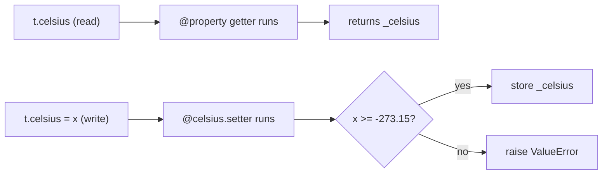

# 02 · Encapsulation & Properties

> **Level:** Intermediate · **Prerequisites:** [01 · Classes & objects](01_classes_and_objects.md)
> **Time:** ~1 hour · **Verified:** 2026-06-04 (Python 3.12.13)

## Why this matters

**Encapsulation** means an object controls access to its own data. Outside code shouldn't be able to set `account.balance = -1000` and corrupt your invariants. Python gives you conventions and tools — a naming convention for "internal" attributes, and **properties** that let an attribute run code (validate, compute) when read or written. Properties are how you add safety *without* changing how callers use your object.

## Concept: Python's privacy convention

Unlike some languages, Python has no truly "private" attributes — instead it relies on convention:

- `name` — **public**: part of the object's intended interface.
- `_name` — **"internal"** (one underscore): "please don't touch this from outside." Not enforced, but every Python developer understands the signal.
- `__name` — **name-mangled** (two underscores): Python rewrites it to `_ClassName__name` to avoid accidental clashes in subclasses. Use rarely.

```python
class Account:
    def __init__(self, balance):
        self._balance = balance      # the leading _ says "internal"

a = Account(100)
print(a._balance)     # 100 — Python won't STOP you, but you're "breaking the rules"
```

> 🧠 **"We're all consenting adults here"** is the Python philosophy: the language trusts you. The `_` prefix is a polite, universally-understood "keep out" sign, not a locked door.

## Concept: the problem properties solve

Suppose temperature must never go below absolute zero. With a plain attribute, anyone can break that:

```python
class Temperature:
    def __init__(self, celsius):
        self.celsius = celsius

t = Temperature(25)
t.celsius = -500     # nonsense — colder than physically possible, but allowed
```

You *could* add `get_celsius()`/`set_celsius()` methods — but then every caller must write `t.set_celsius(30)` instead of the natural `t.celsius = 30`, and any existing code breaks. **Properties** give you the validation of a method with the syntax of an attribute.

## Concept: `@property`

A **property** turns method calls into attribute access. Decorate a method with `@property` and it becomes a *read-only* computed attribute:

```python
class Temperature:
    def __init__(self, celsius=0):
        self._celsius = celsius          # the real stored value (internal)

    @property
    def celsius(self):                   # accessed as t.celsius (no parentheses!)
        return self._celsius

    @celsius.setter
    def celsius(self, value):            # runs on  t.celsius = value
        if value < -273.15:
            raise ValueError("below absolute zero")
        self._celsius = value

    @property
    def fahrenheit(self):                # a COMPUTED, read-only property
        return self._celsius * 9 / 5 + 32
```

Use it exactly like a normal attribute — the methods run behind the scenes:

```python
t = Temperature(25)
print(t.celsius)        # 25   -> getter runs
print(t.fahrenheit)     # 77.0 -> computed on the fly
t.celsius = 100         # setter runs (and validates)
print(t.fahrenheit)     # 212.0
```

Output (verified):

```text
25
77.0
212.0
```

And the validation actually protects the object:

```python
t.celsius = -500
```
```text
ValueError: below absolute zero
```



### Key points about properties

- `@property` defines the **getter** (reading `t.celsius`).
- `@celsius.setter` defines the **setter** (assigning `t.celsius = x`).
- **No parentheses** when using them: `t.celsius`, not `t.celsius()`.
- A property with only a getter is **read-only** — assigning to it raises `AttributeError`. (`fahrenheit` above has no setter, so `t.fahrenheit = 100` fails.)
- Callers' code is unchanged: `t.celsius = 30` looks identical whether `celsius` is a plain attribute or a property. You can add a property *later* without breaking anyone.

## Worked example: a validated product

```python
# product.py — guard the price so it can never be negative.

class Product:
    def __init__(self, name, price):
        self.name = name
        self.price = price            # goes THROUGH the setter (validates)

    @property
    def price(self):
        return self._price

    @price.setter
    def price(self, value):
        if value < 0:
            raise ValueError(f"price cannot be negative: {value}")
        self._price = round(value, 2)  # also normalise to 2 decimals

    @property
    def price_with_tax(self):
        return round(self._price * 1.2, 2)   # read-only, computed

p = Product("Mug", 9.999)
print(p.price)             # 10.0  -> rounded by the setter
print(p.price_with_tax)    # 12.0
p.price = 5
print(p.price, p.price_with_tax)
```

Output (verified):

```text
10.0
12.0
5 6.0
```

Note that even `__init__` assigning `self.price = price` runs through the setter — so an object can never be created in an invalid state. That's the power of encapsulation.

## Common mistakes

**Mistake: calling a property like a method**
```python
t = Temperature(25)
print(t.fahrenheit())     # TypeError: 'float' object is not callable
```
**Why:** a property is accessed *without* parentheses. `t.fahrenheit` already gives the value; adding `()` tries to call that value.

**Mistake: infinite recursion in a property**
```python
class Bad:
    @property
    def x(self):
        return self.x        # reads x -> calls the property -> reads x -> ...
```
```text
RecursionError: maximum recursion depth exceeded
```
**Why:** the getter for `x` reads `self.x`, which calls the getter again, forever. Store the real value under a *different* name, like `self._x`, and have the property return that.

**Mistake: assigning to a read-only property**
```python
t.fahrenheit = 100
```
```text
AttributeError: property 'fahrenheit' of 'Temperature' object has no setter
```
**Why:** `fahrenheit` has no `.setter`, so it's read-only. Set `celsius` instead (the source value).

## Practice

**Exercise:** Write a `Circle` class storing `_radius`. Expose `radius` as a property that rejects non-positive values, and a read-only `area` property (`π r²`, use `3.14159`). Create a circle, print its area, change the radius, print again, and show that a negative radius is rejected.

<details><summary>Solution</summary>

```python
class Circle:
    def __init__(self, radius):
        self.radius = radius          # validated via the setter

    @property
    def radius(self):
        return self._radius

    @radius.setter
    def radius(self, value):
        if value <= 0:
            raise ValueError("radius must be positive")
        self._radius = value

    @property
    def area(self):
        return round(3.14159 * self._radius ** 2, 2)

c = Circle(2)
print(c.area)         # 12.57
c.radius = 3
print(c.area)         # 28.27

try:
    c.radius = -1
except ValueError as e:
    print("rejected:", e)
```

Output:

```text
12.57
28.27
rejected: radius must be positive
```

`area` is computed from `_radius` each time it's read and has no setter, so it's safely read-only; the `radius` setter guarantees the radius is always positive.
</details>

## Recap & next

- ✅ Learned Python's privacy *convention* (`_internal`, `__mangled`).
- ✅ Used `@property` for read-only computed attributes (`fahrenheit`, `area`).
- ✅ Used `@x.setter` to validate on assignment — without changing caller syntax.
- ✅ Saw that even `__init__` can route through setters to prevent invalid objects.
- Self-check: why use a property instead of just letting callers set the attribute directly?

→ Next: **[03 · Inheritance](03_inheritance.md)**
