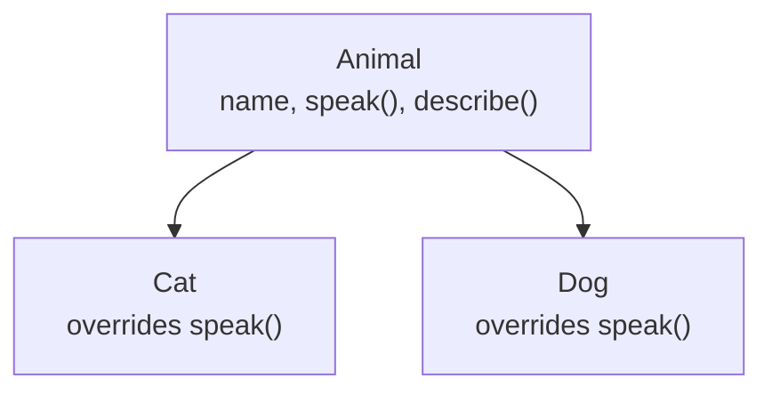

# 03 · Inheritance

> **Level:** Intermediate · **Prerequisites:** [01 · Classes & objects](01_classes_and_objects.md)
> **Time:** ~1 hour · **Verified:** 2026-06-04 (Python 3.12.13)

## Why this matters

**Inheritance** lets a class build on another: a `Manager` *is an* `Employee` plus a bit more. The child class gets all the parent's attributes and methods for free, and can add or change behaviour. It's how you avoid copy-pasting shared logic — and it powers the exception hierarchy you'll meet in Section 05 and the models in FastAPI.

## Concept: a subclass inherits

- **What:** define `class Child(Parent):` and `Child` automatically has everything `Parent` has.
- **Why:** share common code; specialise where needed.

```python
class Animal:
    def __init__(self, name):
        self.name = name
    def speak(self):
        return "..."
    def describe(self):
        return f"{self.name} says {self.speak()}"

class Cat(Animal):           # Cat IS-A Animal
    def speak(self):         # override: provide Cat's own version
        return "meow"

c = Cat("Tom")
print(c.name)               # Tom        -> inherited __init__ set this
print(c.speak())            # meow       -> Cat's override
print(c.describe())         # Tom says meow -> inherited method calls Cat's speak()
```

Output (verified):

```text
Tom
meow
Tom says meow
```

`Cat` never defines `__init__` or `describe`, yet both work — they're inherited from `Animal`. And `describe` (defined in the parent) calls `self.speak()`, which resolves to *Cat's* version. That dynamic dispatch is the heart of polymorphism (next module).



## Concept: overriding and extending with `super()`

To **override** a method, define it again in the child. To **extend** it (do what the parent does *plus* more), call `super()` — a reference to the parent.

```python
class Employee:
    def __init__(self, name, salary):
        self.name = name
        self.salary = salary
    def describe(self):
        return f"{self.name}: {self.salary}"

class Manager(Employee):
    def __init__(self, name, salary, reports):
        super().__init__(name, salary)     # run Employee's __init__ first
        self.reports = reports             # then add manager-specific data
    def describe(self):
        base = super().describe()          # reuse the parent's logic
        return base + f" (manages {self.reports})"

m = Manager("Ada", 100, 5)
print(m.describe())
```

Output (verified):

```text
Ada: 100 (manages 5)
```

- `super().__init__(...)` is essential in a child's `__init__` — it lets the parent set up its part of the object. Forgetting it means `self.name`/`self.salary` are never created.
- `super().describe()` calls the parent's version so you don't duplicate it; you just add to it.

> 🧠 **`super()` means "the next class up."** It keeps you from hard-coding the parent's name and makes multiple inheritance work correctly (more below).

## Concept: `isinstance` and the IS-A relationship

```python
m = Manager("Ada", 100, 5)
print(isinstance(m, Manager))    # True
print(isinstance(m, Employee))   # True  -> a Manager IS-A Employee
print(isinstance(m, str))        # False
```

A `Manager` is *both* a `Manager` and an `Employee`. This is why functions written to accept an `Employee` happily accept a `Manager` too — the basis of polymorphism.

## Concept: when NOT to use inheritance — composition

Inheritance models **"is-a"** (a Manager *is an* Employee). For **"has-a"** relationships, prefer **composition** — store another object as an attribute:

```python
class Engine:
    def start(self):
        return "vroom"

class Car:
    def __init__(self):
        self.engine = Engine()        # a Car HAS-A Engine (composition)
    def start(self):
        return self.engine.start()

print(Car().start())                  # vroom
```

A car *is not* an engine, so `class Car(Engine)` would be wrong. It *has* one. As a guideline: **"favour composition over inheritance"** — deep inheritance trees get rigid and confusing, while composition stays flexible. Reach for inheritance when there's a genuine is-a relationship and real shared behaviour.

## Concept: multiple inheritance & the MRO (brief)

A class can inherit from more than one parent. Python resolves which method to use via the **MRO** (Method Resolution Order), viewable with `.__mro__`:

```python
class A:
    def hi(self): return "A"
class B(A):
    def hi(self): return "B"
class C(A):
    def hi(self): return "C"
class D(B, C):           # inherits from both B and C
    pass

print(D().hi())                       # B  -> first match along the MRO
print([cls.__name__ for cls in D.__mro__])
```

Output (verified):

```text
B
['D', 'B', 'C', 'A', 'object']
```

Python searches `D → B → C → A → object` and uses the first `hi` it finds (B's). Multiple inheritance is powerful but easy to overuse — most code sticks to single inheritance plus composition. (Notice every class ultimately inherits from `object`, the root of all Python classes.)

## Worked example: a shape hierarchy

```python
# shapes.py — shared behaviour in a base class, specifics in children.

class Shape:
    def __init__(self, name):
        self.name = name
    def area(self):
        raise NotImplementedError("subclasses must implement area()")
    def summary(self):
        return f"{self.name} with area {self.area():.2f}"

class Rectangle(Shape):
    def __init__(self, width, height):
        super().__init__("Rectangle")
        self.width = width
        self.height = height
    def area(self):
        return self.width * self.height

class Circle(Shape):
    def __init__(self, radius):
        super().__init__("Circle")
        self.radius = radius
    def area(self):
        return 3.14159 * self.radius ** 2

for shape in [Rectangle(4, 3), Circle(2)]:
    print(shape.summary())            # inherited summary() calls each shape's area()
```

Output (verified):

```text
Rectangle with area 12.00
Circle with area 12.57
```

`summary()` is written *once* in `Shape` but works for every subclass, because `self.area()` dispatches to the right implementation. (We'll make "must implement `area`" enforced — not just a runtime error — with abstract base classes in Module 07.)

## Common mistakes

**Mistake: forgetting `super().__init__()`**
```python
class Manager(Employee):
    def __init__(self, name, salary, reports):
        self.reports = reports        # forgot super().__init__!

m = Manager("Ada", 100, 5)
print(m.name)
```
```text
AttributeError: 'Manager' object has no attribute 'name'
```
**Why:** the parent's `__init__` never ran, so `name`/`salary` were never set. Call `super().__init__(name, salary)` first.

**Mistake: deep, rigid inheritance trees**
```python
class A: ...
class B(A): ...
class C(B): ...
class D(C): ...     # 4 levels deep — hard to follow, fragile to change
```
**Why:** changes ripple unpredictably. Prefer shallow hierarchies + composition.

## Practice

**Exercise:** Create a base `Account` with `__init__(self, owner, balance)` and a `describe()` returning `"<owner>: $<balance>"`. Make a `SavingsAccount(Account)` that adds an `interest_rate` and an `add_interest()` method increasing the balance by the rate, and overrides `describe()` to also show the rate (reusing the parent's via `super()`).

<details><summary>Solution</summary>

```python
class Account:
    def __init__(self, owner, balance):
        self.owner = owner
        self.balance = balance
    def describe(self):
        return f"{self.owner}: ${self.balance}"

class SavingsAccount(Account):
    def __init__(self, owner, balance, interest_rate):
        super().__init__(owner, balance)        # set owner & balance
        self.interest_rate = interest_rate
    def add_interest(self):
        self.balance += self.balance * self.interest_rate
        return self.balance
    def describe(self):
        return super().describe() + f" ({self.interest_rate:.0%} APR)"

s = SavingsAccount("Ada", 1000, 0.05)
print(s.describe())     # Ada: $1000 (5% APR)
s.add_interest()
print(s.describe())     # Ada: $1050.0 (5% APR)
```

Output:

```text
Ada: $1000 (5% APR)
Ada: $1050.0 (5% APR)
```

`super().__init__` reuses the parent's setup; `super().describe()` reuses its string and `SavingsAccount` appends the rate.
</details>

## Recap & next

- ✅ A subclass inherits all the parent's attributes and methods.
- ✅ **Overrode** methods to specialise; **extended** them with `super()`.
- ✅ Always called `super().__init__()` in a child's initialiser.
- ✅ Distinguished is-a (inheritance) from has-a (composition) — and favoured composition.
- ✅ Peeked at multiple inheritance and the MRO.
- Self-check: what happens if a child's `__init__` forgets to call `super().__init__()`?

→ Next: **[04 · Polymorphism & duck typing](04_polymorphism_and_duck_typing.md)**
