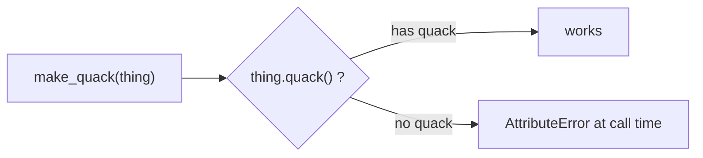

# 04 · Polymorphism & Duck Typing

> **Level:** Intermediate · **Prerequisites:** [03 · Inheritance](03_inheritance.md)
> **Time:** ~45 min · **Verified:** 2026-06-04 (Python 3.12.13)

## Why this matters

**Polymorphism** — "many forms" — means one piece of code works with many different types, as long as they support the operations it needs. It's what lets you write a `render(items)` function once and have it work for buttons, images, and text boxes. In Python, polymorphism is especially flexible because of **duck typing**: Python cares about what an object *can do*, not what class it *is*.

## Concept: polymorphism through a shared interface

If several classes provide a method with the same name, code that calls that method works on all of them — without knowing or caring which class it got.

```python
class Cat:
    def speak(self):
        return "meow"

class Cow:
    def speak(self):
        return "moo"

class Duck:
    def speak(self):
        return "quack"

def make_it_speak(animal):
    return animal.speak()              # works for ANYTHING with a speak() method

for a in [Cat(), Cow(), Duck()]:
    print(make_it_speak(a))
```

Output (verified):

```text
meow
moo
quack
```

`make_it_speak` has no idea what type it receives. It just calls `.speak()`. Each object responds in its own way — *one function, many forms*. Notice these three classes **don't share a base class** — they don't need to.

## Concept: duck typing

> *"If it walks like a duck and quacks like a duck, it's a duck."*

Python doesn't check an object's type before calling a method; it just tries the call. If the object has the method, it works. This is **duck typing** — the object's *behaviour* (its methods) matters, not its *class*.

```python
class RealDuck:
    def quack(self):
        return "Quack!"

class Person:
    def quack(self):
        return "I'm imitating a duck!"

def make_quack(thing):
    return thing.quack()               # no type check — just "can you quack?"

print(make_quack(RealDuck()))          # Quack!
print(make_quack(Person()))            # I'm imitating a duck!
```

Output (verified):

```text
Quack!
I'm imitating a duck!
```

A `Person` is not a duck, shares no ancestry with `RealDuck`, yet works perfectly because it *can quack*. This is why Python code is so flexible: you write to an informal "interface" (a set of expected methods), and anything fulfilling it slots in.



## Concept: built-in polymorphism you already use

You've relied on polymorphism since Section 01 without naming it:

```python
print(len("hello"))      # 5   -> string length
print(len([1, 2, 3]))    # 3   -> list length
print(len({"a": 1}))     # 1   -> dict length
```

Output (verified):

```text
5
3
1
```

`len()` works on strings, lists, dicts, sets, tuples — anything that defines `__len__` (a dunder method, next module). `+` similarly adds numbers, concatenates strings, and joins lists. Same operation, many types — that's polymorphism baked into the language.

## Concept: duck typing vs `isinstance` checks

Idiomatic Python prefers "try it and see" over "check the type first". This is the **EAFP** principle — *Easier to Ask Forgiveness than Permission* (you'll meet it fully in [Section 05](../05_exceptions_and_errors/08_best_practices.md)).

```python
# Pythonic (duck typing): just use it
def total_length(items):
    return sum(len(item) for item in items)   # works if each item has len()

print(total_length(["ab", [1, 2, 3], (1,)]))  # 2 + 3 + 1 = 6
```

Output (verified):

```text
6
```

This works for a mixed list of a string, a list, and a tuple — none of which share a class, all of which support `len()`. Rigidly checking `isinstance(item, list)` would have *rejected* the perfectly-usable string and tuple. Duck typing keeps your code open to anything that fits.

> 🧭 **When to still check types:** use `isinstance` when you must branch on type (e.g. handle a number differently from a string) or to give clearer error messages. But default to duck typing — it's more flexible and more Pythonic.

## Worked example: a flexible reporter

```python
# report.py — one function, many renderable types.

class TextBox:
    def __init__(self, text):
        self.text = text
    def render(self):
        return f"[Text: {self.text}]"

class Image:
    def __init__(self, path):
        self.path = path
    def render(self):
        return f"[Image: {self.path}]"

class Divider:
    def render(self):
        return "-" * 20

def render_page(components):
    """Render any objects that have a render() method."""
    return "\n".join(c.render() for c in components)

page = [TextBox("Welcome"), Divider(), Image("logo.png")]
print(render_page(page))
```

Output (verified):

```text
[Text: Welcome]
--------------------
[Image: logo.png]
```

`render_page` is written once and works for any current or *future* component, as long as it has a `render()` method. Add a `Button` class tomorrow with its own `render()` and it slots right in — no change to `render_page`. That extensibility is the practical payoff of polymorphism.

## Common mistakes

**Mistake: a missing method surfaces only at call time**
```python
class Widget:
    pass                       # forgot to add render()

render_page([Widget()])
```
```text
AttributeError: 'Widget' object has no attribute 'render'
```
**Why:** duck typing doesn't check ahead of time, so a missing method fails when the method is *called*. This is the trade-off for flexibility. (Abstract base classes — Module 07 — let you enforce the "must have render()" contract earlier and more clearly.)

**Mistake: over-checking types and rejecting valid input**
```python
def process(items):
    if not isinstance(items, list):    # rejects tuples, generators, etc.
        raise TypeError("need a list")
    ...
```
**Why:** you've locked out perfectly iterable inputs. Unless you truly need a list specifically, just iterate — let duck typing accept anything iterable.

## Practice

**Exercise:** Define three classes — `Dog`, `Robot`, and `Phone` — each with a `make_sound()` method returning a different string. Write a `chorus(things)` function that returns all their sounds joined by `" | "`. Demonstrate it works across the unrelated classes.

<details><summary>Solution</summary>

```python
class Dog:
    def make_sound(self):
        return "woof"

class Robot:
    def make_sound(self):
        return "beep boop"

class Phone:
    def make_sound(self):
        return "ring ring"

def chorus(things):
    """Join the sounds of any objects that can make_sound()."""
    return " | ".join(t.make_sound() for t in things)

print(chorus([Dog(), Robot(), Phone()]))
```

Output:

```text
woof | beep boop | ring ring
```

`chorus` doesn't care that a `Dog`, `Robot`, and `Phone` are completely unrelated — each one *can* `make_sound()`, so each one works. That's duck typing enabling polymorphism.
</details>

## Recap & next

- ✅ **Polymorphism:** one piece of code works across many types via a shared method.
- ✅ **Duck typing:** Python checks behaviour (does it have the method?), not class.
- ✅ Saw built-in polymorphism (`len`, `+`) and the EAFP mindset.
- ✅ Wrote extensible code that accepts any object fulfilling an informal interface.
- Self-check: why can `make_it_speak` work on a `Cat` and a `Duck` that share no base class?

→ Next: **[05 · Dunder methods](05_dunder_methods.md)**
