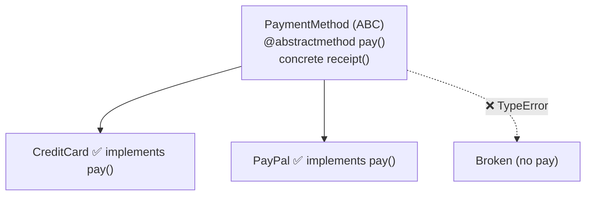

# 07 · Abstract Base Classes

> **Level:** Intermediate · **Prerequisites:** [03 · Inheritance](03_inheritance.md), [04 · Polymorphism](04_polymorphism_and_duck_typing.md)
> **Time:** ~1 hour · **Verified:** 2026-06-04 (Python 3.12.13)

## Why this matters

In Module 04 you saw duck typing's downside: a missing method only fails when it's *called*, sometimes deep in production. An **abstract base class (ABC)** lets you define a *contract* — "any subclass MUST implement these methods" — and Python enforces it at object-creation time, not later. ABCs make your interfaces explicit and catch incomplete implementations early. They're the formal version of the informal "must have a `render()` method" interfaces you've been relying on.

## Concept: defining an abstract base class

- **What:** a class that can't be instantiated directly and declares methods subclasses *must* provide.
- **Why:** enforce a consistent interface across a family of classes.

Use the `abc` module: inherit from `ABC` and mark required methods with `@abstractmethod`.

```python
from abc import ABC, abstractmethod

class PaymentMethod(ABC):
    @abstractmethod
    def pay(self, amount):
        """Subclasses MUST implement how a payment is made."""
        ...                       # `...` (Ellipsis) is a common "empty body" placeholder

    def receipt(self, amount):    # a CONCRETE method — shared by all subclasses
        return f"Paid {amount} via {type(self).__name__}"
```

- `PaymentMethod(ABC)` makes it abstract.
- `@abstractmethod` marks `pay` as required.
- `receipt` is a normal (concrete) method — ABCs can mix required-and-abstract with ready-made shared behaviour.

## Concept: the contract is enforced

Try to create the abstract class directly, and Python refuses:

```python
PaymentMethod()
```
```text
TypeError: Can't instantiate abstract class PaymentMethod without an implementation for abstract method 'pay'
```

And a subclass that *forgets* to implement `pay` is equally rejected — at instantiation, before any method is called:

```python
class Broken(PaymentMethod):
    pass            # forgot pay()!

Broken()
```
```text
TypeError: Can't instantiate abstract class Broken without an implementation for abstract method 'pay'
```

This is the key win over plain duck typing: the error happens **the moment you try to build the object**, with a clear message — not hidden until someone calls `.pay()` months later.

## Concept: a complete subclass works

Implement all abstract methods and the class becomes usable:

```python
class CreditCard(PaymentMethod):
    def pay(self, amount):
        return f"Charging card ${amount}"

cc = CreditCard()
print(cc.pay(50))                 # Charging card $50  -> our implementation
print(cc.receipt(50))             # Paid 50 via CreditCard -> inherited concrete method
print(isinstance(cc, PaymentMethod))   # True
```

Output (verified):

```text
Charging card $50
Paid 50 via CreditCard
True
```



## Concept: why ABCs over duck typing?

Both achieve polymorphism. The difference is *when* and *how clearly* problems surface:

| | Duck typing | Abstract base class |
|--|-------------|---------------------|
| Enforcement | none — fails when method is called | at instantiation |
| Error clarity | `AttributeError` somewhere downstream | clear "must implement X" |
| Self-documenting | interface is implicit | interface is explicit in code |
| Flexibility | accepts anything that fits | requires inheriting the ABC |

Use ABCs when you're designing a *family* of interchangeable classes and want to guarantee they all honour the same contract (payment methods, storage backends, file exporters). Use plain duck typing for lightweight, one-off flexibility.

## Concept: `Protocol` — structural typing (a modern alternative)

ABCs require subclasses to *explicitly inherit* from them. `typing.Protocol` (Python 3.8+) offers "structural" typing — a class matches the interface just by *having the right methods*, no inheritance needed. It's duck typing that type-checkers (and optionally `isinstance`) understand:

```python
from typing import Protocol, runtime_checkable

@runtime_checkable
class Renderable(Protocol):
    def render(self) -> str: ...

class Box:                       # does NOT inherit Renderable...
    def render(self):
        return "box"

print(isinstance(Box(), Renderable))   # True — it has render(), so it matches
```

Output (verified):

```text
True
```

- **ABC:** "you must *be* a PaymentMethod (inherit it)."
- **Protocol:** "you must *look like* a Renderable (have its methods)."

Protocols are increasingly popular for typing because they keep duck typing's flexibility while giving tools something to check. You'll see this distinction more in [Section 06's advanced typing](../06_pythonic_intermediate/05_advanced_typing.md).

## Worked example: a pluggable exporter interface

```python
# exporters.py — enforce that every exporter can export().

from abc import ABC, abstractmethod

class Exporter(ABC):
    @abstractmethod
    def export(self, data: dict) -> str:
        """Turn a dict into a string in this format."""

    def save(self, data: dict, path: str) -> str:    # shared concrete helper
        content = self.export(data)
        return f"[would write {len(content)} chars to {path}]"

class JsonExporter(Exporter):
    def export(self, data):
        import json
        return json.dumps(data)

class CsvExporter(Exporter):
    def export(self, data):
        keys = ",".join(data.keys())
        vals = ",".join(str(v) for v in data.values())
        return f"{keys}\n{vals}"

data = {"name": "Ada", "age": 31}
for exporter in [JsonExporter(), CsvExporter()]:
    print(type(exporter).__name__, "->", exporter.export(data))
    print("  ", exporter.save(data, "out.txt"))
```

Output (verified):

```text
JsonExporter -> {"name": "Ada", "age": 31}
   [would write 26 chars to out.txt]
CsvExporter -> name,age
Ada,31
   [would write 15 chars to out.txt]
```

Every exporter is *guaranteed* to have `export` (the ABC enforces it), so `save` can rely on it. Adding an `XmlExporter` tomorrow means implementing one method — and Python won't let you ship it half-done.

## Common mistakes

**Mistake: thinking `@abstractmethod` alone makes a class abstract**
```python
class Base:                       # forgot to inherit ABC!
    @abstractmethod
    def f(self): ...

Base()                            # works — no enforcement!
```
**Why:** the metaclass machinery only kicks in if the class inherits from `ABC` (or uses `metaclass=ABCMeta`). Always `class Base(ABC):`.

**Mistake: forgetting to implement every abstract method**
A subclass must implement *all* abstract methods to be instantiable. Implement them all, or the subclass itself stays abstract.

## Practice

**Exercise:** Define an ABC `Notifier` with an abstract `send(message)` and a concrete `send_all(messages)` that calls `send` for each. Implement `EmailNotifier` and `SmsNotifier`. Show that instantiating `Notifier` directly fails, and that both subclasses work via `send_all`.

<details><summary>Solution</summary>

```python
from abc import ABC, abstractmethod

class Notifier(ABC):
    @abstractmethod
    def send(self, message: str) -> str:
        ...

    def send_all(self, messages: list[str]) -> list[str]:
        return [self.send(m) for m in messages]      # relies on the contract

class EmailNotifier(Notifier):
    def send(self, message):
        return f"EMAIL: {message}"

class SmsNotifier(Notifier):
    def send(self, message):
        return f"SMS: {message}"

try:
    Notifier()
except TypeError as e:
    print("cannot create abstract Notifier")

for n in [EmailNotifier(), SmsNotifier()]:
    print(n.send_all(["hi", "bye"]))
```

Output:

```text
cannot create abstract Notifier
['EMAIL: hi', 'EMAIL: bye']
['SMS: hi', 'SMS: bye']
```

`send_all` is written once in the ABC and works for every notifier, because the contract guarantees `send` exists; instantiating the abstract `Notifier` raises `TypeError`.
</details>

## Recap & next

- ✅ Defined ABCs with `ABC` + `@abstractmethod` to declare required methods.
- ✅ Python enforces the contract **at instantiation** — clearer and earlier than duck typing's late failure.
- ✅ Mixed abstract (required) and concrete (shared) methods.
- ✅ Met `Protocol` for structural typing — "looks like" instead of "inherits from".
- Self-check: at what moment does Python complain if a subclass forgets an abstract method?

🎉 **Section 04 complete.** You can now model real-world things as well-designed classes — the backbone of the capstone project.

→ Next: **[Section 05 · Exceptions & Errors ⭐](../05_exceptions_and_errors/README.md)** — our special, in-depth topic.
