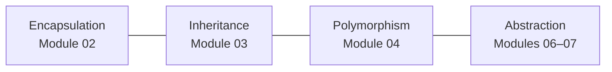

# Section 04 · Object-Oriented Programming

> **Level:** Intermediate · **Prerequisites:** [Section 03](../03_functions_and_modules/README.md)
> **Time:** ~7 hours · **Verified:** 2026-06-04 (Python 3.12.13)

So far data (dicts, lists) and behaviour (functions) have lived apart. **Object-oriented programming** bundles them together: a **class** is a blueprint that combines *data* (attributes) with *behaviour* (methods). This is how you model real-world things — a `User`, a `BankAccount`, an `Order` — and it's the design backbone of large programs, including the FastAPI app you'll build.

## Modules

| # | Module | You'll learn to… |
|---|--------|------------------|
| 01 | [Classes & objects](01_classes_and_objects.md) | Define classes, create instances, use `self` |
| 02 | [Encapsulation & properties](02_encapsulation_and_properties.md) | Protect state; compute attributes with `@property` |
| 03 | [Inheritance](03_inheritance.md) | Build specialised classes on top of general ones |
| 04 | [Polymorphism & duck typing](04_polymorphism_and_duck_typing.md) | Write code that works across many types |
| 05 | [Dunder methods](05_dunder_methods.md) | Make objects print, compare, and add like built-ins |
| 06 | [dataclasses](06_dataclasses.md) | Get classes for "data bags" almost for free |
| 07 | [Abstract base classes](07_abstract_base_classes.md) | Define interfaces classes must implement |

## The four pillars (and where we cover them)

→ Start: **[01 · Classes & objects](01_classes_and_objects.md)**
