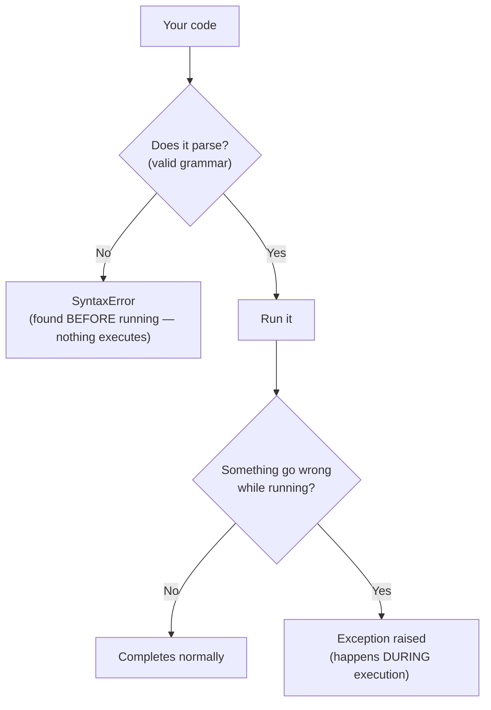
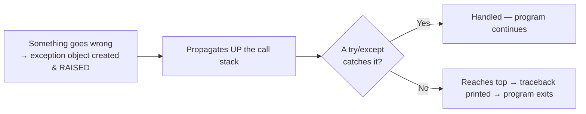

# 01 · Errors vs Exceptions

> **Level:** Intermediate · **Prerequisites:** [Section 04](../04_oop/README.md)
> **Time:** ~45 min · **Verified:** 2026-06-04 (Python 3.12.13)

## Why this matters

Before you can *handle* errors, you need a clear mental model of what an "error" even *is* in Python. There are two fundamentally different kinds, and they fail at different times. Confusing them is why beginners feel lost. Once the model is clear, the rest of this section is straightforward.

## Concept: two kinds of errors



1. **Syntax errors** — your code breaks Python's *grammar*. Python can't even understand the file, so **nothing runs at all**. Caught before execution.
2. **Exceptions** — your code is grammatically valid and starts running, but something goes wrong *while running* (dividing by zero, a missing key). These happen **during execution** and are the kind you can catch and handle.

## Concept: syntax errors (won't even start)

A `SyntaxError` means the structure is wrong — a missing colon, an unclosed bracket, bad indentation. Python reports it and refuses to run a single line.

```python
def greet(name)        # missing colon
    print(name)
```
```text
  File "bad.py", line 1
    def greet(name)
                   ^
SyntaxError: expected ':'
```

Notice: even though `print(name)` looks fine, **nothing executes** — the whole file failed to parse. Syntax errors are fixed by correcting the code's structure; you don't "handle" them at runtime. A related one is `IndentationError` (a subclass of `SyntaxError`):

```python
def f():
print("hi")            # not indented
```
```text
IndentationError: expected an indented block after function definition on line 1
```

> 🧠 **Tell-tale sign:** if the error appears *before any of your output*, and mentions `SyntaxError`/`IndentationError`, it's a grammar problem — re-read the line (and the one above it) for a missing `:`, `)`, `"`, or wrong indentation.

## Concept: exceptions (fail while running)

An **exception** is an event raised during execution that interrupts the normal flow. The code was valid; the *situation* was not.

```python
print("starting")          # this DOES run
x = 10 / 0                 # exception raised here
print("done")              # never reached
```
```text
starting
Traceback (most recent call last):
  File "div.py", line 2, in <module>
    x = 10 / 0
        ~~~^~~
ZeroDivisionError: division by zero
```

Crucial difference from syntax errors: `"starting"` printed, because the program *ran* up to the bad line. The exception then stopped it. This is the kind of error you'll learn to **catch** and recover from.

## Concept: exceptions you've already met

Every error flagged in earlier sections was an exception. Here they are, named:

| Exception | Triggered by | Seen in |
|-----------|--------------|---------|
| `NameError` | using a variable that doesn't exist | [01.02](../01_fundamentals/02_variables_and_types.md) |
| `TypeError` | an operation on the wrong type (`"a" + 1`) | [01.02](../01_fundamentals/02_variables_and_types.md) |
| `ValueError` | right type, bad value (`int("abc")`) | [01.05](../01_fundamentals/05_input_output.md) |
| `IndexError` | list index out of range | [02.01](../02_data_structures/01_lists.md) |
| `KeyError` | missing dictionary key | [02.03](../02_data_structures/03_dicts.md) |
| `ZeroDivisionError` | dividing by zero | this module |
| `AttributeError` | accessing a missing attribute/method | [02.02](../02_data_structures/02_tuples.md) |
| `FileNotFoundError` | opening a file that isn't there | next modules |

You haven't been hitting random failures — you've been meeting members of a well-organised family (the [hierarchy](04_exception_hierarchy.md), Module 04).

## Concept: exceptions are objects

This is the bridge to everything else. An exception is an **object** — an instance of a class (you built classes in Section 04!). When something goes wrong, Python *creates* an exception object and **raises** it. That object carries information: its type (`ZeroDivisionError`), a message (`"division by zero"`), and a traceback (where it happened).

```python
err = ValueError("something specific went wrong")   # just creating one, not raising
print(type(err).__name__)     # ValueError
print(str(err))               # something specific went wrong
print(isinstance(err, Exception))   # True — all exceptions inherit from Exception
```

Output (verified):

```text
ValueError
something specific went wrong
True
```

Because exceptions are objects in a class hierarchy, you can catch them by type, inspect their data, and even define your own (Module 05). Keep this in mind: **"raising an exception" = creating an error object and handing it up the call stack** until something catches it — or it reaches the top and crashes the program with a traceback.

## Concept: the life of an exception



When raised, an exception travels *up* through the functions that called the current one, looking for a handler. If a `try/except` (Module 03) catches it, the program recovers. If none does, it reaches the top and Python prints the traceback (Module 02) and stops. Understanding this "propagate up until caught" flow is the key to the whole section.

## Common mistakes

**Mistake: thinking a `SyntaxError` can be caught with `try/except`**
```python
try:
    eval("def f(:")        # this string has a syntax error
except SyntaxError:
    print("caught it")     # this DOES catch it — because eval runs at runtime
```
**Why:** normally a `SyntaxError` in *your file* stops the file from running, so a `try` around it never even executes. (The only way to "catch" one is when you compile/`eval` code dynamically *at runtime*, as above — rare.) The takeaway: fix syntax errors by editing code; handle *exceptions* with `try/except`.

**Mistake: confusing "error" the everyday word with the two technical kinds**
Be precise: "I got a SyntaxError" (won't run) is a totally different situation from "I got a KeyError" (ran, then failed). The fix is different for each.

## Practice

**Exercise:** For each snippet, decide whether it's a **syntax error** (won't run) or an **exception** (runs then fails), and name it. Then run them to confirm.

```python
# A
for i in range(5)
    print(i)

# B
nums = [1, 2, 3]
print(nums[5])

# C
print(int("hello"))
```

<details><summary>Solution</summary>

- **A** → **SyntaxError** (missing colon after `range(5)`). Nothing runs.
  ```text
  SyntaxError: expected ':'
  ```
- **B** → **exception** (`IndexError`): the code runs, then fails accessing index 5 of a 3-item list.
  ```text
  IndexError: list index out of range
  ```
- **C** → **exception** (`ValueError`): `int()` runs but `"hello"` isn't a valid number.
  ```text
  ValueError: invalid literal for int() with base 10: 'hello'
  ```

A is a grammar problem (fix the code); B and C are runtime problems you could *handle* with `try/except` — coming in Module 03.
</details>

## Recap & next

- ✅ **Syntax errors** break grammar and stop the file from running at all.
- ✅ **Exceptions** happen *during* execution; they're catchable.
- ✅ Named the common exceptions you'd already encountered.
- ✅ Understood exceptions are **objects** that get **raised** and **propagate up** until caught.
- Self-check: if you see output *before* the error message, is it a syntax error or an exception?

→ Next: **[02 · Reading tracebacks](02_reading_tracebacks.md)**
