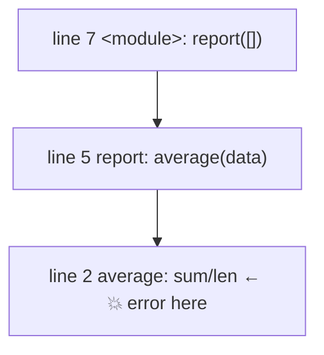

# 02 · Reading Tracebacks

> **Level:** Intermediate · **Prerequisites:** [01 · Errors vs exceptions](01_errors_vs_exceptions.md)
> **Time:** ~1 hour · **Verified:** 2026-06-04 (Python 3.12.13)

## Why this matters

A **traceback** is the report Python prints when an exception isn't caught. Beginners' eyes glaze over the wall of text and they panic. But a traceback is the single most useful debugging tool you have: it tells you *what* went wrong, *where*, and *how the program got there*. Learning to read it — especially with Python 3.11+'s pinpoint markers — turns "I have no idea why it broke" into "found it in five seconds."

## Concept: anatomy of a traceback

Run this file:

```python
# tb1.py
def average(numbers):
    return sum(numbers) / len(numbers)

def report(data):
    return f"Average: {average(data)}"

print(report([]))   # empty list -> division by zero
```

Python prints (verified, Python 3.12.13):

```text
Traceback (most recent call last):
  File "/tmp/tb1.py", line 7, in <module>
    print(report([]))   # empty list -> division by zero
          ^^^^^^^^^^
  File "/tmp/tb1.py", line 5, in report
    return f"Average: {average(data)}"
                       ^^^^^^^^^^^^^
  File "/tmp/tb1.py", line 2, in average
    return sum(numbers) / len(numbers)
           ~~~~~~~~~~~~~^~~~~~~~~~~~~~
ZeroDivisionError: division by zero
```

Let's decode it piece by piece.

### Read it bottom-up first

The **last line is the most important** — it's the *type* and *message* of the error:

```text
ZeroDivisionError: division by zero
```

That alone often tells you what happened: you divided by zero. Always read the bottom line first.

### The stack of frames (how you got there)

Above the error is the **call stack** — the chain of function calls that led to the failure, **oldest at the top, newest at the bottom**. Read it bottom-up to trace the path:

- `File ... line 7, in <module>` — the program started at line 7, calling `report([])`. (`<module>` means top-level code, not inside any function.)
- `File ... line 5, in report` — `report` then called `average(data)`.
- `File ... line 2, in average` — `average` ran `sum(numbers) / len(numbers)` — and *this* is where it blew up.



So the **deepest frame (bottom) is where the exception was actually raised**; the frames above show the path that got you there. The bug is usually at or near the bottom frame in *your* code.

### The 3.11+ pinpoint markers

Look at the carets under each line — this is a Python 3.11+ feature that's a genuine game-changer:

```text
    return sum(numbers) / len(numbers)
           ~~~~~~~~~~~~~^~~~~~~~~~~~~~
```

The `^` (and surrounding `~`) point at the **exact sub-expression** that failed — here, the *division operation* (`sum(numbers) / len(numbers)`), narrowing it down even within a complex line. On older Python (≤3.10) you'd only get the line number, not the precise spot.

## Concept: it pinpoints *which* operation

This precision shines when one line has several things that *could* fail. Run:

```python
# tb3.py
data = {"user": {"name": "Ada"}}
print(data["user"]["age"]["x"])
```

Output (verified, Python 3.12.13):

```text
Traceback (most recent call last):
  File "/tmp/tb3.py", line 2, in <module>
    print(data["user"]["age"]["x"])
          ~~~~~~~~~~~~^^^^^^^
KeyError: 'age'
```

There are *three* subscripts on that line, but the carets `~~~~~~~~~~~~^^^^^^^` point exactly at `data["user"]["age"]` — so you instantly know it's the `["age"]` lookup that failed (the `"user"` dict has no `"age"` key), not the `["x"]`. Before 3.11, you'd have had to guess which `[...]` broke.

## Concept: a `KeyError` example, fully read

```python
# tb2.py
config = {"host": "localhost"}
print(config["port"])
```

```text
Traceback (most recent call last):
  File "/tmp/tb2.py", line 2, in <module>
    print(config["port"])
          ~~~~~~^^^^^^^^
KeyError: 'port'
```

Reading it:
1. **Bottom line:** `KeyError: 'port'` → a dictionary was asked for a key `'port'` that doesn't exist.
2. **Frame:** line 2, top-level, in the expression `config["port"]` (carets confirm the subscript).
3. **Fix:** the dict only has `"host"`. Either add `"port"`, or use `config.get("port", default)` to avoid the error.

The traceback handed you everything: the type (missing key), the value (`'port'`), and the location.

## Concept: the most common reading mistakes

- **Reading top-down and stopping.** The top frame is often library/framework code, not your bug. Scan **bottom-up**, and look for the **last frame that's in *your* file** — that's usually where you should start.
- **Ignoring the message.** `KeyError: 'port'` literally names the missing key. `ValueError: invalid literal for int() with base 10: 'abc'` tells you `'abc'` was the bad input. Read it.
- **Panicking at the length.** A long traceback through many files just means many calls happened; the *structure* is identical — find the bottom line and your nearest frame.

## Worked example: debugging from a traceback

You're handed this real traceback (verified, Python 3.12.13) and the file. Find and fix the bug *using only the traceback*:

```text
Traceback (most recent call last):
  File "/tmp/cart.py", line 11, in <module>
    print(checkout(cart))
          ^^^^^^^^^^^^^^
  File "/tmp/cart.py", line 8, in checkout
    return apply_tax(subtotal(items))
                     ^^^^^^^^^^^^^^^
  File "/tmp/cart.py", line 2, in subtotal
    return sum(item["price"] for item in items)
           ^^^^^^^^^^^^^^^^^^^^^^^^^^^^^^^^^^^^
  File "/tmp/cart.py", line 2, in <genexpr>
    return sum(item["price"] for item in items)
               ~~~~^^^^^^^^^
KeyError: 'price'
```

**Reading it:**
- Bottom line: `KeyError: 'price'` — a dict lacks a `"price"` key.
- Deepest frame: `in <genexpr>` at line 2, with the carets on `item["price"]`. The `<genexpr>` frame is the generator expression `(item["price"] for item in items)` running *inside* `sum()` — Python gives comprehensions/generators their own frame. So one of the `items` has no `"price"`.
- Path: `<module>` → `checkout` → `subtotal` → the generator. The data came in via `checkout(cart)`.

> 🧠 **`<genexpr>`, `<listcomp>`, `<lambda>`** appearing as a "function" in a frame just means the failure was inside a generator expression, list comprehension, or lambda — not a named function. It's normal.

**The fix** is to ensure every item has a `price`, or read it safely:

```python
def subtotal(items):
    return sum(item.get("price", 0) for item in items)   # default 0 if missing
```

You diagnosed it without even seeing the data — the traceback pointed at the exact key and line.

## Concept: getting a traceback as text (preview)

Sometimes you want to log a traceback instead of crashing. The `traceback` module turns one into a string (you'll use this with logging in [Module 08](08_best_practices.md)):

```python
import traceback

try:
    1 / 0
except ZeroDivisionError:
    tb_text = traceback.format_exc()    # the full traceback as a string
    print("Captured:\n" + tb_text)
```

Output (verified — the `File`/line shown will match wherever your code runs):

```text
Captured:
Traceback (most recent call last):
  File "<string>", line 3, in <module>
ZeroDivisionError: division by zero
```

This is how production systems record errors to log files instead of printing to the screen and dying.

## Common mistakes

**Mistake: editing the wrong line.** The line number in a frame is where *that call* happened, not always where the value came from. Read the whole chain — sometimes the bad *data* originated higher up even though the *crash* is at the bottom.

**Mistake: not re-running after a fix.** Tracebacks reflect the code at run time. After editing, run again — the next traceback (or clean run) confirms your fix.

## Practice

**Exercise:** Read this traceback and answer without running anything: (a) the exception type, (b) the function where it was raised, (c) the line of *your* code to investigate, (d) a likely fix.

```text
Traceback (most recent call last):
  File "app.py", line 20, in <module>
    main()
  File "app.py", line 16, in main
    greeting = build_greeting(user)
               ^^^^^^^^^^^^^^^^^^^^
  File "app.py", line 9, in build_greeting
    return "Hello " + user["name"].upper()
                      ~~~~^^^^^^^^
TypeError: 'NoneType' object is not subscriptable
```

<details><summary>Solution</summary>

- **(a) Type:** `TypeError` — specifically "`'NoneType' object is not subscriptable`", meaning something that is `None` was indexed with `[...]`.
- **(b) Raised in:** `build_greeting`, the deepest frame (line 9).
- **(c) Investigate:** line 9, `user["name"]` — and the carets confirm `user[...]` is the problem. `user` is `None`, so `user["name"]` fails.
- **(d) Likely fix:** `user` arrived as `None` (perhaps `main` didn't load a real user). Guard it: `if user is None: ...`, or ensure a valid `user` is passed. The bug's *cause* is higher up (whatever set `user = None`), even though the *crash* is at line 9 — a great example of reading the whole stack.

</details>

## Recap & next

- ✅ A traceback shows the **error type+message** (bottom) and the **call stack** (frames, oldest on top).
- ✅ Read **bottom-up**: start at the last line, then find the nearest frame in *your* code.
- ✅ Used Python 3.11+ **caret markers** to pinpoint the exact failing sub-expression.
- ✅ Captured a traceback as text with `traceback.format_exc()`.
- Self-check: in a traceback, which frame is where the exception was actually raised — the top or the bottom?

→ Next: **[03 · try / except / else / finally](03_try_except_else_finally.md)**
