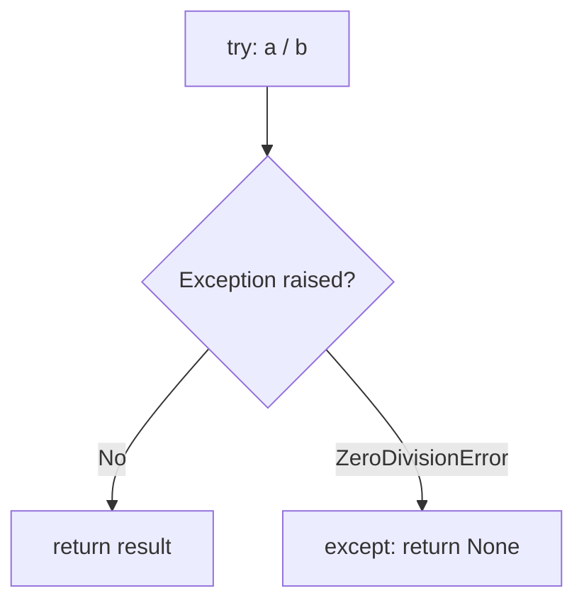
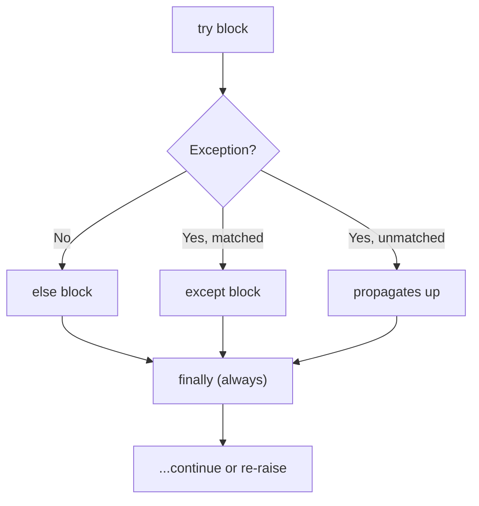

# 03 · try / except / else / finally

> **Level:** Intermediate · **Prerequisites:** [02 · Reading tracebacks](02_reading_tracebacks.md)
> **Time:** ~1.5 hours · **Verified:** 2026-06-04 (Python 3.12.13)

## Why this matters

This is the core skill of the whole section: **catching** an exception so your program can recover instead of crashing. A robust program expects things to go wrong — files missing, input malformed, networks down — and responds gracefully. The `try`/`except`/`else`/`finally` statement is how.

## Concept: `try` / `except`

- **What:** put risky code in a `try` block; handle failures in `except`.
- **Why:** turn a crash into a controlled response.

```python
def safe_div(a, b):
    try:
        return a / b                # risky: might divide by zero
    except ZeroDivisionError:
        return None                 # handle it: return None instead of crashing

print(safe_div(10, 2))    # 5.0
print(safe_div(10, 0))    # None   -> no crash!
```

Output (verified):

```text
5.0
None
```

The flow: Python runs the `try` block; if a `ZeroDivisionError` is raised, it *jumps* to the matching `except` block and runs that instead of crashing. If no error occurs, the `except` is skipped entirely.



## Concept: catching the exception object with `as`

Use `as name` to capture the exception object and inspect its message:

```python
def parse_int(s):
    try:
        return int(s)
    except ValueError as e:           # `e` is the exception object
        return f"bad value: {e}"

print(parse_int("42"))     # 42
print(parse_int("abc"))    # bad value: invalid literal for int() with base 10: 'abc'
```

Output (verified):

```text
42
bad value: invalid literal for int() with base 10: 'abc'
```

`str(e)` (used here via the f-string) gives the error message — useful for logging or building a helpful response.

## Concept: handling multiple exception types

You can have several `except` blocks, each for a different type. The **first matching one wins** (like `if/elif`):

```python
def parse_int(s):
    try:
        return int(s)
    except ValueError as e:
        return f"bad value: {e}"
    except TypeError as e:
        return f"bad type: {e}"

print(parse_int("abc"))    # bad value: ...   (ValueError)
print(parse_int(None))     # bad type: ...    (TypeError — can't int() None)
```

Output (verified, abbreviated):

```text
bad value: invalid literal for int() with base 10: 'abc'
bad type: int() argument must be a string, a bytes-like object or a real number, not 'NoneType'
```

If two types should be handled the *same* way, group them in a tuple:

```python
try:
    raise KeyError("k")
except (KeyError, IndexError) as e:        # catch either with one block
    print("lookup failed:", type(e).__name__)
```

Output (verified):

```text
lookup failed: KeyError
```

## Concept: `else` — run only if no exception

The `else` block runs **only when the `try` succeeded** (no exception). It keeps the "success path" separate from the risky line — so you don't accidentally catch errors from code that should *not* be guarded.

```python
def process(s):
    try:
        n = int(s)              # ONLY this is risky
    except ValueError:
        print("  parse failed")
        return None
    else:
        print("  parse ok")     # runs only if int(s) succeeded
        return n * 2
```

```text
>>> process("5")
  parse ok
10
>>> process("x")
  parse failed
None
```

> 🧠 **Why use `else` instead of just putting the success code in the `try`?** If `n * 2` were inside the `try`, and *it* somehow raised `ValueError`, your `except` would catch it too — masking a different bug. `else` narrows the `try` to exactly the line that can fail.

## Concept: `finally` — always runs

The `finally` block runs **no matter what** — whether the `try` succeeded, raised, was handled, or even `return`ed. Use it for **cleanup** that must happen regardless: closing files, releasing locks, disconnecting.

```python
def process(s):
    try:
        n = int(s)
    except ValueError:
        print("  parse failed")
        return None
    else:
        print("  parse ok")
        return n * 2
    finally:
        print("  cleanup always runs")    # runs even after the return!

print(process("5"))
print(process("x"))
```

Output (verified):

```text
  parse ok
  cleanup always runs
10
  parse failed
  cleanup always runs
None
```

Notice `cleanup always runs` prints in *both* cases — even though each path hits a `return`. `finally` is guaranteed.



## Concept: the full picture

The complete order, and when each part runs:

| Block | Runs when |
|-------|-----------|
| `try` | always (it's the code you're guarding) |
| `except` | only if a matching exception was raised |
| `else` | only if **no** exception was raised |
| `finally` | **always**, last — even on `return` or unhandled error |

You rarely use all four at once, but knowing the full shape lets you pick the right pieces.

## Worked example: reading a config file safely

```python
# read_config.py — handle a missing or malformed file without crashing.

def load_port(path):
    try:
        with open(path) as f:           # might raise FileNotFoundError
            text = f.read().strip()
        port = int(text)                # might raise ValueError
    except FileNotFoundError:
        print(f"  no file at {path}, using default")
        return 8000
    except ValueError:
        print(f"  file content isn't a number, using default")
        return 8000
    else:
        print(f"  loaded port {port}")
        return port
    finally:
        print("  (done attempting to load)")

# Simulate by writing test files first
from pathlib import Path
Path("/tmp/good_port.txt").write_text("9000")
Path("/tmp/bad_port.txt").write_text("not-a-number")

print("Good file:", load_port("/tmp/good_port.txt"))
print("Bad file:", load_port("/tmp/bad_port.txt"))
print("Missing file:", load_port("/tmp/nope.txt"))
```

Output (verified):

```text
  loaded port 9000
  (done attempting to load)
Good file: 9000
  file content isn't a number, using default
  (done attempting to load)
Bad file: 8000
  no file at /tmp/nope.txt, using default
  (done attempting to load)
Missing file: 8000
```

Three different outcomes — success, bad content, missing file — all handled cleanly, with the `finally` cleanup line printing every time. The program never crashes.

## Common mistakes

**Mistake: a bare `except:` that catches everything**
```python
try:
    risky()
except:                  # catches EVERYTHING, even Ctrl-C and typos
    pass
```
**Why:** a bare `except` (or `except Exception` used carelessly) swallows *all* errors — including ones you didn't anticipate, hiding real bugs and even catching keyboard interrupts. Catch **specific** types you can actually handle. (More in [Module 08](08_best_practices.md).)

**Mistake: too much code in the `try`**
```python
try:
    data = parse(raw)        # the line that can fail
    result = transform(data) # but if THIS fails, you'd blame parsing
    save(result)
except ValueError:
    print("parse error")
```
**Why:** the `except` will also catch a `ValueError` from `transform` or `save`, mislabelling it. Keep `try` blocks tight — ideally one risky operation — and use `else` for the follow-up.

**Mistake: using exceptions for normal control flow you could check cheaply** — sometimes a simple `if` is clearer. But often EAFP (try it and handle failure) *is* the Pythonic choice; we weigh this in [Module 08](08_best_practices.md).

## Practice

**Exercise:** Write `safe_get(d, key)` that returns the value for `key` in dict `d`, or the string `"<missing>"` if the key isn't there — using `try`/`except KeyError` (not `.get()`). Then write `divide_all(numbers, divisor)` that returns a list of `n / divisor`, but if `divisor` is 0, returns `[]` and prints a message, using `try`/`except`/`else`.

<details><summary>Solution</summary>

```python
def safe_get(d, key):
    try:
        return d[key]
    except KeyError:
        return "<missing>"

print(safe_get({"a": 1}, "a"))     # 1
print(safe_get({"a": 1}, "b"))     # <missing>

def divide_all(numbers, divisor):
    try:
        results = [n / divisor for n in numbers]
    except ZeroDivisionError:
        print("cannot divide by zero")
        return []
    else:
        return results

print(divide_all([10, 20, 30], 2))   # [5.0, 10.0, 15.0]
print(divide_all([10, 20, 30], 0))   # message, then []
```

Output:

```text
1
<missing>
[5.0, 10.0, 15.0]
cannot divide by zero
[]
```

`safe_get` catches the `KeyError` for a missing key; `divide_all` does the risky division in `try` and returns the results in `else` only when no error occurred.
</details>

## Recap & next

- ✅ Caught exceptions with `try`/`except` to recover instead of crashing.
- ✅ Captured the exception object with `as e` and grouped types in a tuple.
- ✅ Used `else` (runs on success) to keep `try` blocks tight.
- ✅ Used `finally` for cleanup that **always** runs.
- ✅ Learned to catch **specific** types and keep `try` blocks small.
- Self-check: if a `try` block hits `return`, does its `finally` still run?

→ Next: **[04 · The exception hierarchy](04_exception_hierarchy.md)**
