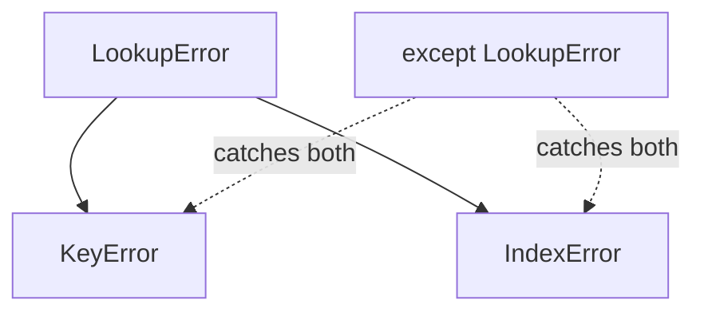

# 04 · The Exception Hierarchy

> **Level:** Intermediate · **Prerequisites:** [03 · try/except](03_try_except_else_finally.md), [OOP inheritance](../04_oop/03_inheritance.md)
> **Time:** ~1 hour · **Verified:** 2026-06-04 (Python 3.12.13)

## Why this matters

Exceptions are **classes arranged in an inheritance tree** (which is why we did OOP first). `KeyError` *is a* `LookupError` *is an* `Exception`. This matters enormously for catching: an `except` block catches its type *and all its subclasses*. Understand the tree and you can catch errors at exactly the right level — neither too broad (hiding bugs) nor too narrow (missing cases).

## Concept: the tree

All exceptions descend from `BaseException`. Here's the part you'll use:

```text
BaseException
 ├── SystemExit              (raised by sys.exit() — don't catch casually)
 ├── KeyboardInterrupt       (raised by Ctrl-C — don't catch casually)
 ├── GeneratorExit
 └── Exception               ← catch THIS or its subclasses, never BaseException
      ├── ArithmeticError
      │    └── ZeroDivisionError
      ├── LookupError
      │    ├── IndexError
      │    └── KeyError
      ├── ValueError
      ├── TypeError
      ├── AttributeError
      ├── NameError
      ├── OSError
      │    ├── FileNotFoundError
      │    ├── PermissionError
      │    └── ... (many I/O errors)
      ├── RuntimeError
      │    └── RecursionError
      ├── StopIteration
      └── ... (and more)
```

We can confirm these relationships at runtime by walking each exception's MRO (Section 04's method resolution order — exceptions are just classes):

```python
for exc in [ZeroDivisionError, KeyError, IndexError, FileNotFoundError]:
    chain = " -> ".join(c.__name__ for c in exc.__mro__[1:4])
    print(f"{exc.__name__} -> {chain}")
```

Output (verified):

```text
ZeroDivisionError -> ArithmeticError -> Exception -> BaseException
KeyError -> LookupError -> Exception -> BaseException
IndexError -> LookupError -> Exception -> BaseException
FileNotFoundError -> OSError -> Exception -> BaseException
```

So `ZeroDivisionError` is an `ArithmeticError` is an `Exception`. This *is-a* chain is the key to the next concept.

## Concept: catching a base class catches its subclasses

An `except SomeError` block catches `SomeError` **and every exception that inherits from it**. So you can handle a whole family with one block:

```python
def lookup(container, key):
    try:
        return container[key]
    except LookupError as e:        # base class of BOTH KeyError and IndexError
        return f"{type(e).__name__}: not found"

print(lookup({"a": 1}, "b"))        # KeyError (a LookupError)
print(lookup([1, 2, 3], 10))        # IndexError (also a LookupError)
```

Output (verified):

```text
KeyError: not found
IndexError: not found
```

One `except LookupError` caught both a `KeyError` (missing dict key) and an `IndexError` (bad list index), because both *are* `LookupError`s. This is why `except Exception` catches *almost everything* — nearly all errors inherit from `Exception`.



## Concept: order specific → general

When you have multiple `except` blocks, **put specific exceptions before their base classes** — the first match wins, so a base class listed first would "steal" the more specific ones.

```python
def classify(s):
    try:
        return 10 / int(s)
    except ValueError:
        return "not a number"          # int("abc") fails here
    except ArithmeticError:            # ZeroDivisionError IS an ArithmeticError
        return "math problem"          # 10/0 fails here

print(classify("abc"))   # not a number
print(classify("0"))     # math problem
print(classify("2"))     # 5.0
```

Output (verified):

```text
not a number
math problem
5.0
```

If you reversed them and wrote `except Exception` first, it would catch *everything*, and the specific blocks below would be dead code. Some linters warn about this "unreachable except" mistake.

> 🧠 **Rule:** list `except` blocks from **most specific to most general**, top to bottom — just like the order matters in `if`/`elif`.

## Concept: choosing the right level to catch

- **Catch specific** (`except KeyError`) when you know exactly what can fail and how to handle each case. This is the default — it's precise and won't hide surprises.
- **Catch a base class** (`except OSError`) when you genuinely want to handle a whole family the same way (e.g. *any* file-system problem → "couldn't access file").
- **Catch `except Exception`** only at the *top level* of a program or a request handler, where you want to log anything unexpected and keep running rather than crash — never to silently ignore errors deep in your logic.
- **Never catch `BaseException`** (or use a bare `except:`). It also grabs `KeyboardInterrupt` (Ctrl-C) and `SystemExit`, making your program impossible to stop and masking shutdown signals.

```python
# At the top level of a long-running service, this is reasonable:
try:
    handle_request()
except Exception as e:          # log ANY unexpected error, stay alive
    print(f"request failed: {type(e).__name__}: {e}")
    # ...log it, return a 500, move on
```

## Concept: `OSError` and the file family

File and OS operations raise subclasses of `OSError`. You can catch the specific one or the family:

```python
def read_file(path):
    try:
        with open(path) as f:
            return f.read()
    except FileNotFoundError:
        return "(no such file)"
    except PermissionError:
        return "(permission denied)"
    except OSError as e:               # any OTHER OS-level problem
        return f"(I/O error: {e})"

print(read_file("/tmp/nope.txt"))      # (no such file)
```

Output (verified):

```text
(no such file)
```

Specific cases first, then `OSError` as the catch-all for the family — exactly the specific→general ordering.

## Worked example: a robust value parser

```python
# parse.py — handle each failure mode with the right exception.

def parse_temperature(raw):
    """Parse 'NN.N' into a float, with clear handling of each failure."""
    try:
        value = float(raw)              # ValueError if not numeric
        if value < -273.15:
            raise ValueError("below absolute zero")   # we raise it too (Module 05)
        return value
    except (TypeError, ValueError) as e:
        # TypeError: raw was None or wrong type; ValueError: bad string / out of range
        return f"invalid temperature ({type(e).__name__}): {e}"

print(parse_temperature("21.5"))      # 21.5
print(parse_temperature("hot"))       # invalid (ValueError)
print(parse_temperature(None))        # invalid (TypeError)
print(parse_temperature("-300"))      # invalid (ValueError: below absolute zero)
```

Output (verified):

```text
21.5
invalid temperature (ValueError): could not convert string to float: 'hot'
invalid temperature (TypeError): float() argument must be a string or a real number, not 'NoneType'
invalid temperature (ValueError): below absolute zero
```

Grouping `(TypeError, ValueError)` handles both "wrong type" and "bad value" together, while `type(e).__name__` still tells us *which* occurred. (Module 05 covers the `raise` we used for the absolute-zero check.)

## Common mistakes

**Mistake: base class before specific (unreachable handlers)**
```python
try:
    risky()
except Exception:        # catches everything...
    ...
except ValueError:       # ...so this NEVER runs (dead code)
    ...
```
**Why:** the first matching `except` wins, and `Exception` matches `ValueError`. Order specific → general.

**Mistake: catching `Exception` everywhere to "be safe"**
```python
try:
    config["port"]
except Exception:
    port = 8000           # hides typos, attribute errors, anything
```
**Why:** you wanted to handle a *missing key* (`KeyError`), but you've silenced *every* possible bug. Catch `KeyError` specifically.

## Practice

**Exercise:** Write `fetch(data, path)` where `data` is nested dicts/lists and `path` is a list of keys/indices to follow (e.g. `["users", 0, "name"]`). Return the value, or `"<not found>"` if any step fails. Catch the *one* base class that covers both missing dict keys and out-of-range list indices.

<details><summary>Solution</summary>

```python
def fetch(data, path):
    try:
        current = data
        for step in path:
            current = current[step]       # may raise KeyError or IndexError
        return current
    except LookupError:                   # base class of BOTH
        return "<not found>"

sample = {"users": [{"name": "Ada"}, {"name": "Bo"}]}
print(fetch(sample, ["users", 0, "name"]))    # Ada
print(fetch(sample, ["users", 5, "name"]))    # <not found> (IndexError)
print(fetch(sample, ["admins"]))              # <not found> (KeyError)
```

Output:

```text
Ada
<not found>
<not found>
```

`LookupError` is the shared base of `KeyError` and `IndexError`, so one `except` cleanly handles both a missing dict key and a bad list index.
</details>

## Recap & next

- ✅ Exceptions form an inheritance tree rooted at `BaseException`; catch `Exception` or below.
- ✅ An `except` for a base class catches **all its subclasses** (e.g. `LookupError` → `KeyError`+`IndexError`).
- ✅ Order `except` blocks **specific → general**.
- ✅ Picked the right catching level; never catch `BaseException`/bare `except`.
- Self-check: why does `except LookupError` catch a `KeyError`?

→ Next: **[05 · Raising & custom exceptions](05_raising_and_custom_exceptions.md)**
