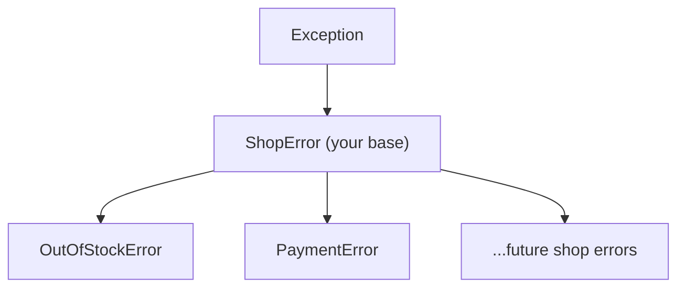

# 05 · Raising & Custom Exceptions

> **Level:** Intermediate · **Prerequisites:** [04 · Exception hierarchy](04_exception_hierarchy.md), [OOP](../04_oop/README.md)
> **Time:** ~1.5 hours · **Verified:** 2026-06-04 (Python 3.12.13)

## Why this matters

So far you've *caught* exceptions Python raised. Now you'll **raise them yourself** — to signal "this input is invalid, refuse to continue" — and **design your own** exception types so callers can handle *your* errors precisely. Custom exceptions are the difference between a library that returns mysterious `ValueError`s and one whose errors are self-documenting (`OutOfStockError`, `PaymentDeclinedError`). FastAPI's error handling builds directly on this.

## Concept: `raise`

- **What:** the `raise` statement creates and throws an exception.
- **Why:** to refuse invalid states early ("fail fast") instead of letting bad data spread.

```python
def set_age(age):
    if not isinstance(age, int):
        raise TypeError(f"age must be int, got {type(age).__name__}")
    if age < 0:
        raise ValueError(f"age cannot be negative: {age}")
    return age

print(set_age(30))        # 30
```

When a bad value comes in, `raise` stops the function immediately and sends the exception up to the caller:

```python
for bad in [-5, "x"]:
    try:
        set_age(bad)
    except (TypeError, ValueError) as e:
        print(type(e).__name__, e)
```

Output (verified):

```text
30
ValueError age cannot be negative: -5
TypeError age must be int, got str
```

> 🧠 **"Fail fast."** Validating inputs at the boundary and raising immediately means bugs surface *where they happen*, with a clear message — not three functions later as a confusing `NoneType` error. A good `raise` message names the problem *and* the offending value.

### Choose the right built-in to raise

Before writing a custom type, see if a built-in fits:
- **`ValueError`** — right type, unacceptable value (negative age, empty name).
- **`TypeError`** — wrong type entirely (`int` where `str` expected).
- **`KeyError`/`IndexError`** — missing key/index (usually let the container raise these).
- **`NotImplementedError`** — a method that subclasses must override (recall [abstract classes](../04_oop/07_abstract_base_classes.md)).

## Concept: re-raising

Sometimes you want to *react* to an exception (log it, clean up) but still let it propagate. A bare `raise` inside an `except` re-throws the **same** exception, preserving its original traceback:

```python
def process(x):
    try:
        return 10 / x
    except ZeroDivisionError:
        print("  logging the error, then re-raising")
        raise                       # re-raise the SAME exception, unchanged

try:
    process(0)
except ZeroDivisionError:
    print("  caught at top")
```

Output (verified):

```text
  logging the error, then re-raising
  caught at top
```

`raise` with no argument means "re-throw whatever I just caught." This is the standard pattern for "do something on the way out, but don't swallow the error." (Note: `raise` *with* a new exception starts a fresh one — that's chaining, [Module 06](06_chaining_and_context.md).)

## Concept: defining a custom exception

A custom exception is just a class that inherits from `Exception` (or a more specific built-in). The simplest useful one:

```python
class InsufficientFundsError(Exception):
    """Raised when an account lacks funds for a withdrawal."""

raise InsufficientFundsError("not enough money")
```

That's it — inherit from `Exception`, give it a docstring, done. The name itself documents the failure. **Always inherit from `Exception`** (or a subclass), never from `BaseException`.

### Carrying data on the exception

Because exceptions are objects ([Module 01](01_errors_vs_exceptions.md)), you can attach useful attributes so the *handler* can react with details — not just a string:

```python
class InsufficientFundsError(Exception):
    def __init__(self, balance, amount):
        self.balance = balance
        self.amount = amount
        # build a readable message and pass it up to Exception
        super().__init__(f"need {amount}, have {balance}")

try:
    raise InsufficientFundsError(balance=50, amount=100)
except InsufficientFundsError as e:
    print(e)                              # need 100, have 50  (the message)
    print("short by", e.amount - e.balance)   # access the structured data
```

Output (verified):

```text
need 100, have 50
short by 50
```

The handler can read `e.balance` and `e.amount` to build a precise response (e.g. "you need \$50 more"). Always call `super().__init__(message)` so the string message works too.

## Concept: a custom exception *hierarchy*

The real power: define a **base** exception for your module/library, then specific subclasses. Callers can catch one specific error, *or* the base to handle the whole family — exactly like the built-in hierarchy ([Module 04](04_exception_hierarchy.md)).

```python
class ShopError(Exception):
    """Base class for all shop errors."""

class OutOfStockError(ShopError):
    def __init__(self, sku, requested, available):
        self.sku = sku
        self.requested = requested
        self.available = available
        super().__init__(f"{sku}: wanted {requested}, only {available} in stock")

class PaymentError(ShopError):
    """Raised when payment fails."""

# A caller can catch the WHOLE family with the base class:
try:
    raise OutOfStockError("BK-1", requested=5, available=2)
except ShopError as e:                    # catches OutOfStockError, PaymentError, ...
    print(type(e).__name__, "->", e)
    print("short by", e.requested - e.available)
```

Output (verified):

```text
OutOfStockError -> BK-1: wanted 5, only 2 in stock
short by 3
```



> 💡 **Design rule:** give every library/app *one* base exception (`ShopError`). Then users can write `except ShopError:` to catch anything your code raises, without also catching unrelated `ValueError`s from elsewhere. This is how mature libraries (`requests`, `httpx`, database drivers) structure their errors — and what you'll do in the capstone.

## Worked example: a validated registration

```python
# register.py — a small domain with its own error family.

class RegistrationError(Exception):
    """Base for all registration problems."""

class InvalidEmailError(RegistrationError):
    pass

class WeakPasswordError(RegistrationError):
    def __init__(self, min_length):
        self.min_length = min_length
        super().__init__(f"password must be at least {min_length} characters")

def register(email, password):
    if "@" not in email:
        raise InvalidEmailError(f"not a valid email: {email!r}")
    if len(password) < 8:
        raise WeakPasswordError(min_length=8)
    return f"registered {email}"

for email, pw in [("ada@x.io", "supersecret"), ("nope", "x"), ("bo@x.io", "short")]:
    try:
        print(register(email, pw))
    except RegistrationError as e:          # one handler for the whole family
        print(f"  rejected ({type(e).__name__}): {e}")
```

Output (verified):

```text
registered ada@x.io
  rejected (InvalidEmailError): not a valid email: 'nope'
  rejected (WeakPasswordError): password must be at least 8 characters
```

One `except RegistrationError` handles every registration failure, while `type(e).__name__` still distinguishes them. (`{email!r}` in the f-string uses `repr`, so the bad value is shown with quotes — handy for spotting whitespace.)

## Common mistakes

**Mistake: raising a string or a bare class wrongly**
```python
raise "something broke"          # TypeError: exceptions must derive from BaseException
```
**Why:** you must raise an *exception instance* (or class), not a string. Use `raise ValueError("something broke")`.

**Mistake: inheriting from `BaseException`**
```python
class MyError(BaseException):    # too high in the tree!
    pass
```
**Why:** code that does `except Exception:` won't catch it (it's a *sibling* of `Exception`), and it'll dodge normal handling. Always inherit from `Exception`.

**Mistake: swallowing the original when re-raising for context** — if you `raise NewError(...)` inside an `except`, the original cause should be linked with `from` so you don't lose it. That's the next module.

## Practice

**Exercise:** Build a tiny `BankAccount` (reuse [OOP Module 01](../04_oop/01_classes_and_objects.md)) with a custom exception family: a base `AccountError`, and `InsufficientFundsError` (carrying `balance` and `amount`) and `InvalidAmountError`. `withdraw` should raise `InvalidAmountError` for non-positive amounts and `InsufficientFundsError` when the balance is too low. Demonstrate catching both via the base class.

<details><summary>Solution</summary>

```python
class AccountError(Exception):
    """Base for account errors."""

class InvalidAmountError(AccountError):
    pass

class InsufficientFundsError(AccountError):
    def __init__(self, balance, amount):
        self.balance = balance
        self.amount = amount
        super().__init__(f"cannot withdraw {amount}; balance is {balance}")

class BankAccount:
    def __init__(self, balance=0):
        self.balance = balance
    def withdraw(self, amount):
        if amount <= 0:
            raise InvalidAmountError(f"amount must be positive, got {amount}")
        if amount > self.balance:
            raise InsufficientFundsError(self.balance, amount)
        self.balance -= amount
        return self.balance

acc = BankAccount(100)
for amount in [30, -5, 1000]:
    try:
        print("balance now", acc.withdraw(amount))
    except AccountError as e:               # base catches both kinds
        print(f"  {type(e).__name__}: {e}")
```

Output:

```text
balance now 70
  InvalidAmountError: amount must be positive, got -5
  InsufficientFundsError: cannot withdraw 1000; balance is 70
```

Both error types inherit from `AccountError`, so one `except AccountError` handles the whole family while their distinct types and attributes remain available.
</details>

## Recap & next

- ✅ Used `raise` to signal errors and **fail fast** with clear messages.
- ✅ Chose the right built-in (`ValueError`/`TypeError`) before going custom.
- ✅ **Re-raised** with a bare `raise` to react without swallowing.
- ✅ Defined custom exceptions inheriting from `Exception`, carrying structured data.
- ✅ Built an **exception hierarchy** with one base class for the whole family.
- Self-check: why give a library a single base exception class?

→ Next: **[06 · Chaining & context](06_chaining_and_context.md)**
