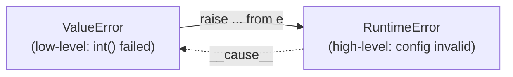

# 06 · Chaining & Context

> **Level:** Intermediate · **Prerequisites:** [05 · Raising & custom exceptions](05_raising_and_custom_exceptions.md)
> **Time:** ~1 hour · **Verified:** 2026-06-04 (Python 3.12.13)

## Why this matters

Real code wraps low-level errors in higher-level ones: a database driver's `ConnectionError` becomes your app's `UserLoadError`. If you do this carelessly, you **lose the original cause** and the traceback can't tell you *why* it really failed. Python's **exception chaining** keeps both errors linked, so the traceback shows the full story: "this failed *because* that failed." Mastering `raise ... from` is what separates debuggable error handling from frustrating black holes.

## Concept: implicit chaining (automatic)

When you raise a *new* exception **while handling another one**, Python automatically remembers the original and shows both. You don't have to do anything:

```python
# implicit.py
def get_user(users, name):
    try:
        return users[name]
    except KeyError:
        raise RuntimeError("could not load user")   # new error, inside the handler

get_user({}, "ada")
```

Output (verified):

```text
Traceback (most recent call last):
  File "/tmp/implicit.py", line 3, in get_user
    return users[name]
           ~~~~~^^^^^^
KeyError: 'ada'

During handling of the above exception, another exception occurred:

Traceback (most recent call last):
  File "/tmp/implicit.py", line 7, in <module>
    get_user({}, "ada")
  File "/tmp/implicit.py", line 5, in get_user
    raise RuntimeError("could not load user")
    ^^^^^^^^^^^^^^^^^^^^^^^^^^^^^^^^^^^^^^^^^
RuntimeError: could not load user
```

The key phrase is **"During handling of the above exception, another exception occurred"**. Python shows *both* tracebacks — the original `KeyError` and the `RuntimeError` that replaced it. This automatic link is stored on the new exception's `__context__` attribute.

## Concept: explicit chaining with `raise ... from`

The phrase "*during handling*... another exception occurred" sounds slightly accidental — as if the second error was a surprise. When the second error is a **deliberate** wrapping of the first, say so with `raise NewError(...) from original`:

```python
# chain.py
def load_config(text):
    try:
        return int(text)
    except ValueError as e:
        raise RuntimeError("config invalid") from e    # explicit cause

load_config("oops")
```

Output (verified):

```text
Traceback (most recent call last):
  File "/tmp/chain.py", line 3, in load_config
    return int(text)
           ^^^^^^^^^
ValueError: invalid literal for int() with base 10: 'oops'

The above exception was the direct cause of the following exception:

Traceback (most recent call last):
  File "/tmp/chain.py", line 7, in <module>
    load_config("oops")
  File "/tmp/chain.py", line 5, in load_config
    raise RuntimeError("config invalid") from e
RuntimeError: config invalid
```

Now the phrase is **"The above exception was the direct cause of the following exception"** — clearly stating intent: the `ValueError` *caused* the `RuntimeError`. `from e` sets the new exception's `__cause__` attribute.



> 🧠 **`__context__` vs `__cause__`:**
> - **`__context__`** is set *automatically* whenever you raise inside an `except` → prints "during handling".
> - **`__cause__`** is set when you use `from` → prints "direct cause".
> Use `from` whenever the wrapping is intentional (almost always). It documents the relationship and reads better in the traceback.

## Concept: inspecting the chain

Both links are real attributes you can read:

```python
try:
    try:
        1 / 0
    except ZeroDivisionError as e:
        raise ValueError("wrapped") from e
except ValueError as v:
    print("cause:", type(v.__cause__).__name__)        # ZeroDivisionError
    print("context:", type(v.__context__).__name__)    # ZeroDivisionError
    print("suppress:", v.__suppress_context__)         # True
```

Output (verified):

```text
cause: ZeroDivisionError
context: ZeroDivisionError
suppress: True
```

With `from`, both `__cause__` and `__context__` point to the original, and `__suppress_context__` becomes `True` (so only the cleaner "direct cause" message shows). Frameworks use these attributes to render rich error pages.

## Concept: suppressing the chain with `from None`

Occasionally the original error is noise — an internal detail you don't want to leak to the caller. `raise ... from None` hides it:

```python
# suppress.py
def get_user(users, name):
    try:
        return users[name]
    except KeyError:
        raise RuntimeError("could not load user") from None   # hide the KeyError

get_user({}, "ada")
```

Output (verified):

```text
Traceback (most recent call last):
  File "/tmp/suppress.py", line 7, in <module>
    get_user({}, "ada")
  File "/tmp/suppress.py", line 5, in get_user
    raise RuntimeError("could not load user") from None
RuntimeError: could not load user
```

No "during handling" section — the `KeyError` is suppressed. Use this **sparingly**: hiding the cause makes debugging harder. It's appropriate when the internal error is a meaningless implementation detail and the new message fully explains the problem.

## Concept: why chaining matters — a layered example

Wrapping errors at layer boundaries gives callers a clean, stable error type *without* throwing away the diagnostic detail:

```python
class UserServiceError(Exception):
    """Public error from the user service."""

def _fetch_raw(user_id):
    data = {1: '{"name": "Ada"}'}
    return data[user_id]            # raises KeyError for unknown ids

def get_user_name(user_id):
    try:
        import json
        return json.loads(_fetch_raw(user_id))["name"]
    except KeyError as e:
        # wrap low-level KeyError in a meaningful, public error — keep the cause
        raise UserServiceError(f"no user with id {user_id}") from e

try:
    get_user_name(999)
except UserServiceError as e:
    print(f"public error: {e}")
    print(f"underlying cause: {type(e.__cause__).__name__}")
```

Output (verified):

```text
public error: no user with id 999
underlying cause: KeyError
```

Callers catch the clean `UserServiceError` (they don't need to know about dicts or JSON), but if they (or your logs) dig in, `__cause__` reveals it was a `KeyError`. Best of both worlds: a tidy public interface *and* full diagnostics.

## Common mistakes

**Mistake: wrapping without `from`, losing intent**
```python
except ValueError:
    raise ConfigError("bad config")     # works, but says "during handling"
```
**Why:** it still chains (via `__context__`), but `from e` reads better and signals the wrap was deliberate. Prefer `raise ConfigError("bad config") from e`.

**Mistake: over-using `from None`**
```python
except Exception:
    raise MyError("failed") from None   # original cause GONE
```
**Why:** you've thrown away the real reason. Only suppress when the original is truly irrelevant noise; otherwise keep the chain for debuggability.

**Mistake: catching just to re-raise a vaguer error**
```python
except FileNotFoundError:
    raise Exception("error")            # less specific AND no detail!
```
**Why:** you replaced a precise, informative error with a vague one. If you must wrap, wrap into something *more* meaningful (a domain error), keep the cause with `from`, and include the relevant data.

## Practice

**Exercise:** Write `parse_record(line)` that splits a CSV line `"name,age"` and returns `{"name": ..., "age": int(...)}`. If the age isn't an integer, raise a custom `RecordError` *from* the original `ValueError`, with a message including the bad line. Catch `RecordError` and print both the message and the underlying cause's type.

<details><summary>Solution</summary>

```python
class RecordError(Exception):
    """A record could not be parsed."""

def parse_record(line):
    name, age_text = line.split(",")
    try:
        age = int(age_text)
    except ValueError as e:
        raise RecordError(f"bad record: {line!r}") from e   # keep the cause
    return {"name": name, "age": age}

print(parse_record("Ada,31"))

try:
    parse_record("Bo,thirty")
except RecordError as e:
    print(f"error: {e}")
    print(f"caused by: {type(e.__cause__).__name__}")
```

Output:

```text
{'name': 'Ada', 'age': 31}
error: bad record: 'Bo,thirty'
caused by: ValueError
```

`from e` links the `ValueError` (from `int("thirty")`) to the public `RecordError`, so the handler sees a clean domain error *and* can recover the original cause via `__cause__`.
</details>

## Recap & next

- ✅ **Implicit chaining:** raising inside `except` auto-links via `__context__` ("during handling").
- ✅ **Explicit chaining:** `raise New() from original` sets `__cause__` ("direct cause") — use it for deliberate wrapping.
- ✅ Inspected `__cause__`/`__context__`/`__suppress_context__`.
- ✅ Suppressed noise with `from None` — sparingly.
- ✅ Wrapped low-level errors in meaningful domain errors *without* losing diagnostics.
- Self-check: which traceback phrase tells you the wrapping was intentional?

→ Next: **[07 · Exception groups](07_exception_groups.md)**
