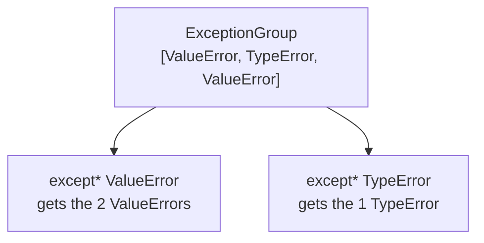

# 07 · Exception Groups

> **Level:** Intermediate → Advanced · **Prerequisites:** [06 · Chaining & context](06_chaining_and_context.md)
> **Time:** ~1 hour · **Verified:** 2026-06-04 (Python 3.12.13)
> **📌 Version:** `ExceptionGroup` and `except*` are **new in Python 3.11**. On 3.10 or earlier they don't exist.

## Why this matters

Normal exceptions are "one at a time" — the first failure stops everything. But sometimes you have **several independent failures** that all matter: validating a form where three fields are wrong, or running ten tasks concurrently where four fail. You don't want to report just the first one. Python 3.11 introduced **exception groups** to raise and handle *multiple* exceptions together. They're also the backbone of error handling in async `TaskGroup`s ([Section 08](../08_async/README.md)), so this is essential groundwork for modern Python.

## Concept: the problem — one error hides the rest

With ordinary exceptions, validating a form stops at the first bad field:

```python
def validate_one_at_a_time(form):
    if not form.get("name"):
        raise ValueError("name is required")      # stops here...
    if "@" not in form.get("email", ""):
        raise ValueError("email is invalid")      # ...never checked
```

The user fixes the name, resubmits, *then* learns the email is wrong too. Annoying. We'd rather collect **all** problems and report them at once.

## Concept: `ExceptionGroup`

An `ExceptionGroup` bundles several exceptions into one. You collect failures in a list, then raise them together:

```python
def validate(form):
    errors = []                                    # collect, don't raise yet
    if not form.get("name"):
        errors.append(ValueError("name is required"))
    age = form.get("age")
    if not isinstance(age, int):
        errors.append(TypeError("age must be an integer"))
    elif age < 0:
        errors.append(ValueError("age must be non-negative"))
    if "@" not in form.get("email", ""):
        errors.append(ValueError("email is invalid"))

    if errors:
        raise ExceptionGroup("validation failed", errors)   # raise them ALL
    return "ok"

print(validate({"name": "Ada", "age": 31, "email": "a@x.io"}))   # ok
```

Output (verified):

```text
ok
```

`ExceptionGroup(message, list_of_exceptions)` takes a description and a list of exception *instances*. When raised uncaught, it prints a tree showing every contained error:

```python
validate({"name": "", "email": "nope"})    # name missing AND email invalid
```
```text
  + Exception Group Traceback (most recent call last):
  |   File "/tmp/eg2.py", line 10, in <module>
  |     validate({"name": "", "email": "nope"})
  |   File "/tmp/eg2.py", line 8, in validate
  |     raise ExceptionGroup("validation failed", errors)
  | ExceptionGroup: validation failed (2 sub-exceptions)
  +-+---------------- 1 ----------------
    | ValueError: name is required
    +---------------- 2 ----------------
    | ValueError: email is invalid
    +------------------------------------
```

Every failure is shown at once, each numbered — far more useful than one-at-a-time.

## Concept: `except*` — handling groups by type

To *catch* exceptions from a group, use the new `except*` syntax (note the asterisk). Unlike regular `except`, **multiple `except*` blocks can run** — one for each type present in the group:

```python
try:
    validate({"name": "", "age": -5, "email": "nope"})
except* ValueError as eg:
    print("ValueErrors:", [str(e) for e in eg.exceptions])
except* TypeError as eg:
    print("TypeErrors:", [str(e) for e in eg.exceptions])
```

Output (verified):

```text
ValueErrors: ['name is required', 'age must be non-negative', 'email is invalid']
```

(Here all three failures were `ValueError`s, so only the first block ran. If a `TypeError` had been in the group — e.g. `age` was `"old"` instead of `-5` — the second block would have run *too*.)

Key points about `except*`:
- The caught object is itself an `ExceptionGroup` (named `eg` here) — its `.exceptions` is the list of the matching errors.
- **Several `except*` blocks can fire** for one group (one per type) — regular `except` only ever runs one block.
- `except*` *splits* the group: matching exceptions go to your block; any non-matching ones re-raise as a smaller group automatically.



> 📌 **Don't mix `except` and `except*`** in the same `try` — it's a `SyntaxError`. Within one `try`, use all `except` (normal) or all `except*` (groups).

## Concept: where you'll really meet them — async TaskGroups

You don't hand-build `ExceptionGroup`s every day. Where they shine is **concurrency**: when you run many tasks at once and several fail, the failures arrive together as a group. Python's `asyncio.TaskGroup` ([Section 08](../08_async/03_tasks_and_gather.md)) raises an `ExceptionGroup` if any of its tasks fail. So learning `except*` now means you'll be ready to handle "3 of my 10 downloads failed" cleanly later.

## Worked example: collecting all validation errors into a report

```python
# form_report.py — turn a group of failures into a user-friendly report.

def validate(form):
    errors = []
    if not form.get("name"):
        errors.append(ValueError("name is required"))
    if not isinstance(form.get("age"), int):
        errors.append(TypeError("age must be a number"))
    if "@" not in form.get("email", ""):
        errors.append(ValueError("email is invalid"))
    if errors:
        raise ExceptionGroup("form invalid", errors)
    return form

def submit(form):
    try:
        validate(form)
        return "✅ submitted"
    except* ValueError as eg:
        for e in eg.exceptions:
            print(f"  • {e}")
    except* TypeError as eg:
        for e in eg.exceptions:
            print(f"  • (type) {e}")
    return "❌ rejected"

print(submit({"name": "Ada", "age": 31, "email": "a@x.io"}))
print("---")
print(submit({"name": "", "age": "old", "email": "nope"}))
```

Output (verified):

```text
✅ submitted
---
  • name is required
  • email is invalid
  • (type) age must be a number
❌ rejected
```

Both `except*` blocks ran for the bad form — the `ValueError`s in one, the `TypeError` in the other — producing a complete list of everything wrong in a single pass.

## Common mistakes

**Mistake: using `ExceptionGroup`/`except*` on Python ≤ 3.10**
```text
SyntaxError: invalid syntax     # on `except*` in 3.10 and earlier
NameError: name 'ExceptionGroup' is not defined
```
**Why:** both are 3.11+ features. On older versions, collect errors and raise a single custom exception holding the list instead. Check `python3 --version`.

**Mistake: mixing `except` and `except*`**
```python
try:
    ...
except ValueError:      # regular
    ...
except* TypeError:      # group — SyntaxError when combined!
    ...
```
**Why:** a single `try` must use one style or the other. Pick `except*` only when you're handling groups.

## Practice

**Exercise:** Write `run_checks(checks)` where `checks` is a list of zero-argument functions. Run *all* of them, collecting any exceptions, and if any failed, raise an `ExceptionGroup("checks failed", errors)`. Then call it with a mix of passing and failing checks and use `except*` to report `ValueError`s and `RuntimeError`s separately.

<details><summary>Solution</summary>

```python
def run_checks(checks):
    errors = []
    for check in checks:
        try:
            check()
        except Exception as e:        # collect, keep going
            errors.append(e)
    if errors:
        raise ExceptionGroup("checks failed", errors)
    return "all passed"

def ok():        pass
def bad_value(): raise ValueError("value too high")
def bad_state(): raise RuntimeError("service down")

try:
    run_checks([ok, bad_value, bad_state, ok])
except* ValueError as eg:
    print("value problems:", [str(e) for e in eg.exceptions])
except* RuntimeError as eg:
    print("state problems:", [str(e) for e in eg.exceptions])
```

Output:

```text
value problems: ['value too high']
state problems: ['service down']
```

`run_checks` runs every check (catching each failure into `errors`), then raises them all as a group; the two `except*` blocks each handle their own exception type, and both run.
</details>

## Recap & next

- ✅ `ExceptionGroup(msg, [exc, ...])` raises **many exceptions at once** (Python 3.11+).
- ✅ `except*` catches by type from a group, and **multiple blocks can run**.
- ✅ The caught `eg.exceptions` is the list of matching errors.
- ✅ Groups are how `asyncio.TaskGroup` reports multiple concurrent failures.
- ✅ Don't mix `except`/`except*`; both features need Python 3.11+.
- Self-check: how does `except*` differ from `except` when several error types are present?

→ Next: **[08 · Best practices](08_best_practices.md)**
