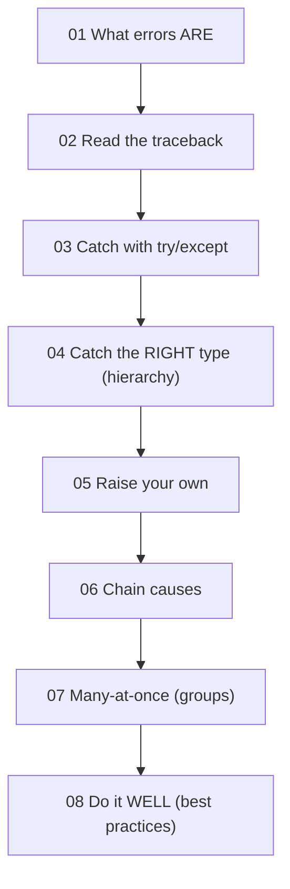

# Section 05 · Exceptions & Errors ⭐

> **Level:** Intermediate · **Prerequisites:** [Section 04](../04_oop/README.md) (custom exceptions are classes)
> **Time:** ~7 hours · **Verified:** 2026-06-04 (Python 3.12.13)

## This is the special topic

Most beginners *fear* the red error text. The goal of this section is to flip that fear into fluency. A traceback isn't Python yelling at you — it's Python handing you a precise map to the problem. And exceptions aren't just "crashes"; they're a **control-flow tool** you use deliberately to handle the messy real world: missing files, bad user input, flaky networks, empty lists.

By the end you'll **read any traceback**, **handle failure gracefully**, **design your own exception types**, and know the difference between robust error handling and the anti-patterns that silently hide bugs. Everything after this — concurrency, async, and FastAPI's error responses — depends on these skills.

## Why this section sits here

It comes right after OOP (custom exceptions are classes) and right before concurrency/async/web (where errors are *constant* and must be handled deliberately). You've now written enough code to have *hit* `NameError`, `TypeError`, `KeyError`, `ValueError`, `IndexError`, `ZeroDivisionError` — we've flagged each as it appeared. Now we make sense of all of them, systematically.

## Modules

| # | Module | You'll learn to… |
|---|--------|------------------|
| 01 | [Errors vs exceptions](01_errors_vs_exceptions.md) | Tell syntax errors from runtime exceptions; the mental model |
| 02 | [Reading tracebacks](02_reading_tracebacks.md) | Decode any traceback, including 3.12's pinpoint carets |
| 03 | [try / except / else / finally](03_try_except_else_finally.md) | Catch and recover from errors with the full statement |
| 04 | [The exception hierarchy](04_exception_hierarchy.md) | Catch the right exceptions using the built-in class tree |
| 05 | [Raising & custom exceptions](05_raising_and_custom_exceptions.md) | Signal errors yourself; design a clean exception type |
| 06 | [Chaining & context](06_chaining_and_context.md) | Preserve the original cause with `raise ... from` |
| 07 | [Exception groups](07_exception_groups.md) | Handle many errors at once with `ExceptionGroup`/`except*` (3.11+) |
| 08 | [Best practices](08_best_practices.md) | EAFP vs LBYL, logging, and anti-patterns to avoid |

→ Start: **[01 · Errors vs exceptions](01_errors_vs_exceptions.md)**
