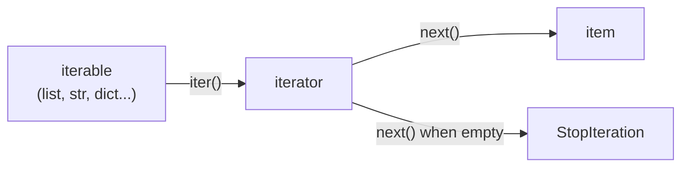

# 01 · Iterators & Iterables

> **Level:** Intermediate · **Prerequisites:** [Section 05](../05_exceptions_and_errors/README.md)
> **Time:** ~1 hour · **Verified:** 2026-06-04 (Python 3.12.13)

## Why this matters

Every `for` loop you've written secretly uses the **iterator protocol**. Understanding it demystifies how `for` works, lets you loop over your *own* objects, and is the foundation for generators (next module) and async iteration later. It also explains a common bug: why an iterator can only be consumed *once*.

## Concept: iterable vs iterator

Two related but distinct ideas:

- **Iterable:** something you *can* loop over — a list, string, dict, set, range. It can produce an iterator.
- **Iterator:** the object that actually does the walking — it remembers *where it is* and gives you the next item on demand.

The built-ins that connect them:
- `iter(iterable)` → returns a fresh **iterator**.
- `next(iterator)` → returns the **next item**, or raises `StopIteration` when exhausted.

```python
nums = [10, 20, 30]      # a list is an ITERABLE
it = iter(nums)          # get an ITERATOR from it

print(next(it))          # 10
print(next(it))          # 20
print(next(it))          # 30
next(it)                 # raises StopIteration — nothing left
```

```text
10
20
30
```
then:
```text
StopIteration
```

## Concept: this is exactly what `for` does

A `for` loop is just `iter` + `next` + catching `StopIteration`, automated:

```python
# what you write:
for x in nums:
    print(x)

# what Python effectively does under the hood:
it = iter(nums)
while True:
    try:
        x = next(it)
    except StopIteration:
        break
    print(x)
```

Both print `10 20 30`. Now you know there's no magic — `for` is built on the same `iter`/`next` you can call yourself, and the `StopIteration` you met in [the exception hierarchy](../05_exceptions_and_errors/04_exception_hierarchy.md) is the normal "we're done" signal.



## Concept: iterators are single-use

An iterator remembers its position and **can't be rewound**. Once exhausted, it's done — you must make a new one. This catches many beginners:

```python
it = iter([1, 2, 3])
print(list(it))     # [1, 2, 3]  -> consumes all of it
print(list(it))     # []         -> already exhausted!
```

```text
[1, 2, 3]
[]
```

A *list* can be looped many times (each `for` calls `iter()` afresh), but a bare *iterator* (or a generator, next module) is one-shot. If you need the data twice, keep the list, or rebuild the iterator.

## Concept: making your own iterator

To make a class iterable, implement two dunder methods ([Section 04](../04_oop/05_dunder_methods.md)):
- `__iter__(self)` → returns an iterator (often `self`).
- `__next__(self)` → returns the next value, or raises `StopIteration`.

```python
class Countdown:
    """Counts down from `start` to 1."""
    def __init__(self, start):
        self.start = start
    def __iter__(self):
        self.n = self.start      # reset position when iteration begins
        return self              # this object is its own iterator
    def __next__(self):
        if self.n <= 0:
            raise StopIteration  # signal: no more items
        self.n -= 1
        return self.n + 1

print(list(Countdown(3)))        # [3, 2, 1]
for x in Countdown(2):
    print(x)
```

Output (verified):

```text
[3, 2, 1]
2
1
```

Because `Countdown` implements the protocol, it works everywhere an iterable is expected — `for`, `list()`, `sum()`, comprehensions. You've extended Python's iteration to your own type.

> 🧠 **In practice, you'll rarely write `__iter__`/`__next__` by hand** — generators (next module) give you the same power with far less code. But knowing the protocol is what makes generators make sense.

## Worked example: a paginator

```python
# paginator.py — iterate over fixed-size chunks of a sequence.

class Paginator:
    """Yield successive `size`-item pages from a list."""
    def __init__(self, items, size):
        self.items = items
        self.size = size
    def __iter__(self):
        self.pos = 0
        return self
    def __next__(self):
        if self.pos >= len(self.items):
            raise StopIteration
        page = self.items[self.pos : self.pos + self.size]
        self.pos += self.size
        return page

data = ["a", "b", "c", "d", "e"]
for page_num, page in enumerate(Paginator(data, size=2), start=1):
    print(f"Page {page_num}: {page}")
```

Output (verified):

```text
Page 1: ['a', 'b']
Page 2: ['c', 'd']
Page 3: ['e']
```

The paginator hands out slices one page at a time — useful for processing big datasets in batches. (We combine it with `enumerate` from [Section 01](../01_fundamentals/07_loops.md) to number the pages.)

## Common mistakes

**Mistake: expecting to reuse an exhausted iterator**
```python
it = iter([1, 2, 3])
total = sum(it)        # consumes it
count = len(list(it))  # 0 — nothing left!
```
**Why:** `sum(it)` drained the iterator. Either keep the original list, or create a new iterator for each pass.

**Mistake: forgetting to raise `StopIteration`**
```python
class Bad:
    def __iter__(self): return self
    def __next__(self): return 1     # never stops!

for x in Bad(): print(x)             # infinite loop
```
**Why:** without a `StopIteration`, iteration never ends. Always have a termination condition that raises it.

## Practice

**Exercise:** Write an iterable class `Fibonacci(n)` that yields the first `n` Fibonacci numbers (1, 1, 2, 3, 5, ...). Implement `__iter__`/`__next__`. Print `list(Fibonacci(7))`.

<details><summary>Solution</summary>

```python
class Fibonacci:
    """Iterates the first `n` Fibonacci numbers."""
    def __init__(self, n):
        self.n = n
    def __iter__(self):
        self.count = 0
        self.a, self.b = 1, 1
        return self
    def __next__(self):
        if self.count >= self.n:
            raise StopIteration
        self.count += 1
        value = self.a
        self.a, self.b = self.b, self.a + self.b   # advance the pair
        return value

print(list(Fibonacci(7)))
```

Output:

```text
[1, 1, 2, 3, 5, 8, 13]
```

`__iter__` resets the state (count and the running pair), and `__next__` returns the current value then advances `a, b` using tuple unpacking — raising `StopIteration` after `n` items.
</details>

## Recap & next

- ✅ **Iterable** (can be looped) vs **iterator** (does the walking, tracks position).
- ✅ `iter()` makes an iterator; `next()` advances it; `StopIteration` ends it.
- ✅ A `for` loop *is* `iter` + `next` + catching `StopIteration`.
- ✅ Iterators are **single-use**.
- ✅ Implemented `__iter__`/`__next__` to make custom iterables.
- Self-check: why does `list(it)` return `[]` the second time you call it on the same iterator?

→ Next: **[02 · Generators](02_generators.md)**
