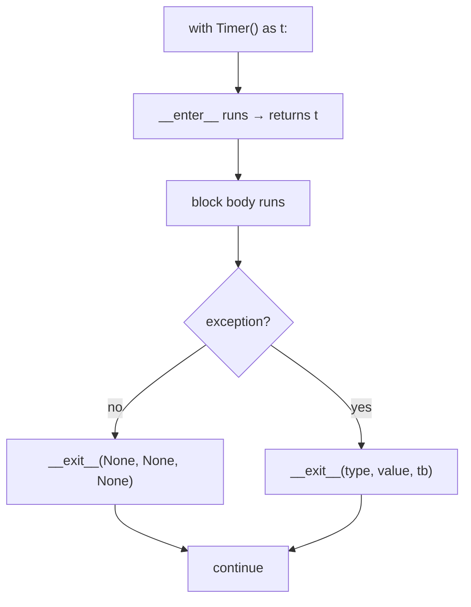

# 04 · Context Managers

> **Level:** Intermediate · **Prerequisites:** [Dunder methods](../04_oop/05_dunder_methods.md), [exceptions](../05_exceptions_and_errors/README.md)
> **Time:** ~1 hour · **Verified:** 2026-06-04 (Python 3.12.13)

## Why this matters

You've used `with open(...) as f:` since Section 03 without knowing how it works. A **context manager** is the object behind `with` — it guarantees **setup and cleanup** happen as a pair, *even if an error occurs in between*. Files get closed, locks get released, connections get returned to the pool — reliably. This is the clean alternative to `try/finally`, and it's the mechanism FastAPI uses for dependencies and lifespans (Section 09).

## Concept: the problem — cleanup that must happen

Open a file the manual way and you must remember to close it — and handle errors:

```python
f = open("/tmp/data.txt", "w")
try:
    f.write("hello")
finally:
    f.close()          # MUST run, even if write() raised
```

That `try/finally` is correct but noisy, and easy to forget. The `with` statement bundles it up:

```python
with open("/tmp/data.txt", "w") as f:
    f.write("hello")
# f.close() happens automatically here — even if write() had raised
```

The `with` block *is* the `try/finally`. When the block ends — normally or via an exception — the file is closed. That's a context manager at work.

## Concept: the protocol — `__enter__` and `__exit__`

A context manager is any object with two dunder methods:
- `__enter__(self)` — runs at the **start** of the `with`; its return value is bound by `as`.
- `__exit__(self, exc_type, exc_val, exc_tb)` — runs at the **end**, *always*; receives info about any exception (or `None`×3 if the block succeeded).

```python
import time

class Timer:
    """Times the code inside its `with` block."""
    def __enter__(self):
        self.start = time.perf_counter()
        return self                      # bound to the name after `as`
    def __exit__(self, exc_type, exc_val, exc_tb):
        self.elapsed = time.perf_counter() - self.start
        print(f"  elapsed: {self.elapsed*1000:.1f} ms")
        return False                     # see "suppressing" below

with Timer() as t:
    sum(range(100_000))
```

Output (timing varies):

```text
  elapsed: 0.9 ms
```

`__enter__` ran first (recording the start), the block ran, then `__exit__` ran (printing the elapsed time) — guaranteed.



## Concept: `__exit__` and exceptions — the return value matters

`__exit__` receives details of any exception raised in the block. Its **return value decides what happens next**:
- Return `False` (or `None`) → the exception **propagates** normally (the usual case).
- Return `True` → the exception is **suppressed** (swallowed). Use rarely and deliberately.

```python
class Suppress:
    """Swallow the given exception type(s) inside the block."""
    def __init__(self, *exc_types):
        self.exc_types = exc_types
    def __enter__(self):
        return self
    def __exit__(self, exc_type, exc_val, exc_tb):
        # True -> suppress; only suppress the types we were asked to
        return exc_type is not None and issubclass(exc_type, self.exc_types)

with Suppress(ZeroDivisionError):
    print("before")
    1 / 0                       # raises — but __exit__ returns True
    print("after (skipped)")    # never runs
print("continues normally")     # but the program continues!
```

Output (verified):

```text
before
continues normally
```

The division error was *suppressed* by `__exit__` returning `True`, so `"after (skipped)"` never printed but the program carried on. Crucially, cleanup in `__exit__` runs whether or not there's an exception — which is the whole point.

## Concept: the easy way — `@contextmanager`

Writing a class for every context manager is heavy. `contextlib.contextmanager` turns a **generator** into a context manager: code before `yield` is the setup, code after (ideally in a `finally`) is the cleanup.

```python
from contextlib import contextmanager

@contextmanager
def managed():
    print("setup")              # __enter__ part
    try:
        yield "resource"        # the value bound by `as`
    finally:
        print("teardown")       # __exit__ part — always runs

with managed() as r:
    print("using", r)
```

Output (verified):

```text
setup
using resource
teardown
```

The single `yield` splits the function: everything before it is `__enter__`, everything after (in the `finally`) is `__exit__`. The `try/finally` ensures teardown runs even if the `with` block raises. This is the most common way to write context managers in practice — far less boilerplate than a class.

## Concept: ready-made context managers

The standard library ships handy ones in `contextlib`:

```python
from contextlib import suppress

# suppress: the clean way to ignore a specific expected exception
with suppress(FileNotFoundError):
    open("/tmp/nope_xyz.txt")      # missing — but no crash
print("survived missing file")
```

Output (verified):

```text
survived missing file
```

`contextlib.suppress(SomeError)` is the readable, intentional replacement for `try: ... except SomeError: pass`. Others worth knowing: `contextlib.redirect_stdout`, `contextlib.ExitStack` (manage a dynamic number of context managers). And you can open **multiple** at once:

```python
with open("/tmp/a.txt", "w") as a, open("/tmp/b.txt", "w") as b:
    a.write("A")
    b.write("B")
# both files closed here
```

## Worked example: a database-connection stand-in

```python
# db.py — guarantee the connection closes, even on error.

from contextlib import contextmanager

class FakeConnection:
    def __init__(self, name):
        self.name = name
        self.open = True
    def query(self, sql):
        if not self.open:
            raise RuntimeError("connection is closed")
        return f"[{self.name}] result of: {sql}"
    def close(self):
        self.open = False

@contextmanager
def connect(name):
    conn = FakeConnection(name)
    print(f"  opened {name}")
    try:
        yield conn                  # hand the connection to the `with` block
    finally:
        conn.close()                # ALWAYS close, even if the block raised
        print(f"  closed {name} (open={conn.open})")

# Normal use
with connect("main") as db:
    print(db.query("SELECT 1"))

# Even if the block raises, the connection still closes:
try:
    with connect("main") as db:
        print(db.query("SELECT 2"))
        raise ValueError("something went wrong mid-transaction")
except ValueError as e:
    print(f"  handled: {e}")
```

Output (verified):

```text
  opened main
[main] result of: SELECT 1
  closed main (open=False)
  opened main
[main] result of: SELECT 2
  closed main (open=False)
  handled: something went wrong mid-transaction
```

Note the order in the error case: the context manager's `finally` closes the connection (`closed main`) *before* the `except` handler runs (`handled: ...`) — cleanup happens as the exception travels out of the `with` block, on its way up to the handler. In *both* cases — success and mid-block error — the connection is closed by the `finally` in the context manager. That guarantee is why production code wraps resources (DB connections, files, network sockets, locks) in context managers.

## Common mistakes

**Mistake: not using `with` for resources**
```python
f = open("data.txt")
data = f.read()
# forgot f.close() — file handle leaks; on errors it's never closed
```
**Why:** leaked file handles/connections cause resource exhaustion. Use `with open(...) as f:` so cleanup is automatic.

**Mistake: no `try/finally` in a `@contextmanager` generator**
```python
@contextmanager
def bad():
    conn = connect()
    yield conn
    conn.close()          # if the block raises, this NEVER runs!
```
**Why:** an exception in the `with` block skips straight past the post-`yield` code unless it's in a `finally`. Always wrap the `yield` in `try/finally`.

**Mistake: returning `True` from `__exit__` by accident**
```python
def __exit__(self, *a):
    print("cleanup")
    # no explicit return -> returns None (falsy) -> exception propagates: GOOD
```
**Why:** returning a truthy value silently swallows exceptions. Return `False`/`None` unless you *intend* to suppress.

## Practice

**Exercise:** Write a context manager `temporary_file(content)` (using `@contextmanager`) that creates a temp file with the given content, yields its `Path`, and **deletes it on exit** — even if the block raises. Demonstrate that the file exists inside the block and is gone afterwards.

<details><summary>Solution</summary>

```python
from contextlib import contextmanager
from pathlib import Path

@contextmanager
def temporary_file(content):
    path = Path("/tmp/_temp_demo.txt")
    path.write_text(content)
    try:
        yield path                  # give the path to the block
    finally:
        path.unlink(missing_ok=True)   # delete it, always

with temporary_file("hello") as p:
    print("inside block, exists:", p.exists())
    print("content:", p.read_text())

print("after block, exists:", p.exists())
```

Output:

```text
inside block, exists: True
content: hello
after block, exists: False
```

The file is created in the setup phase, available throughout the block, and the `finally` deletes it on exit — so it's gone afterwards regardless of how the block ended.
</details>

## Recap & next

- ✅ A context manager guarantees paired **setup/cleanup** via `with`.
- ✅ Implemented the protocol with `__enter__`/`__exit__` (the `as` value comes from `__enter__`).
- ✅ `__exit__`'s return value controls exception suppression (`False`/`None` = propagate).
- ✅ Used `@contextmanager` + a generator (`try/finally` around `yield`) for the easy way.
- ✅ Used ready-made `contextlib.suppress` and multiple managers in one `with`.
- Self-check: in a `@contextmanager`, why must the cleanup go in a `finally`?

→ Next: **[05 · Advanced typing](05_advanced_typing.md)**
