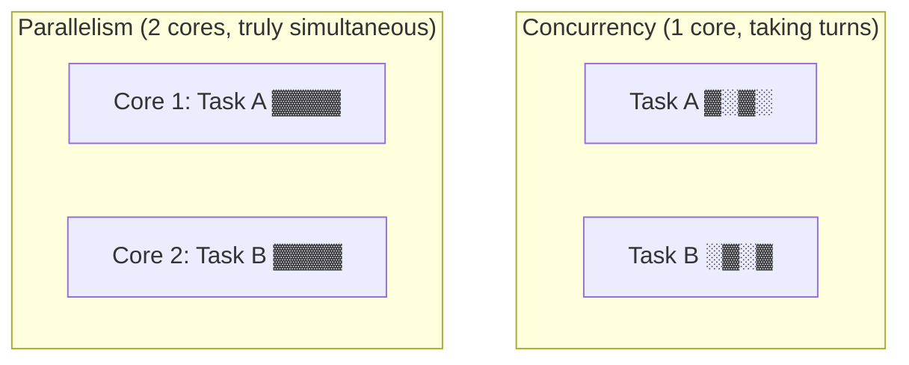
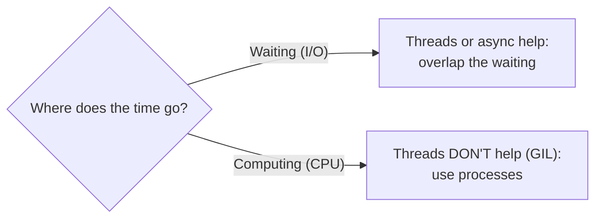
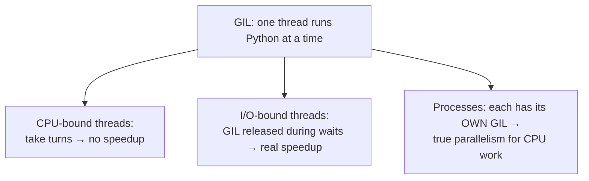

# 01 · Concurrency, Parallelism & the GIL

> **Level:** Advanced · **Prerequisites:** [Section 05](../05_exceptions_and_errors/README.md)
> **Time:** ~1 hour · **Verified:** 2026-06-04 (Python 3.12.13)

## Why this matters

Before writing any threaded code, you need the mental model — otherwise you'll reach for the wrong tool and get *slower* code. The single most important thing to understand in Python concurrency is the **GIL** (Global Interpreter Lock): it's the reason threads don't speed up CPU-heavy work, and why "use threads for I/O, processes for CPU" is the golden rule.

## Concept: concurrency vs parallelism

These words are used loosely, but they're different:

- **Concurrency:** *dealing with* many things at once — structuring your program so multiple tasks are in progress, taking turns. Like one chef juggling several dishes, switching between them.
- **Parallelism:** *doing* many things at the exact same instant — literally running on multiple CPU cores simultaneously. Like several chefs each cooking one dish.



Concurrency is about *structure*; parallelism is about *execution*. You can have concurrency without parallelism (one core switching between tasks) — and that's exactly what Python threads give you, because of the GIL.

## Concept: I/O-bound vs CPU-bound

The *kind* of work decides the right tool. This distinction is everything:

- **I/O-bound:** most time is spent **waiting** — for the network, disk, or a database. The CPU is idle during the wait. Examples: web requests, reading files, querying a DB.
- **CPU-bound:** most time is spent **computing** — the CPU is busy the whole time. Examples: image processing, number crunching, parsing huge data.



While one task **waits** on I/O, another can run — so overlapping the waiting (with threads or async) gives big speedups. But if every task is **busy computing**, there's no idle time to fill, and threads can't help in Python — because of the GIL.

## Concept: the GIL (Global Interpreter Lock)

The **GIL** is a lock inside CPython (the standard Python interpreter) that allows **only one thread to execute Python bytecode at a time**, even on a multi-core machine. It exists because it makes CPython's memory management simpler and single-threaded code faster.

The consequence:

- For **CPU-bound** work, threads run *one at a time* (taking turns holding the GIL), so multiple threads give **no speedup** — sometimes a slight slowdown from switching overhead.
- For **I/O-bound** work, the GIL is **released while a thread waits** for I/O, so other threads run during that wait — threads *do* help.



> 🧠 **The golden rule:**
> - **I/O-bound → threads** (Module 02) **or async** (Section 08).
> - **CPU-bound → processes** (Module 04), because each process has its *own* interpreter and *own* GIL, so they run truly in parallel.

> 📌 **The GIL is changing.** Python 3.13 introduced an *experimental* free-threaded build (PEP 703) that can disable the GIL, and 3.12 added per-interpreter GILs (PEP 684) for advanced use. But the **standard** interpreter you'll use still has the GIL, so the golden rule above remains the practical guidance for now.

## Concept: seeing the GIL in action

Here's the proof. The same CPU-heavy work, run with 4 threads vs 4 processes:

```python
# mp_demo.py
import time
from concurrent.futures import ProcessPoolExecutor, ThreadPoolExecutor

def cpu_heavy(n):
    total = 0
    for i in range(n):
        total += i * i
    return total

if __name__ == "__main__":
    tasks = [5_000_000] * 4

    start = time.perf_counter()
    with ThreadPoolExecutor(max_workers=4) as ex:
        list(ex.map(cpu_heavy, tasks))
    print(f"threads:   {time.perf_counter() - start:.2f}s")

    start = time.perf_counter()
    with ProcessPoolExecutor(max_workers=4) as ex:
        list(ex.map(cpu_heavy, tasks))
    print(f"processes: {time.perf_counter() - start:.2f}s")
```

Output (verified on a 12-core machine; exact numbers vary):

```text
threads:   0.85s
processes: 0.30s
```

The processes were **~2.8× faster** for the identical CPU work. The four *threads* couldn't run in parallel (the GIL forced them to take turns), but the four *processes* each used a separate core. This single experiment is the whole reason the golden rule exists. (The `if __name__ == "__main__":` guard is **required** for multiprocessing — Module 04 explains why.)

## Concept: when concurrency *isn't* worth it

Concurrency adds complexity — race conditions, harder debugging, overhead. Don't reach for it reflexively:

- **Tiny workloads:** the setup cost (spawning threads/processes) can exceed the work itself.
- **Purely sequential logic:** if step B needs step A's result, there's nothing to overlap.
- **When simpler is fine:** a script that runs in 50 ms doesn't need threads.

Use concurrency when you have *independent* work and a real bottleneck (lots of waiting, or lots of computing across cores). Otherwise, plain sequential code is easier to write and debug.

## Common mistakes

**Mistake: using threads to speed up CPU-bound work**
```python
# Four threads crunching numbers — NO faster than one, due to the GIL
with ThreadPoolExecutor(max_workers=4) as ex:
    ex.map(cpu_heavy, tasks)
```
**Why:** the GIL serialises Python bytecode. For CPU work, use `ProcessPoolExecutor` instead.

**Mistake: using processes for tiny or I/O-bound tasks**
**Why:** processes have high startup cost and must *copy* data between them (pickling). For I/O-bound work, threads/async are lighter and faster. Match the tool to the bottleneck.

## Practice

**Exercise (conceptual):** For each task, say whether it's **I/O-bound** or **CPU-bound**, and which tool you'd choose (threads, processes, or async):
1. Downloading 100 web pages.
2. Resizing 100 large images.
3. Reading 50 files from disk and counting words.
4. Computing SHA-256 hashes of 100 GB of data.

<details><summary>Solution</summary>

1. **I/O-bound** (waiting on the network) → **threads** or **async**. Overlap the waiting.
2. **CPU-bound** (image maths) → **processes**. Use all cores; the GIL would block threads.
3. **I/O-bound** (waiting on disk reads) → **threads** (or async with async file I/O). The word-counting is light.
4. **CPU-bound** (hashing is heavy computation) → **processes**, to run hashes in parallel across cores.

The pattern: *waiting* → threads/async; *computing* → processes. When unsure, ask "is the CPU busy or idle while this runs?"
</details>

## Recap & next

- ✅ **Concurrency** (structuring tasks to take turns) vs **parallelism** (truly simultaneous).
- ✅ **I/O-bound** (waiting) vs **CPU-bound** (computing) decides the tool.
- ✅ The **GIL** lets only one thread run Python bytecode at a time → threads don't speed up CPU work.
- ✅ **Golden rule:** I/O-bound → threads/async; CPU-bound → processes.
- ✅ Concurrency isn't free — use it for real bottlenecks with independent work.
- Self-check: why do 4 threads fail to speed up a CPU-heavy task, while 4 processes succeed?

→ Next: **[02 · Threading](02_threading.md)**
