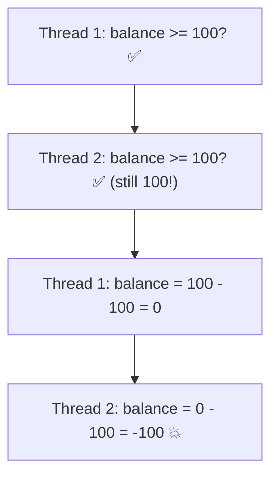
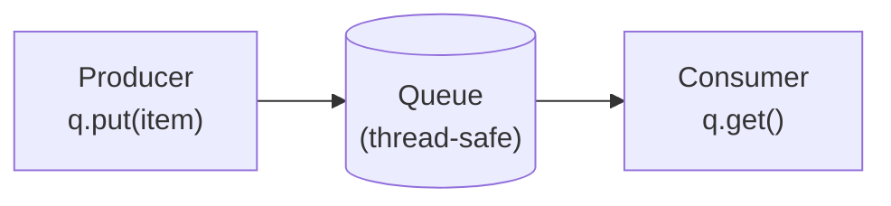

# 03 · Synchronization

> **Level:** Advanced · **Prerequisites:** [02 · Threading](02_threading.md)
> **Time:** ~1 hour · **Verified:** 2026-06-04 (Python 3.12.13)

## Why this matters

When threads share data, they can step on each other — two threads reading and updating the same value at once produce wrong results. These **race conditions** are among the nastiest bugs in programming: intermittent, hard to reproduce, and silent. This module shows how races happen and the tools to prevent them — **locks** for protecting shared state, and **queues** for safely passing work between threads.

## Concept: the race condition

A **race condition** is when the result depends on the unpredictable *timing* of threads. The classic case: "check then act" on shared state. Two threads both check, both see "OK", both act — but only one should have.

```python
import threading, time

balance = 100

def withdraw(amount):
    global balance
    if balance >= amount:        # CHECK: enough money?
        time.sleep(0.001)        # (work happens here — a context-switch window)
        balance -= amount        # ACT: take the money

# Two threads each try to withdraw 100 from a balance of 100
t1 = threading.Thread(target=withdraw, args=(100,))
t2 = threading.Thread(target=withdraw, args=(100,))
t1.start(); t2.start()
t1.join(); t2.join()

print("final balance:", balance)
```

Output (verified):

```text
final balance: -100
```

**Disaster.** Both threads checked `balance >= 100` *before* either subtracted — both saw 100, both passed the check, both withdrew. The balance went *negative*, which should be impossible. The `sleep` just widens the window; without it the bug is rarer but still real. This is exactly how real systems lose money or double-book seats.



> 🧠 **Why the GIL doesn't save you:** the GIL makes a *single bytecode op* atomic, but `if balance >= amount: ... balance -= amount` is *many* ops with gaps in between. A thread can be paused mid-sequence, letting another run. The GIL prevents memory corruption, not logical races.

## Concept: the `Lock`

A **lock** (mutex) ensures only one thread at a time can run a protected section ("critical section"). A thread *acquires* the lock, does its work, and *releases* it; others wait their turn.

```python
import threading, time

balance = 100
lock = threading.Lock()

def withdraw(amount):
    global balance
    with lock:                   # acquire the lock (others wait here)
        if balance >= amount:
            time.sleep(0.001)
            balance -= amount
    # lock released automatically when the `with` block ends

t1 = threading.Thread(target=withdraw, args=(100,))
t2 = threading.Thread(target=withdraw, args=(100,))
t1.start(); t2.start()
t1.join(); t2.join()

print("final balance:", balance)
```

Output (verified):

```text
final balance: 0
```

Now it's **correct**. The first thread to acquire the lock does its full check-and-withdraw *atomically* — the second waits until the lock is free, by which time the balance is already 0 and its check fails. The check and the act can no longer be split apart.

- `lock = threading.Lock()` creates a lock (share *one* lock across the threads).
- `with lock:` acquires it on entry, releases it on exit — even if an exception occurs ([context managers](../06_pythonic_intermediate/04_context_managers.md) again!). Always prefer `with lock:` over manual `acquire()`/`release()`.

> ⚠️ **Keep critical sections small.** Hold the lock only around the shared-data access. Locking too much serialises your threads (killing concurrency); locking too little leaves races. And beware **deadlock**: if thread A holds lock 1 waiting for lock 2 while thread B holds lock 2 waiting for lock 1, both freeze forever. Acquire multiple locks in a consistent order to avoid it.

## Concept: confirming a lock fixes a counter race

A simpler, classic demonstration — incrementing a shared counter. The lock guarantees the expected total:

```python
import threading

counter = 0
lock = threading.Lock()

def increment():
    global counter
    for _ in range(100_000):
        with lock:               # protect the read-modify-write
            counter += 1

threads = [threading.Thread(target=increment) for _ in range(2)]
for t in threads: t.start()
for t in threads: t.join()

print("counter:", counter)       # exactly 200000, every time
```

Output (verified):

```text
counter: 200000
```

With the lock, two threads each adding 100,000 reliably reach 200,000. (Without it, you *can* get a smaller number on some systems/versions because increments are lost — the lock removes all doubt.)

## Concept: `Queue` — safe communication between threads

Often the cleanest design is to **not share mutable state at all** — instead, pass data between threads through a thread-safe **`queue.Queue`**. Queues handle all the locking internally, so you never touch a `Lock` yourself. This is the **producer/consumer** pattern:

```python
import queue, threading

q = queue.Queue()
results = []

def producer():
    for i in range(5):
        q.put(i)             # put work items on the queue
    q.put(None)              # a sentinel value meaning "no more work"

def consumer():
    while True:
        item = q.get()       # blocks until an item is available
        if item is None:     # sentinel -> stop
            break
        results.append(item * 10)
        q.task_done()

p = threading.Thread(target=producer)
c = threading.Thread(target=consumer)
p.start(); c.start()
p.join(); c.join()

print("processed:", results)
```

Output (verified):

```text
processed: [0, 10, 20, 30, 40]
```

- `q.put(x)` adds an item; `q.get()` removes one (blocking until one exists).
- The **sentinel** (`None`) tells the consumer to stop — a common, clean shutdown signal.
- `Queue` is **thread-safe**: multiple producers/consumers can use it without you writing a single lock. This is why "communicate by passing messages, don't share memory" is the preferred design — it sidesteps the whole race-condition problem.



## Concept: other synchronization primitives (brief)

The `threading` module has more tools for specific needs — know they exist:

| Primitive | For |
|-----------|-----|
| `Lock` | mutual exclusion (one thread in a section) |
| `RLock` | a lock the *same* thread can acquire repeatedly (re-entrant) |
| `Event` | one thread signals others to proceed (`set()`/`wait()`) |
| `Semaphore` | allow *up to N* threads at once (e.g. limit concurrent connections) |
| `Condition` | wait for a condition + notify (advanced producer/consumer) |
| `Barrier` | make threads wait until all reach a point |

For most code, `Lock` and `Queue` cover the vast majority of needs.

## Common mistakes

**Mistake: forgetting to lock shared mutable state**
```python
counter += 1     # from multiple threads, with no lock -> race
```
**Why:** any read-modify-write on shared data needs protection. Lock it, or use a `Queue`/atomic design.

**Mistake: each thread creating its own lock**
```python
def work():
    lock = threading.Lock()   # a NEW lock per call — protects nothing!
    with lock: ...
```
**Why:** a lock only synchronises threads that share *the same* lock object. Create it once, outside, and share it.

**Mistake: holding a lock during slow I/O**
```python
with lock:
    data = download(url)      # network wait while holding the lock -> no concurrency
```
**Why:** other threads block the whole time. Acquire the lock only around the actual shared-data update, not the slow part.

## Practice

**Exercise:** Ten threads each add their ID (1–10) to a shared running total. Without a lock the result is unreliable; with a lock it must equal `sum(1..10) = 55`. Write the locked version and confirm it always gives 55. (Have each thread add its id 1000 times, so the expected total is `55 * 1000 = 55000`.)

<details><summary>Solution</summary>

```python
import threading

total = 0
lock = threading.Lock()

def add_id(uid):
    global total
    for _ in range(1000):
        with lock:                 # protect the shared total
            total += uid

threads = [threading.Thread(target=add_id, args=(uid,)) for uid in range(1, 11)]
for t in threads: t.start()
for t in threads: t.join()

print("total:", total)             # 55 * 1000
print("correct:", total == 55 * 1000)
```

Output:

```text
total: 55000
correct: True
```

Each thread adds its id 1000 times; the shared lock makes every `total += uid` atomic, so no updates are lost and the total is always exactly 55000.
</details>

## Recap & next

- ✅ **Race conditions** happen when threads interleave on shared state ("check then act").
- ✅ The GIL prevents corruption but **not** logical races.
- ✅ A **`Lock`** (used via `with lock:`) makes a critical section atomic — keep it small.
- ✅ Beware **deadlock**; acquire multiple locks in a consistent order.
- ✅ **`queue.Queue`** lets threads pass work safely with no manual locking (producer/consumer).
- Self-check: why doesn't the GIL prevent the negative-balance bug?

→ Next: **[04 · Multiprocessing & pools](04_multiprocessing_and_pools.md)**
