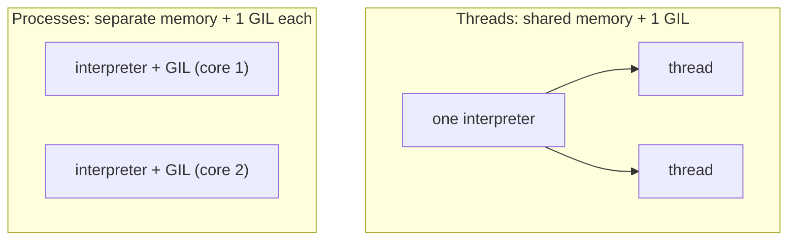

# 04 · Multiprocessing & Pools

> **Level:** Advanced · **Prerequisites:** [01 · The GIL](01_concurrency_vs_parallelism_and_the_gil.md), [02 · Threading](02_threading.md)
> **Time:** ~1.5 hours · **Verified:** 2026-06-04 (Python 3.12.13)

## Why this matters

For **CPU-bound** work, threads hit the GIL wall (Module 01). **Multiprocessing** sidesteps it: each process is a *separate Python interpreter* with its *own GIL*, so processes run truly in parallel across your CPU cores. This is how you make number-crunching, image processing, and data parsing actually use all your hardware. The API mirrors threading, so most of what you learned transfers.

## Concept: processes vs threads

| | Threads | Processes |
|--|---------|-----------|
| Memory | **shared** (one interpreter) | **separate** (each its own) |
| GIL | one shared GIL → no CPU parallelism | one GIL *each* → true parallelism |
| Communication | shared variables (need locks) | message-passing (pickling) |
| Startup cost | cheap | heavier |
| Best for | I/O-bound | **CPU-bound** |

Because processes don't share memory, there are **no race conditions on ordinary variables** — but you also can't just share a list; data is *copied* between processes (serialised with `pickle`). That copying is the price of true parallelism.



## Concept: `ProcessPoolExecutor` (the easy way)

The best part: `ProcessPoolExecutor` has the **same interface** as `ThreadPoolExecutor` (Module 02) — just swap the class. Everything you learned about `map`/`submit`/`Future` applies.

```python
# mp_full.py  — note: multiprocessing code MUST be guarded by __main__
import time
from concurrent.futures import ProcessPoolExecutor

def slow_square(x):
    time.sleep(0.05)
    return x * x

if __name__ == "__main__":                 # REQUIRED — see below
    with ProcessPoolExecutor(max_workers=4) as ex:
        results = list(ex.map(slow_square, range(8)))
    print("results:", results)
```

Output (verified):

```text
results: [0, 1, 4, 9, 16, 25, 36, 49]
```

Identical to the threaded version — but now CPU-heavy `slow_square` calls run in *parallel processes* on different cores. For real CPU work (not a `sleep`), this is where the speedup over threads appears (recall the 2.8× from [Module 01](01_concurrency_vs_parallelism_and_the_gil.md)).

## Concept: the `if __name__ == "__main__":` requirement ⚠️

This guard ([Section 03](../03_functions_and_modules/04_modules_and_packages.md)) is **mandatory** for multiprocessing on Windows and macOS (and good practice everywhere). Here's why: to start a new process, Python **imports your script** in the child. Without the guard, the child would re-run your process-spawning code, which spawns more children, which re-run it... — an infinite explosion of processes (or a crash).

```python
# ❌ WITHOUT the guard — on Windows/macOS this spawns processes recursively
with ProcessPoolExecutor() as ex:
    ex.map(work, data)

# ✅ WITH the guard — the spawning code runs only in the main process
if __name__ == "__main__":
    with ProcessPoolExecutor() as ex:
        ex.map(work, data)
```

**Rule:** any script that uses multiprocessing must put the process-creating code inside `if __name__ == "__main__":`.

## Concept: `multiprocessing.Pool` (the classic API)

The `multiprocessing` module's own `Pool` is the older, still-common API. Functionally similar to `ProcessPoolExecutor`:

```python
from multiprocessing import Pool

def cpu_task(n):
    return sum(i * i for i in range(n))

if __name__ == "__main__":
    with Pool(processes=4) as pool:
        sums = pool.map(cpu_task, [100, 1000, 10000])
    print("sums:", sums)
```

Output (verified):

```text
sums: [328350, 332833500, 333283335000]
```

`pool.map` distributes the inputs across worker processes and collects results in order. `Pool` also offers `apply_async`, `starmap` (for multi-argument functions), and `imap` (lazy). For new code, `ProcessPoolExecutor` is often preferred for its unified `concurrent.futures` interface (same as threads), but you'll see `Pool` widely.

## Concept: what can (and can't) cross process boundaries

Because arguments and results are **pickled** (serialised) to travel between processes, they must be **picklable**:

- ✅ Works: numbers, strings, lists, dicts, most objects, module-level functions.
- ❌ Fails: lambdas, locally-defined (nested) functions, open files/sockets, database connections.

```python
# ❌ This fails — lambdas can't be pickled:
# with ProcessPoolExecutor() as ex:
#     ex.map(lambda x: x*x, range(5))   # raises a PicklingError

# ✅ Use a module-level (top-level) function instead:
def square(x):
    return x * x
```

> 🧠 **Design implication:** pass *data*, not handles. Send a filename (a string) to the worker and let it open the file, rather than trying to pass an open file object. Keep the per-task data small, since it's copied.

## Concept: sharing results back

Each process has its own memory, so you can't collect results by appending to a shared list (the workers would each modify their *own* copy). Instead, **return** values and let the pool gather them — exactly what `map`/`submit` do:

```python
from concurrent.futures import ProcessPoolExecutor

def process_chunk(chunk):
    return sum(chunk)                  # RETURN the result; don't mutate shared state

if __name__ == "__main__":
    chunks = [[1, 2, 3], [4, 5, 6], [7, 8, 9]]
    with ProcessPoolExecutor() as ex:
        partial_sums = list(ex.map(process_chunk, chunks))
    print("partial sums:", partial_sums)   # [6, 15, 24]
    print("grand total:", sum(partial_sums))  # 45
```

Output (verified):

```text
partial sums: [6, 15, 24]
grand total: 45
```

This "**map** chunks to workers, then **reduce** the partial results in the parent" is the core pattern for parallel data processing. (For genuinely shared memory across processes, `multiprocessing` offers `Value`, `Array`, and `Manager`, but returning results is simpler and usually better.)

## Worked example: parallel word counting

```python
# wordcount.py — split text into chunks, count words in parallel, combine.

from concurrent.futures import ProcessPoolExecutor
from collections import Counter

def count_words(text):
    return Counter(text.split())       # runs in a worker process

if __name__ == "__main__":
    documents = [
        "the cat sat on the mat",
        "the dog ran in the park",
        "the cat and the dog played",
    ]

    # Count each document in parallel
    with ProcessPoolExecutor(max_workers=3) as ex:
        counters = list(ex.map(count_words, documents))

    # Combine the partial Counters in the parent (reduce step)
    total = Counter()
    for c in counters:
        total += c

    print("top 3 words:", total.most_common(3))
```

Output (verified):

```text
top 3 words: [('the', 6), ('cat', 2), ('dog', 2)]
```

Each document is counted in its own process (parallel for large inputs), then the parent merges the `Counter`s ([Section 03 stdlib](../03_functions_and_modules/06_standard_library_tour.md)). Scale this to thousands of documents and the parallelism across cores is a real win — the canonical "map-reduce" shape.

## Common mistakes

**Mistake: omitting `if __name__ == "__main__":`**
```text
RuntimeError: An attempt has been made to start a new process before the
current process has finished its bootstrapping phase...
```
**Why:** the child re-imports your module and re-runs the spawning code. Guard it with `if __name__ == "__main__":`.

**Mistake: trying to pass a lambda or local function**
```python
ex.map(lambda x: x * 2, data)    # PicklingError
```
**Why:** lambdas/nested functions can't be pickled to send to a process. Define a top-level function.

**Mistake: using processes for I/O-bound or tiny tasks**
**Why:** process startup and data-copying overhead outweighs the benefit. Use threads/async for I/O ([Module 02](02_threading.md), Section 08); reserve processes for genuine CPU-bound work.

## Practice

**Exercise:** You have a list of limits `[10_000, 50_000, 100_000, 200_000]`. Write a CPU-bound `count_primes(limit)` that counts the prime numbers below `limit`. Use `ProcessPoolExecutor` to compute all in parallel and print each result paired with its input. Remember the `__main__` guard and a top-level function.

<details><summary>Solution</summary>

```python
from concurrent.futures import ProcessPoolExecutor

def count_primes(limit):
    """Count primes below `limit` — a CPU-heavy computation."""
    count = 0
    for n in range(2, limit):
        is_prime = True
        for d in range(2, int(n ** 0.5) + 1):
            if n % d == 0:
                is_prime = False
                break
        if is_prime:
            count += 1
    return count

if __name__ == "__main__":
    inputs = [10_000, 50_000, 100_000, 200_000]
    with ProcessPoolExecutor(max_workers=4) as ex:
        results = list(ex.map(count_primes, inputs))
    for n, c in zip(inputs, results):
        print(f"primes below {n}: {c}")
```

Output:

```text
primes below 10000: 1229
primes below 50000: 5133
primes below 100000: 9592
primes below 200000: 17984
```

Each limit is counted in a separate process, using multiple cores in parallel; `zip` pairs each input with its result (`map` preserves order). The `__main__` guard and the top-level `count_primes` make it picklable and safe to spawn — and because each process has its own GIL, this genuinely uses all four cores.
</details>

## Recap & next

- ✅ Processes have **separate memory** and their **own GIL** → true parallelism for CPU work.
- ✅ `ProcessPoolExecutor` shares the **same API** as `ThreadPoolExecutor` — swap the class.
- ✅ The `if __name__ == "__main__":` guard is **required** for multiprocessing.
- ✅ Data is **pickled** between processes — pass picklable values; use top-level functions.
- ✅ **Return** results (map → reduce) rather than sharing mutable state.
- Self-check: why can a lambda be used with `ThreadPoolExecutor` but not `ProcessPoolExecutor`?

🎉 **Section 07 complete.** You can now use threads for I/O and processes for CPU. Next: a third model — `async` — that handles massive I/O concurrency in a single thread.

→ Next: **[Section 08 · Async](../08_async/README.md)**
