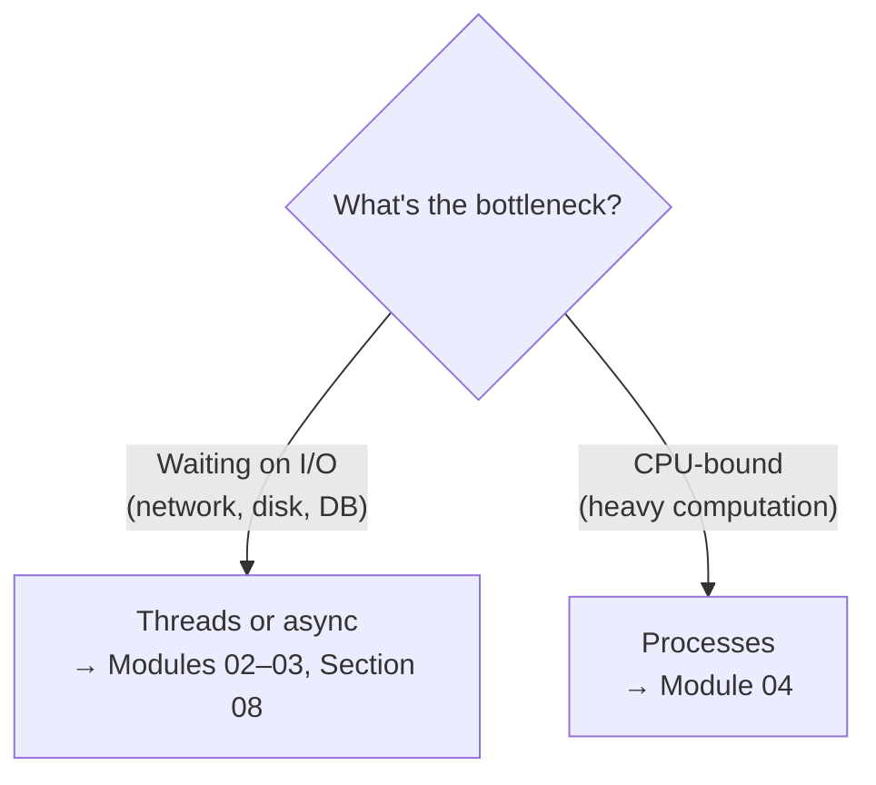

# Section 07 · Concurrency

> **Level:** Advanced · **Prerequisites:** [Functions](../03_functions_and_modules/README.md), [exceptions](../05_exceptions_and_errors/README.md)
> **Time:** ~5 hours · **Verified:** 2026-06-04 (Python 3.12.13)

Real programs often need to do several things at once: download ten files, handle many users, keep a UI responsive while crunching numbers. **Concurrency** is about structuring a program to make progress on multiple tasks. This section covers Python's two classic approaches — **threads** (great for I/O-bound work) and **processes** (great for CPU-bound work) — and the all-important **GIL** that decides which to use. The next section covers a third approach, **async**.

> ⚠️ **A note on output:** concurrency is inherently non-deterministic — the *order* in which threads print can vary between runs. The examples here are designed so the **final result** is deterministic (sums, totals, counts), and timing numbers are illustrative (they vary by machine; verified on a 12-core Linux box).

## Modules

| # | Module | You'll learn to… |
|---|--------|------------------|
| 01 | [Concurrency, parallelism & the GIL](01_concurrency_vs_parallelism_and_the_gil.md) | Understand the core concepts and Python's GIL |
| 02 | [Threading](02_threading.md) | Run I/O-bound work concurrently with threads & pools |
| 03 | [Synchronization](03_synchronization.md) | Avoid race conditions with locks and queues |
| 04 | [Multiprocessing & pools](04_multiprocessing_and_pools.md) | Use multiple CPU cores for CPU-bound work |

→ Start: **[01 · Concurrency, parallelism & the GIL](01_concurrency_vs_parallelism_and_the_gil.md)**
