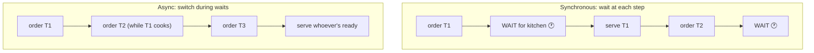
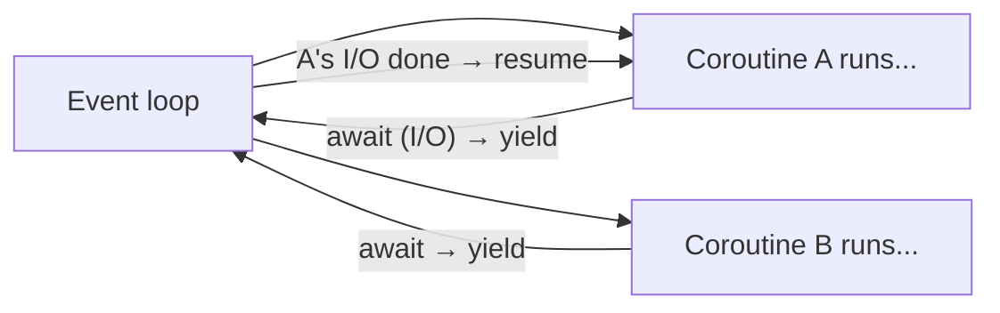
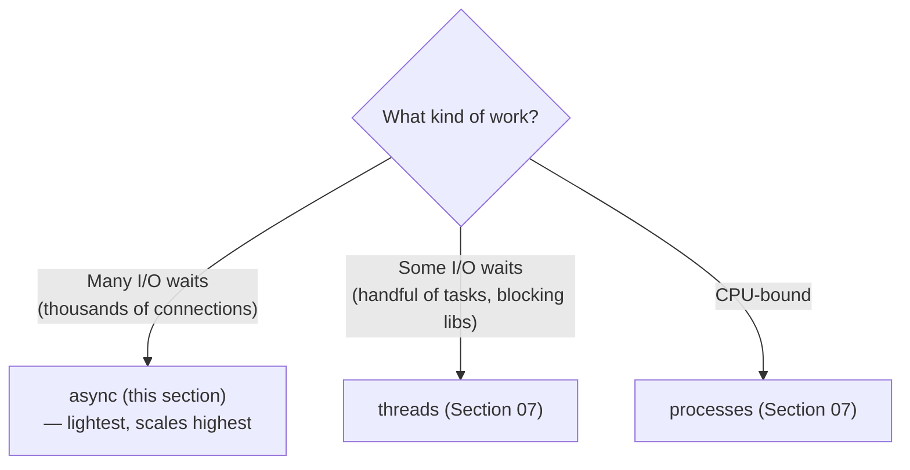

# 01 · Why Async

> **Level:** Advanced · **Prerequisites:** [Section 07](../07_concurrency/README.md)
> **Time:** ~1 hour · **Verified:** 2026-06-04 (Python 3.12.13)

## Why this matters

You already know threads handle I/O-bound work. **Async** does the same job differently — and at a different scale. Instead of many threads (each with memory and switching overhead), async runs everything in *one* thread, switching between tasks only when they *wait*. This lets a single process juggle thousands of network connections efficiently. Understanding *why* and *how the event loop works* is the foundation for everything in this section and FastAPI.

## Concept: the restaurant analogy

Imagine one waiter serving several tables:

- **Synchronous (blocking):** the waiter takes table 1's order, stands at the kitchen *waiting* for the food, delivers it, then moves to table 2. Tables 2–5 sit ignored during every wait. Slow.
- **Async (cooperative):** the waiter takes table 1's order, hands it to the kitchen, and *immediately* serves table 2 while table 1's food cooks. When any food is ready, they deliver it. One waiter, many tables, no idle waiting.

The waiter is your single thread. "Waiting for the kitchen" is I/O (network, disk). Async = the waiter never stands idle; they switch to other useful work during every wait.



## Concept: the event loop

At the heart of async is the **event loop** — a single-threaded scheduler that runs your coroutines. When a coroutine hits an `await` on something slow (I/O), it **yields control back to the loop**, which runs *other* ready coroutines meanwhile. When the awaited thing completes, the loop resumes that coroutine where it left off.



This is **cooperative multitasking**: tasks voluntarily give up control at `await` points. Contrast with threads (Section 07), where the OS *preemptively* switches at any time. The trade-offs:
- ✅ No GIL fighting, no per-thread memory, no locks needed for most code (only one thing runs at a time, and switches happen only at `await` — predictable).
- ⚠️ A task that *never* awaits (e.g. heavy computation, or a blocking call) **hogs the loop** and freezes everything — the cardinal async sin ([Module 04](04_async_pitfalls.md)).

## Concept: this is "single-threaded concurrency"

Key insight: async gives you **concurrency without parallelism** ([Section 07.01](../07_concurrency/01_concurrency_vs_parallelism_and_the_gil.md)). Everything runs in one thread on one core — but because tasks overlap their *waiting*, the program *feels* concurrent and handles huge I/O loads.

- It does **not** speed up CPU-bound work (one thread, one core — same as the GIL limit). Use processes for that.
- It **excels** at I/O-bound work with *many* concurrent operations — thousands of simultaneous network requests, web-socket connections, database queries.



## Concept: async vs threads — the practical differences

| | Threads | Async |
|--|---------|-------|
| Unit | OS thread | coroutine (`async def`) |
| Switching | preemptive (OS, anytime) | cooperative (only at `await`) |
| Overhead per task | ~MB of memory | ~KB — can have *millions* |
| Locks needed? | yes (preemption → races) | rarely (switches only at `await`) |
| Blocking calls | OK (one thread waits) | **forbidden** (freezes the loop) |
| Best scale | dozens–hundreds | thousands–millions of I/O tasks |

Both are for I/O-bound work. Async scales higher and is lighter, *but* requires async-aware libraries (you can't just `await` a normal blocking function). Threads work with any library but cost more per task. FastAPI is built on async, which is why it handles huge concurrent loads.

## Concept: your first taste of the speedup

We'll cover the syntax properly in Module 02, but here's the headline result so the *why* is concrete. Three tasks, each "waiting" 0.1s — run sequentially vs concurrently with async:

```python
import asyncio, time

async def fetch(name, delay):
    await asyncio.sleep(delay)      # simulate an I/O wait (yields to the loop)
    return f"{name} done"

async def sequential():            # await one after another
    start = time.perf_counter()
    await fetch("A", 0.1)
    await fetch("B", 0.1)
    await fetch("C", 0.1)
    return time.perf_counter() - start

async def concurrent():            # run all three at once
    start = time.perf_counter()
    await asyncio.gather(fetch("A", 0.1), fetch("B", 0.1), fetch("C", 0.1))
    return time.perf_counter() - start

print(f"sequential: {asyncio.run(sequential()):.2f}s")
print(f"concurrent: {asyncio.run(concurrent()):.2f}s")
```

Output (verified):

```text
sequential: 0.30s
concurrent: 0.10s
```

Same work, **3× faster** — because the three 0.1s waits *overlapped* in one thread. With async you could do this for *thousands* of tasks, not just three, in a single process. That scalability is why async exists. (Don't worry about `async def`, `await`, `gather`, or `asyncio.run` yet — that's the next two modules.)

## Common mistakes (preview)

**Mistake: thinking async makes everything faster**
**Why:** async only helps **I/O-bound** work with overlap-able waits. CPU-bound code in an async function still runs on one core and *blocks the loop* — it's actually worse than threads/processes there. Async is a scalability tool for I/O, not a magic speed-up.

**Mistake: expecting parallelism**
**Why:** async is single-threaded — concurrent, not parallel. For true multi-core parallelism, use processes (Section 07).

## Practice

**Exercise (conceptual):** For each scenario, pick **async**, **threads**, or **processes** and justify in one line:
1. A chat server handling 50,000 simultaneous WebSocket connections.
2. Resizing 200 photos as fast as possible on an 8-core machine.
3. A quick script that calls 5 REST APIs using a blocking `requests` library.
4. A web scraper making 10,000 concurrent HTTP requests with an async HTTP client.

<details><summary>Solution</summary>

1. **Async** — 50,000 mostly-idle connections; threads would need 50,000 OS threads (too much memory). Async coroutines are ~KB each.
2. **Processes** — CPU-bound image work; needs real multi-core parallelism, which async and threads (GIL) can't provide.
3. **Threads** (or just sequential) — only 5 tasks, and `requests` is *blocking* (not async-aware), so threads are the simple fit. Async would require an async HTTP client.
4. **Async** — 10,000 concurrent I/O waits with an async-aware client; this is async's sweet spot, scaling far beyond what threads handle comfortably.

The decision hinges on: CPU-bound → processes; many I/O waits + async libraries → async; few I/O waits or blocking libraries → threads.
</details>

## Recap & next

- ✅ Async = **cooperative, single-threaded concurrency**: tasks yield at `await`, the event loop runs others meanwhile.
- ✅ The **event loop** schedules coroutines; control returns to it at each `await`.
- ✅ Async is **concurrency without parallelism** — great for *many* I/O waits, useless for CPU work.
- ✅ vs threads: lighter, scales to thousands+, no locks usually — but needs async libraries and *never* block the loop.
- Self-check: why does async give concurrency but not parallelism?

→ Next: **[02 · Coroutines & await](02_coroutines_and_await.md)**
