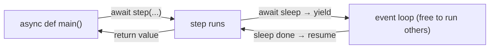

# 02 · Coroutines & await

> **Level:** Advanced · **Prerequisites:** [01 · Why async](01_why_async.md)
> **Time:** ~1.5 hours · **Verified:** 2026-06-04 (Python 3.12.13)

## Why this matters

Now the syntax. `async def` defines a **coroutine**; `await` is how one coroutine waits for another without blocking the event loop. These two keywords are the whole vocabulary of async Python. Get them right and the rest is library APIs. FastAPI route handlers are `async def` functions, so this is the exact pattern you'll write in Section 09.

## Concept: `async def` defines a coroutine

- **What:** a function defined with `async def` is a **coroutine function**. Calling it returns a **coroutine object** — it does *not* run the body yet.
- **Why:** coroutines can be paused and resumed by the event loop at `await` points.

```python
import asyncio

async def greet(name):
    await asyncio.sleep(0.05)        # pause here, yield to the loop, resume later
    return f"hello {name}"

# Calling it does NOT run it — it makes a coroutine object:
coro = greet("Ada")
print(type(coro).__name__)           # coroutine

# To actually run it, hand it to the event loop:
print(asyncio.run(greet("Ada")))     # hello Ada
```

Output (verified):

```text
coroutine
hello Ada
```

> ⚠️ **Calling a coroutine doesn't run it** — a frequent beginner shock. `greet("Ada")` just builds a coroutine object; you must `await` it or pass it to `asyncio.run`. (If you call one and ignore it, Python even warns: *"coroutine was never awaited"*.) This is exactly like a generator function not running until you iterate it ([Section 06.02](../06_pythonic_intermediate/02_generators.md)) — async grew out of generators.

## Concept: `asyncio.run` — the entry point

`asyncio.run(coro)` starts the event loop, runs your top-level coroutine until it finishes, and shuts the loop down. It's the standard way to *enter* async code from normal (synchronous) code:

```python
import asyncio

async def main():
    return "done"

result = asyncio.run(main())     # creates loop, runs main(), returns its result
print(result)                    # done
```

- Call `asyncio.run()` **once**, at your program's top level (the `if __name__ == "__main__":` of async).
- Everything async happens *inside* the coroutine you pass it.
- Don't call `asyncio.run()` from within a running loop — it's the boundary between sync and async worlds.

## Concept: `await` — wait without blocking

`await` can only be used **inside** an `async def`. It means: *"pause me here until this completes, and let the loop run other tasks meanwhile."*

```python
import asyncio

async def step(name, delay):
    print(f"  {name} starting")
    await asyncio.sleep(delay)       # non-blocking pause
    print(f"  {name} finished")
    return name

async def main():
    result = await step("task", 0.1)   # wait for it, yielding to the loop
    print(f"  got: {result}")

asyncio.run(main())
```

Output (verified):

```text
  task starting
  task finished
  got: task
```

- You can only `await` **awaitables** — coroutines, Tasks, and Futures.
- `await coro` runs `coro` to completion and gives you its return value.
- Crucially, `await asyncio.sleep(d)` is **not** `time.sleep(d)`: the async one *yields* to the loop (other tasks run during the wait); the regular one *blocks the whole thread* (nothing else runs — the #1 pitfall, [Module 04](04_async_pitfalls.md)).



## Concept: awaiting in sequence vs concurrently

A subtle but vital point: **`await` one-at-a-time runs them sequentially.** Awaiting in a row does *not* overlap them:

```python
import asyncio, time

async def fetch(name, delay):
    await asyncio.sleep(delay)
    return f"{name} done"

async def main():
    start = time.perf_counter()
    a = await fetch("A", 0.1)        # wait for A...
    b = await fetch("B", 0.1)        # ...THEN start B
    c = await fetch("C", 0.1)        # ...THEN start C
    print([a, b, c], f"{time.perf_counter() - start:.2f}s")

asyncio.run(main())
```

Output (verified):

```text
['A done', 'B done', 'C done'] 0.30s
```

**0.30s, not 0.10s** — because each `await` finishes before the next begins. To make them *overlap*, you need `gather` or tasks (next module). The takeaway: `await x` means "wait for x right now"; concurrency requires explicitly scheduling things to run *together*.

## Concept: async context managers and iterators (brief)

Async has `with`/`for` variants for resources and streams that themselves do I/O:

```python
import asyncio

# async context manager: __aenter__ / __aexit__, used with `async with`
class AsyncResource:
    async def __aenter__(self):
        await asyncio.sleep(0.01)        # e.g. open a connection
        print("  opened")
        return self
    async def __aexit__(self, *exc):
        await asyncio.sleep(0.01)        # e.g. close it
        print("  closed")

# async iterator: __aiter__ / __anext__, used with `async for`
async def countdown(n):
    while n > 0:
        await asyncio.sleep(0.01)
        yield n                          # an async generator
        n -= 1

async def main():
    async with AsyncResource():          # async with
        print("  using")
    async for i in countdown(3):         # async for
        print("  tick", i)

asyncio.run(main())
```

Output (verified):

```text
  opened
  using
  closed
  tick 3
  tick 2
  tick 1
```

`async with` and `async for` are just the async-aware versions of the `with`/`for` you know — used when entering/exiting or iterating itself involves awaiting I/O. (FastAPI uses `async with` for database sessions and lifespans.)

## Worked example: an async "fetch" with error handling

```python
# async_fetch.py — a coroutine that simulates a request and can fail.

import asyncio

async def fetch_user(uid):
    await asyncio.sleep(0.05)            # simulate network latency
    if uid <= 0:
        raise ValueError(f"invalid user id: {uid}")
    return {"id": uid, "name": f"user-{uid}"}

async def main():
    # normal exception handling works exactly as in Section 05
    for uid in [1, 2, -1]:
        try:
            user = await fetch_user(uid)
            print(f"  loaded {user}")
        except ValueError as e:
            print(f"  error: {e}")

asyncio.run(main())
```

Output (verified):

```text
  loaded {'id': 1, 'name': 'user-1'}
  loaded {'id': 2, 'name': 'user-2'}
  error: invalid user id: -1
```

`try`/`except` ([Section 05](../05_exceptions_and_errors/README.md)) works inside coroutines just like in normal functions — an exception raised in an awaited coroutine propagates to the `await`. Async doesn't change how *errors* work; it changes how *waiting* works.

## Common mistakes

**Mistake: forgetting to `await` a coroutine**
```python
async def main():
    fetch_user(1)        # creates a coroutine, never runs it!
```
```text
RuntimeWarning: coroutine 'fetch_user' was never awaited
```
**Why:** calling a coroutine function just makes the object. You must `await` it (or schedule it as a task). Heed the warning.

**Mistake: using `await` outside an `async def`**
```python
def main():              # regular function!
    await fetch_user(1)
```
```text
SyntaxError: 'await' outside async function
```
**Why:** `await` only works inside `async def`. The top level enters async via `asyncio.run`.

**Mistake: calling `asyncio.run` inside a running loop**
```python
async def main():
    asyncio.run(other())   # RuntimeError: cannot be called from a running loop
```
**Why:** `asyncio.run` *creates* a loop; you can't nest it. Inside a coroutine, just `await other()`.

## Practice

**Exercise:** Write a coroutine `make_coffee(kind)` that prints `"brewing <kind>"`, awaits `asyncio.sleep(0.05)`, and returns `"<kind> ready"`. In `main`, `await` it for `"espresso"` and print the result. Then add `prepare(steps)` that takes a list of `(name, delay)` and awaits each in sequence, printing total time — and confirm sequential awaits add up.

<details><summary>Solution</summary>

```python
import asyncio, time

async def make_coffee(kind):
    print(f"brewing {kind}")
    await asyncio.sleep(0.05)
    return f"{kind} ready"

async def prepare(steps):
    start = time.perf_counter()
    for name, delay in steps:
        await asyncio.sleep(delay)       # sequential — each finishes before the next
        print(f"  {name} done")
    print(f"  total: {time.perf_counter() - start:.2f}s")

async def main():
    print(await make_coffee("espresso"))
    await prepare([("grind", 0.05), ("brew", 0.05), ("pour", 0.05)])

asyncio.run(main())
```

Output:

```text
brewing espresso
espresso ready
  grind done
  brew done
  pour done
  total: 0.15s
```

`make_coffee` is awaited to get its result; `prepare` awaits each step *in turn*, so the three 0.05s delays add to ~0.15s — demonstrating that sequential `await`s don't overlap (you'd use `gather` for that, next module).
</details>

## Recap & next

- ✅ `async def` makes a **coroutine**; calling it returns an un-run coroutine object.
- ✅ `asyncio.run(coro)` is the **entry point** from sync code (call once, at the top).
- ✅ `await` pauses a coroutine and yields to the loop until the awaitable completes.
- ✅ `await asyncio.sleep` yields; `time.sleep` blocks — never confuse them.
- ✅ Sequential `await`s run **one at a time**; concurrency needs `gather`/tasks (next).
- ✅ `async with`/`async for` are the async-aware `with`/`for`; `try/except` works normally.
- Self-check: why does calling `fetch_user(1)` without `await` do nothing useful?

→ Next: **[03 · Tasks & gather](03_tasks_and_gather.md)**
