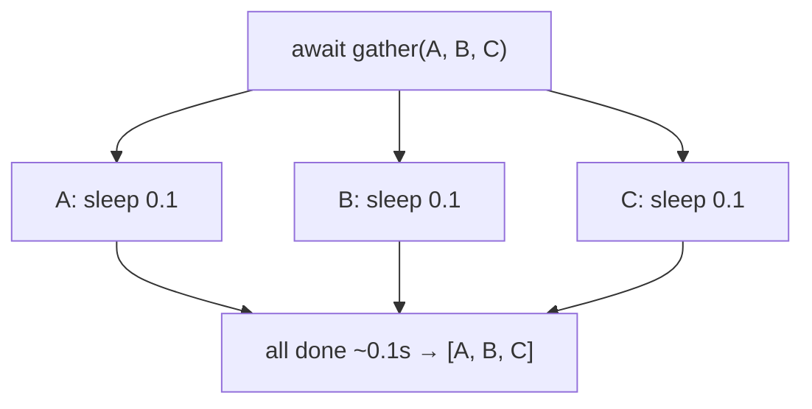

# 03 · Tasks & gather

> **Level:** Advanced · **Prerequisites:** [02 · Coroutines & await](02_coroutines_and_await.md), [exception groups](../05_exceptions_and_errors/07_exception_groups.md)
> **Time:** ~1.5 hours · **Verified:** 2026-06-04 (Python 3.12.13)

## Why this matters

Last module ended on a cliffhanger: sequential `await`s don't overlap. **This** module is where async pays off — running many coroutines *concurrently*. You'll use `asyncio.gather` and `asyncio.TaskGroup` to launch hundreds of operations at once and collect their results, plus handle the case where several fail together (exception groups, from [Section 05.07](../05_exceptions_and_errors/07_exception_groups.md)).

## Concept: `asyncio.gather` — run coroutines concurrently

`gather` schedules several coroutines to run *at the same time* and waits for all of them, returning their results **in order**:

```python
import asyncio, time

async def fetch(name, delay):
    await asyncio.sleep(delay)
    return f"{name} done"

async def main():
    start = time.perf_counter()
    results = await asyncio.gather(
        fetch("A", 0.1),
        fetch("B", 0.1),
        fetch("C", 0.1),
    )
    print(results, f"{time.perf_counter() - start:.2f}s")

asyncio.run(main())
```

Output (verified):

```text
['A done', 'B done', 'C done'] 0.10s
```

**0.10s, not 0.30s** — all three ran concurrently (compare the sequential `await` version from Module 02). `gather` is the workhorse: pass it any number of coroutines, get back a list of their results in the same order you passed them. This is how you fetch 100 URLs at once.



## Concept: `create_task` — schedule and run in the background

`asyncio.create_task(coro)` schedules a coroutine to run **right away** on the loop, returning a `Task` (an awaitable handle). The task runs concurrently with your code until you `await` it for the result:

```python
import asyncio

async def fetch(name, delay):
    await asyncio.sleep(delay)
    return f"{name} done"

async def main():
    # both start running immediately, concurrently:
    task_x = asyncio.create_task(fetch("X", 0.1))
    task_y = asyncio.create_task(fetch("Y", 0.05))

    # await whenever you need the result; Y finishes first
    print(await task_y)        # Y done  (after ~0.05s)
    print(await task_x)        # X done  (after ~0.1s total)

asyncio.run(main())
```

Output (verified):

```text
Y done
X done
```

The difference from a bare coroutine: `create_task` *starts it now* (the loop begins running it), whereas `await coro` only runs it when you await. Use `create_task` to kick off background work, then `await` the task later to collect its result. (`gather` actually wraps your coroutines in tasks for you.)

## Concept: `asyncio.TaskGroup` — the modern, safe way (3.11+)

`asyncio.TaskGroup` (Python 3.11+) is the **recommended** way to run a group of tasks. It's a `async with` block that starts tasks and guarantees they all complete before the block exits — and crucially, if any task fails, it **cancels the others and reports all failures together**:

```python
import asyncio

async def fetch(name, delay):
    await asyncio.sleep(delay)
    return f"{name} done"

async def main():
    results = []
    async with asyncio.TaskGroup() as tg:        # 3.11+
        for name, delay in [("p", 0.05), ("q", 0.1)]:
            tg.create_task(fetch(name, delay))
    # the block exits only after ALL tasks finish
    print("all tasks complete")

asyncio.run(main())
```

Output (verified):

```text
all tasks complete
```

- Inside `async with asyncio.TaskGroup() as tg:`, call `tg.create_task(coro)` to add tasks.
- The block doesn't exit until **all** tasks finish — structured, predictable lifetimes (no "forgotten" tasks).
- It's safer than `gather` for error handling (next concept) and is the preferred choice in new code.

## Concept: handling multiple failures — `ExceptionGroup` + `except*`

This is where [Section 05.07](../05_exceptions_and_errors/07_exception_groups.md) pays off. If several tasks in a `TaskGroup` fail, their exceptions are bundled into an **`ExceptionGroup`** — caught with `except*`:

```python
import asyncio

async def maybe_fail(n):
    await asyncio.sleep(0.01)
    if n % 2 == 0:
        raise ValueError(f"task {n} failed")
    return n

async def main():
    try:
        async with asyncio.TaskGroup() as tg:
            for n in range(4):
                tg.create_task(maybe_fail(n))
    except* ValueError as eg:                # catch the GROUP of ValueErrors
        print(f"caught {len(eg.exceptions)} failures:",
              [str(e) for e in eg.exceptions])

asyncio.run(main())
```

Output (verified):

```text
caught 2 failures: ['task 0 failed', 'task 2 failed']
```

Tasks 0 and 2 (even numbers) both failed; the `TaskGroup` collected both into an `ExceptionGroup`, and `except* ValueError` handled them together. This is exactly the scenario exception groups were designed for: "several of my concurrent tasks failed, and I want *all* the errors." Now you see why we taught `except*` earlier.

## Concept: `gather` error handling

`gather` behaves differently from `TaskGroup` on errors, and you can choose:

- **Default (`return_exceptions=False`):** the *first* exception propagates immediately (other tasks keep running but their results are lost).
- **`return_exceptions=True`:** exceptions are *returned as results* instead of raised, so you can inspect each:

```python
import asyncio

async def task(n):
    await asyncio.sleep(0.01)
    if n == 2:
        raise ValueError("two failed")
    return n * 10

async def main():
    results = await asyncio.gather(
        task(1), task(2), task(3),
        return_exceptions=True,        # collect errors instead of raising
    )
    for r in results:
        if isinstance(r, Exception):
            print(f"  failed: {r}")
        else:
            print(f"  ok: {r}")

asyncio.run(main())
```

Output (verified):

```text
  ok: 10
  failed: two failed
  ok: 30
```

With `return_exceptions=True`, the failed task's exception appears *in the results list* as a value you can check with `isinstance`. Use this when you want *all* results regardless of individual failures. For new code, prefer `TaskGroup` + `except*`; `gather` remains common and useful.

## Worked example: a concurrent API client

```python
# api_client.py — fetch several "endpoints" concurrently, handling failures.

import asyncio, time

async def call_api(endpoint):
    await asyncio.sleep(0.1)                  # simulate network latency
    if endpoint == "/broken":
        raise ConnectionError(f"{endpoint} returned 500")
    return f"{endpoint}: 200 OK"

async def main():
    endpoints = ["/users", "/posts", "/broken", "/comments"]

    start = time.perf_counter()
    results = await asyncio.gather(
        *(call_api(e) for e in endpoints),    # unpack a generator of coroutines
        return_exceptions=True,
    )
    elapsed = time.perf_counter() - start

    for endpoint, result in zip(endpoints, results):
        if isinstance(result, Exception):
            print(f"  {endpoint}: ERROR ({result})")
        else:
            print(f"  {endpoint}: {result}")
    print(f"all {len(endpoints)} calls in {elapsed:.2f}s")

asyncio.run(main())
```

Output (verified):

```text
  /users: /users: 200 OK
  /posts: /posts: 200 OK
  /broken: ERROR (/broken returned 500)
  /comments: /comments: 200 OK
all 4 calls in 0.10s
```

Four API calls (one failing) completed concurrently in ~0.1s instead of ~0.4s sequential. `return_exceptions=True` let the failure become an inspectable result rather than aborting the others — perfect for "fetch everything, report what worked." This is the everyday async pattern, and it's essentially what FastAPI does when an endpoint awaits multiple services.

## Common mistakes

**Mistake: `await`-ing in a loop instead of gathering**
```python
results = []
for url in urls:
    results.append(await fetch(url))   # SEQUENTIAL — defeats the purpose!
```
**Why:** each `await` finishes before the next starts (Module 02). Use `await asyncio.gather(*(fetch(u) for u in urls))` to run them concurrently.

**Mistake: forgetting `return_exceptions` and losing results**
```python
results = await asyncio.gather(*tasks)   # first failure raises; rest lost
```
**Why:** by default the first exception aborts `gather` and you get nothing back. Use `return_exceptions=True` (or `TaskGroup` + `except*`) when partial results matter.

**Mistake: a fire-and-forget task that's garbage-collected**
```python
asyncio.create_task(background_work())   # not stored -> may be GC'd before running
```
**Why:** if you don't keep a reference (or `await` it), the task can be collected and silently cancelled. Store tasks (e.g. in a list) or use a `TaskGroup`.

## Practice

**Exercise:** Write `download(name, delay)` that sleeps `delay` and returns `"<name>: <delay*1000>ms"`, but raises `TimeoutError` if `delay > 0.15`. Use `asyncio.gather(..., return_exceptions=True)` to run downloads for `[("a", 0.1), ("b", 0.2), ("c", 0.05)]` concurrently, then print successes and failures separately. Confirm total time ≈ the slowest, not the sum.

<details><summary>Solution</summary>

```python
import asyncio, time

async def download(name, delay):
    await asyncio.sleep(delay)
    if delay > 0.15:
        raise TimeoutError(f"{name} too slow ({delay}s)")
    return f"{name}: {int(delay * 1000)}ms"

async def main():
    jobs = [("a", 0.1), ("b", 0.2), ("c", 0.05)]
    start = time.perf_counter()
    results = await asyncio.gather(
        *(download(n, d) for n, d in jobs),
        return_exceptions=True,
    )
    elapsed = time.perf_counter() - start

    for (name, _), result in zip(jobs, results):
        if isinstance(result, Exception):
            print(f"  {name}: FAILED ({result})")
        else:
            print(f"  {name}: {result}")
    print(f"total {elapsed:.2f}s (slowest was 0.20s)")

asyncio.run(main())
```

Output:

```text
  a: a: 100ms
  b: FAILED (b too slow (0.2s))
  c: c: 50ms
total 0.20s (slowest was 0.20s)
```

All three ran concurrently, so the total (~0.20s) equals the slowest job, not the 0.35s sum. `return_exceptions=True` turned `b`'s `TimeoutError` into an inspectable result, leaving `a` and `c` intact.
</details>

## Recap & next

- ✅ `asyncio.gather(*coros)` runs coroutines **concurrently**, returning results in order.
- ✅ `asyncio.create_task(coro)` schedules a coroutine to run now; `await` the task for its result.
- ✅ `asyncio.TaskGroup` (3.11+) is the modern, structured way — all tasks finish before the block exits.
- ✅ Multiple `TaskGroup` failures arrive as an **`ExceptionGroup`**, handled with `except*`.
- ✅ `gather(..., return_exceptions=True)` returns errors as results for partial-success handling.
- Self-check: why is `await gather(a, b, c)` faster than three separate `await`s?

→ Next: **[04 · Async pitfalls](04_async_pitfalls.md)**
