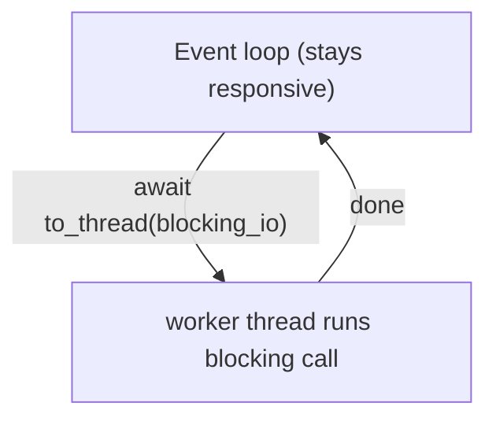

# 04 · Async Pitfalls

> **Level:** Advanced · **Prerequisites:** [03 · Tasks & gather](03_tasks_and_gather.md)
> **Time:** ~1 hour · **Verified:** 2026-06-04 (Python 3.12.13)

## Why this matters

Async is powerful but unforgiving: one blocking call can silently destroy all your concurrency, and "it ran without error" doesn't mean "it ran concurrently." This module collects the traps that bite everyone — most importantly **blocking the event loop** — and the timeout/cancellation tools you need for robust async code. Knowing these is what makes your FastAPI endpoints (Section 09) actually fast.

## Concept: the #1 sin — blocking the event loop

The event loop runs everything in one thread. If a coroutine does **blocking** work (a `time.sleep`, a CPU-heavy loop, a synchronous network call) instead of awaiting, it **freezes the entire loop** — *no other task can run* until it finishes. This silently destroys concurrency.

```python
import asyncio, time

# ❌ BLOCKING: time.sleep freezes the whole loop
async def bad_task(name):
    time.sleep(0.1)              # WRONG — blocks; no yield to the loop
    return name

async def bad_main():
    start = time.perf_counter()
    await asyncio.gather(bad_task("a"), bad_task("b"), bad_task("c"))
    return time.perf_counter() - start

# ✅ NON-BLOCKING: asyncio.sleep yields to the loop
async def good_task(name):
    await asyncio.sleep(0.1)     # RIGHT — yields; others run during the wait
    return name

async def good_main():
    start = time.perf_counter()
    await asyncio.gather(good_task("a"), good_task("b"), good_task("c"))
    return time.perf_counter() - start

print(f"blocking time.sleep: {asyncio.run(bad_main()):.2f}s")
print(f"await asyncio.sleep: {asyncio.run(good_main()):.2f}s")
```

Output (verified):

```text
blocking time.sleep: 0.30s
await asyncio.sleep: 0.10s
```

Even though `bad_task` is `async` and we used `gather`, the blocking `time.sleep` made it run **sequentially** (0.30s) — because while one task slept, the loop was frozen and couldn't switch to the others. The fix is to use **async-aware** operations (`await asyncio.sleep`, an async HTTP client, an async DB driver) everywhere.

> ⚠️ **The trap is invisible.** `bad_main` produces correct *results* with no error — it's just secretly sequential. Always ask: "does every wait in my coroutine `await`?" A single blocking call anywhere in the chain kills concurrency for everyone.

## Concept: offloading unavoidable blocking work

Sometimes you *must* call a blocking function (a library with no async version, or CPU-bound work). Don't run it directly in a coroutine — **offload it to a thread (or process) pool** so the loop stays free. `asyncio.to_thread` (3.9+) is the easy way:

```python
import asyncio, time

def blocking_io(x):              # a normal blocking function
    time.sleep(0.1)
    return x * 10

async def main():
    start = time.perf_counter()
    # run the blocking calls in threads, awaited from async:
    results = await asyncio.gather(
        asyncio.to_thread(blocking_io, 1),
        asyncio.to_thread(blocking_io, 2),
        asyncio.to_thread(blocking_io, 3),
    )
    print(results, f"{time.perf_counter() - start:.2f}s")

asyncio.run(main())
```

Output (verified):

```text
[10, 20, 30] 0.10s
```

`asyncio.to_thread(func, *args)` runs the blocking `func` in a background thread and gives you an awaitable — so the event loop keeps serving other coroutines while the thread waits. Use this for blocking I/O libraries. For *CPU-bound* blocking work, offload to a **process** pool via `loop.run_in_executor(ProcessPoolExecutor(), ...)` instead (the GIL again — Section 07).



## Concept: timeouts

Real I/O can hang forever. Wrap an await in a timeout so it fails fast instead of stalling your whole program. `asyncio.wait_for(coro, timeout)` cancels the coroutine and raises `TimeoutError` if it overruns:

```python
import asyncio

async def slow():
    await asyncio.sleep(1.0)
    return "too late"

async def main():
    try:
        return await asyncio.wait_for(slow(), timeout=0.1)
    except asyncio.TimeoutError:
        return "timed out"

print(asyncio.run(main()))
```

Output (verified):

```text
timed out
```

`slow()` would take 1s, but `wait_for` cancels it after 0.1s and raises `TimeoutError` (which you catch — [Section 05](../05_exceptions_and_errors/README.md) habits apply). Always put timeouts around network calls; a hung connection should never freeze your service. (Python 3.11+ also offers `async with asyncio.timeout(0.1):` as a context-manager form.)

## Concept: cancellation

Async tasks can be **cancelled** — `task.cancel()` raises `asyncio.CancelledError` inside the coroutine at its next `await`. This is how timeouts and `TaskGroup` shutdowns work under the hood. You can clean up in a `finally`, but should generally let the cancellation propagate:

```python
import asyncio

async def worker():
    try:
        print("  working...")
        await asyncio.sleep(10)        # will be interrupted
    except asyncio.CancelledError:
        print("  cancelled — cleaning up")
        raise                          # re-raise: don't suppress cancellation!
    finally:
        print("  finally cleanup")

async def main():
    task = asyncio.create_task(worker())
    await asyncio.sleep(0.05)          # let it start
    task.cancel()                      # request cancellation
    try:
        await task
    except asyncio.CancelledError:
        print("  main saw the task was cancelled")

asyncio.run(main())
```

Output (verified):

```text
  working...
  cancelled — cleaning up
  finally cleanup
  main saw the task was cancelled
```

- `task.cancel()` schedules a `CancelledError` to be raised inside the task at its next `await`.
- You may catch it to clean up, but **re-raise it** — swallowing `CancelledError` breaks timeouts and shutdown logic.
- `finally` blocks still run on cancellation, so put resource cleanup there.

> ⚠️ **Don't swallow `CancelledError`.** It's not a normal error — it's a control signal. Catching it to log is fine; catching it to *continue as if nothing happened* will hang shutdowns and break `wait_for`. Always `raise` it again.

## Concept: other common traps (quick reference)

| Trap | Symptom | Fix |
|------|---------|-----|
| Forgetting `await` | "coroutine was never awaited" warning; nothing runs | `await` it or `create_task` it |
| `await` in a loop | code is secretly sequential | use `gather`/`TaskGroup` |
| Blocking call in a coroutine | no concurrency, loop frozen | `await` async versions, or `asyncio.to_thread` |
| Mixing sync and async libs | blocking sneaks in | use async-native libs (`httpx`, `asyncpg`, `aiofiles`) |
| Swallowing `CancelledError` | hangs on timeout/shutdown | re-raise it |
| Fire-and-forget task GC'd | task silently disappears | keep a reference / use `TaskGroup` |
| CPU-bound work in async | one task hogs the core | offload to a **process** pool |

## Worked example: a robust fetch with timeout and fallback

```python
# robust_fetch.py — concurrent fetches, each with its own timeout and fallback.

import asyncio

async def fetch(name, delay):
    await asyncio.sleep(delay)
    return f"{name}: data"

async def fetch_with_timeout(name, delay, limit=0.15):
    try:
        return await asyncio.wait_for(fetch(name, delay), timeout=limit)
    except asyncio.TimeoutError:
        return f"{name}: <timeout, used cache>"      # graceful fallback

async def main():
    jobs = [("fast", 0.05), ("slow", 0.30), ("medium", 0.1)]
    results = await asyncio.gather(
        *(fetch_with_timeout(n, d) for n, d in jobs)
    )
    for r in results:
        print(f"  {r}")

asyncio.run(main())
```

Output (verified):

```text
  fast: data
  slow: <timeout, used cache>
  medium: data
```

Each fetch runs concurrently with its *own* timeout: `fast` and `medium` return real data, while `slow` (0.30s, over the 0.15s limit) is cancelled and falls back to a cached value — without dragging down the others. This timeout-plus-fallback pattern is exactly what production services (and FastAPI endpoints calling other services) use to stay responsive.

## Common mistakes

**Mistake: assuming `async` alone means concurrent**
**Why:** `async def` + `await` only overlap if the awaits are *non-blocking* and the coroutines are *scheduled together* (`gather`/tasks). A blocking call or sequential `await`s give you async syntax with synchronous behaviour. Measure with timing if unsure.

**Mistake: using blocking libraries (`requests`, `time.sleep`, sync DB drivers) in async code**
**Why:** they freeze the loop. Use async equivalents (`httpx.AsyncClient`, `asyncio.sleep`, `asyncpg`) or wrap them in `asyncio.to_thread`.

## Practice

**Exercise:** You're given a blocking function `slow_lookup(key)` that does `time.sleep(0.1)` and returns `key.upper()`. (1) Show that calling it directly in three gathered coroutines takes ~0.3s (blocks the loop). (2) Fix it with `asyncio.to_thread` so three concurrent lookups take ~0.1s. Print both timings.

<details><summary>Solution</summary>

```python
import asyncio, time

def slow_lookup(key):                 # blocking (no async version available)
    time.sleep(0.1)
    return key.upper()

# (1) WRONG: blocking call directly in the coroutine
async def bad(key):
    return slow_lookup(key)           # freezes the loop

async def bad_main():
    start = time.perf_counter()
    await asyncio.gather(bad("a"), bad("b"), bad("c"))
    return time.perf_counter() - start

# (2) RIGHT: offload the blocking call to a thread
async def good(key):
    return await asyncio.to_thread(slow_lookup, key)

async def good_main():
    start = time.perf_counter()
    results = await asyncio.gather(good("a"), good("b"), good("c"))
    return time.perf_counter() - start, results

print(f"blocking:   {asyncio.run(bad_main()):.2f}s")
t, results = asyncio.run(good_main())
print(f"to_thread:  {t:.2f}s {results}")
```

Output:

```text
blocking:   0.30s
to_thread:  0.10s ['A', 'B', 'C']
```

Calling `slow_lookup` directly froze the loop (sequential, ~0.30s); `asyncio.to_thread` ran each blocking call in a background thread so the loop could overlap them (~0.10s). This is the standard escape hatch for blocking libraries in async code.
</details>

## Recap & next

- ✅ **Never block the event loop** — a `time.sleep`/CPU loop/sync call freezes *all* tasks.
- ✅ Offload unavoidable blocking work with `asyncio.to_thread` (I/O) or a process pool (CPU).
- ✅ Use `asyncio.wait_for` (or `asyncio.timeout`) so hung I/O fails fast.
- ✅ **Cancellation** raises `CancelledError` — clean up in `finally`, but always re-raise it.
- ✅ Use async-native libraries; `async` syntax alone doesn't guarantee concurrency.
- Self-check: why does a single `time.sleep` inside one coroutine slow down *all* gathered coroutines?

🎉 **Section 08 complete.** You now command all three concurrency models. Time to put everything together in a real web API.

→ Next: **[Section 09 · FastAPI](../09_fastapi/README.md)**
