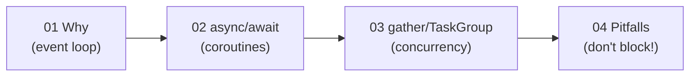

# Section 08 · Async

> **Level:** Advanced · **Prerequisites:** [Section 07 (concurrency)](../07_concurrency/README.md), [generators](../06_pythonic_intermediate/02_generators.md), [exception groups](../05_exceptions_and_errors/07_exception_groups.md)
> **Time:** ~5 hours · **Verified:** 2026-06-04 (Python 3.12.13)

**Async** is Python's third concurrency model (after threads and processes). It runs thousands of I/O-bound tasks concurrently in a *single thread*, using `async`/`await`. There's no GIL fight and no thread overhead — just cooperative switching whenever a task *awaits*. It's the model behind modern high-performance web frameworks, including **FastAPI** (Section 09), so this section is essential preparation for the final stretch.

## When async, when threads?

Both handle I/O-bound work. Async wins when you have *many* concurrent I/O operations (hundreds/thousands of connections) and libraries that support it; threads are simpler for a handful of tasks or when you must call blocking libraries. (CPU-bound work still needs processes — Section 07.)

## Modules

| # | Module | You'll learn to… |
|---|--------|------------------|
| 01 | [Why async](01_why_async.md) | Understand the event loop and where async beats threads |
| 02 | [Coroutines & await](02_coroutines_and_await.md) | Write `async def` functions and `await` them |
| 03 | [Tasks & gather](03_tasks_and_gather.md) | Run many coroutines concurrently; handle group failures |
| 04 | [Async pitfalls](04_async_pitfalls.md) | Avoid blocking the loop and other classic traps |

→ Start: **[01 · Why async](01_why_async.md)**
