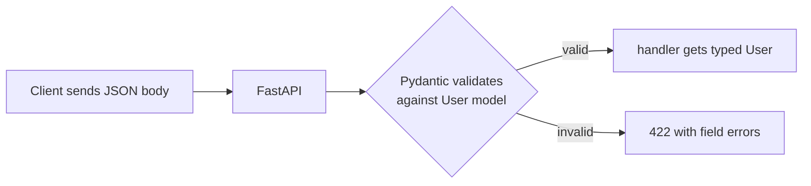

# 03 · Request Bodies & Pydantic

> **Level:** Advanced · **Prerequisites:** [02 · Parameters](02_parameters_and_validation.md), [dataclasses](../04_oop/06_dataclasses.md), [type hints](../03_functions_and_modules/03_type_hints.md)
> **Time:** ~1.5 hours · **Verified:** 2026-06-04 (FastAPI 0.136.3, Pydantic 2.13.4)

## Why this matters

`POST` and `PUT` requests carry data in the **body** (usually JSON) — a new user, an order, a blog post. **Pydantic** is the library FastAPI uses to model, parse, and *validate* that data against your type hints. Define a `BaseModel` class and FastAPI automatically reads the JSON body, validates every field, converts types, rejects bad data with `422`, and documents it. Pydantic is the runtime-validation layer the type-hint chapter promised.

## Concept: a Pydantic model

A Pydantic model is a class inheriting `BaseModel` with **typed fields** — like a [dataclass](../04_oop/06_dataclasses.md), but with *runtime validation* and JSON conversion built in:

```python
from pydantic import BaseModel

class User(BaseModel):
    name: str
    age: int
    email: str
    tags: list[str] = []          # field with a default

# Create one by passing the fields:
u = User(name="Ada", age=31, email="a@x.io")
print(u)                          # name='Ada' age=31 email='a@x.io' tags=[]
print(u.model_dump())             # -> a dict
print(u.model_dump_json())        # -> a JSON string
```

Output (verified):

```text
name='Ada' age=31 email='a@x.io' tags=[]
{'name': 'Ada', 'age': 31, 'email': 'a@x.io', 'tags': []}
{"name":"Ada","age":31,"email":"a@x.io","tags":[]}
```

- Fields are declared with type hints (`name: str`), exactly like dataclasses — but Pydantic *enforces* them.
- `model_dump()` → a Python dict; `model_dump_json()` → a JSON string. (These are Pydantic v2 names; v1 used `.dict()`/`.json()`.)

## Concept: validation and coercion at runtime

Unlike plain type hints (which are ignored at runtime), Pydantic **actually checks and converts** the data:

```python
from pydantic import BaseModel, ValidationError

class User(BaseModel):
    name: str
    age: int
    email: str

# coercion: a numeric string becomes an int
u = User(name="Bo", age="42", email="b@x.io")
print(u.age, type(u.age).__name__)        # 42 int

# validation: bad data raises ValidationError
try:
    User(name="X", age="not a number", email="x")
except ValidationError as e:
    print("validation failed:", e.error_count(), "error(s)")
```

Output (verified):

```text
42 int
validation failed: 1 error(s)
```

The string `"42"` was **coerced** to the integer `42`; `"not a number"` couldn't be, so Pydantic raised `ValidationError`. *This* is the runtime guarantee plain hints can't give you ([Section 03.03](../03_functions_and_modules/03_type_hints.md)) — and it's exactly what makes incoming API data trustworthy.

## Concept: field constraints with `Field`

`Field(...)` adds validation rules to a field — the same constraints you used with `Query`/`Path`:

```python
from pydantic import BaseModel, Field

class Product(BaseModel):
    name: str = Field(min_length=1, max_length=100)
    price: float = Field(gt=0)                    # must be positive
    quantity: int = Field(default=1, ge=0)        # default 1, never negative
    tags: list[str] = Field(default_factory=list) # safe mutable default

p = Product(name="Mug", price=9.99)
print(p.model_dump())
```

Output (verified):

```text
{'name': 'Mug', 'price': 9.99, 'quantity': 1, 'tags': []}
```

`Field(gt=0)` rejects non-positive prices; `Field(default_factory=list)` gives each instance its own list (the mutable-default fix from [Section 03.02](../03_functions_and_modules/02_arguments_and_scope.md), built in). Constraints appear in the auto-docs too.

## Concept: custom validators

For rules beyond simple constraints, write a `@field_validator`. It runs during validation and can transform the value or reject it:

```python
from pydantic import BaseModel, field_validator

class Customer(BaseModel):
    name: str

    @field_validator("name")
    @classmethod
    def clean_name(cls, v: str) -> str:
        if not v.strip():
            raise ValueError("name cannot be blank")
        return v.strip().title()          # normalise: trim + Title Case

c = Customer(name="  ada lovelace  ")
print(c.name)                              # Ada Lovelace
```

Output (verified):

```text
Ada Lovelace
```

The validator both **rejects** blank names and **transforms** valid ones (trim + title-case). It's a `@classmethod` taking the field value; return the cleaned value or `raise ValueError`. (Pydantic turns that `ValueError` into a proper `422` when used in FastAPI.)

## Concept: nested models

Models compose — a field can be *another* model, mirroring nested JSON:

```python
from pydantic import BaseModel

class Address(BaseModel):
    city: str
    zip: str

class Order(BaseModel):
    id: int
    customer: str
    shipping: Address              # a nested model
    items: list[str] = []

order = Order(
    id=1, customer="Ada",
    shipping={"city": "NYC", "zip": "10001"},   # a dict becomes an Address
    items=["book", "pen"],
)
print(order.shipping.city)         # NYC
print(order.model_dump())
```

Output (verified):

```text
NYC
{'id': 1, 'customer': 'Ada', 'shipping': {'city': 'NYC', 'zip': '10001'}, 'items': ['book', 'pen']}
```

Pydantic validates the nested `shipping` dict into an `Address` automatically. This handles arbitrarily deep JSON — exactly the shape of real API payloads.

## Concept: using a model as a request body in FastAPI

This is the payoff. Declare a Pydantic model as a parameter, and FastAPI **reads the JSON body, validates it, and hands you a typed object**:

```python
from fastapi import FastAPI
from fastapi.testclient import TestClient
from pydantic import BaseModel, Field

app = FastAPI()

class User(BaseModel):
    name: str
    age: int = Field(ge=0, le=150)
    email: str

@app.post("/users")
def create_user(user: User):                 # body parsed into a User
    return {"created": user.name, "adult": user.age >= 18}

client = TestClient(app)
print(client.post("/users", json={"name": "Grace", "age": 45, "email": "g@x.io"}).json())
print("missing field:", client.post("/users", json={"name": "X"}).status_code)
print("bad age:", client.post("/users", json={"name": "X", "age": 200, "email": "e"}).status_code)
```

Output (verified):

```text
{'created': 'Grace', 'adult': True}
missing field: 422
bad age: 422
```

The handler receives a fully-validated `User` object — `user.name`, `user.age` are guaranteed to exist and be the right types. Missing fields or out-of-range values are rejected with `422` *before your code runs*. You never parse JSON or write validation by hand. And the model shows up in `/docs` with an example and a schema.



## Concept: separate input and output models

A common, important pattern: use *different* models for what comes **in** vs what goes **out** — e.g. accept a password but never return it, or compute derived fields:

```python
from fastapi import FastAPI
from fastapi.testclient import TestClient
from pydantic import BaseModel

app = FastAPI()

class UserIn(BaseModel):           # what the client sends
    name: str
    password: str

class UserOut(BaseModel):          # what we send back (NO password!)
    name: str
    greeting: str

@app.post("/register", response_model=UserOut)
def register(user: UserIn):
    # password is used internally but never returned
    return UserOut(name=user.name, greeting=f"Welcome, {user.name}!")

client = TestClient(app)
print(client.post("/register", json={"name": "Ada", "password": "secret"}).json())
```

Output (verified):

```text
{'name': 'Ada', 'greeting': 'Welcome, Ada!'}
```

The `password` went *in* (via `UserIn`) but is absent from the response, because `response_model=UserOut` controls the output shape. This input/output split is how you avoid leaking sensitive fields — covered more in [Module 04](04_responses_and_status.md).

## Common mistakes

**Mistake: confusing query params and body**
```python
@app.post("/users")
def create(name: str, age: int): ...   # these become QUERY params, not a body!
```
**Why:** plain-typed params are query/path params. To read the JSON **body**, the parameter must be a Pydantic model (or explicitly marked `Body(...)`). Use `def create(user: User):`.

**Mistake: using a mutable default directly**
```python
class Cart(BaseModel):
    items: list = []        # works in Pydantic (it copies), but be explicit:
```
**Why:** Pydantic actually handles this safely (unlike dataclasses/functions), but prefer `Field(default_factory=list)` to be unambiguous and consistent with the rest of your code.

## Practice

**Exercise:** Define a Pydantic model `BlogPost` with `title` (1–200 chars), `body` (string), `published` (bool, default `False`), and `tags` (list of strings, default empty). Add a validator that rejects a blank title. Use it as the body of `POST /posts`, returning `{"title": ..., "tag_count": ...}`. Verify a valid post and a too-long title (→422).

<details><summary>Solution</summary>

```python
from fastapi import FastAPI
from fastapi.testclient import TestClient
from pydantic import BaseModel, Field, field_validator

app = FastAPI()

class BlogPost(BaseModel):
    title: str = Field(min_length=1, max_length=200)
    body: str
    published: bool = False
    tags: list[str] = Field(default_factory=list)

    @field_validator("title")
    @classmethod
    def title_not_blank(cls, v):
        if not v.strip():
            raise ValueError("title cannot be blank")
        return v.strip()

@app.post("/posts")
def create_post(post: BlogPost):
    return {"title": post.title, "tag_count": len(post.tags)}

client = TestClient(app)
print(client.post("/posts", json={"title": "Hello", "body": "...", "tags": ["a", "b"]}).json())
print("too long:", client.post("/posts", json={"title": "x" * 300, "body": "..."}).status_code)
```

Output:

```text
{'title': 'Hello', 'tag_count': 2}
too long: 422
```

The model validates the title's length and non-blankness, defaults `published`/`tags`, and FastAPI parses the JSON body into a `BlogPost` — rejecting the 300-character title with `422`.
</details>

## Recap & next

- ✅ Pydantic `BaseModel`s define typed, **runtime-validated** data shapes.
- ✅ Pydantic **coerces** types and raises `ValidationError` on bad data (unlike plain hints).
- ✅ `Field(...)` adds constraints; `@field_validator` adds custom rules/transforms.
- ✅ Models **nest** to mirror nested JSON.
- ✅ A model parameter = the **request body**; FastAPI validates it and returns `422` on failure.
- ✅ Separate **input/output models** to control what you accept vs return.
- Self-check: why does a Pydantic model parameter read the body, but `name: str` reads a query param?

→ Next: **[04 · Responses & status codes](04_responses_and_status.md)**
