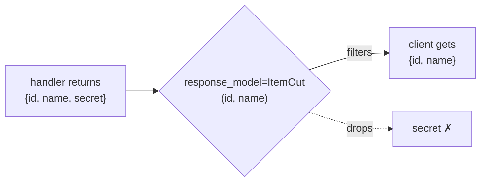

# 04 · Responses & Status Codes

> **Level:** Advanced · **Prerequisites:** [03 · Request bodies & Pydantic](03_request_bodies_pydantic.md)
> **Time:** ~45 min · **Verified:** 2026-06-04 (FastAPI 0.136.3)

## Why this matters

An API's *response* matters as much as its input. Clients rely on **status codes** to know what happened (`201` = created, `204` = deleted, `404` = not found) and on a **consistent response shape** to parse the data. FastAPI lets you control both declaratively — and `response_model` doubles as a safety filter that stops you accidentally leaking internal fields (like password hashes).

## Concept: HTTP status codes

A status code is a number summarising the outcome. The ones you'll use most:

| Code | Name | Meaning |
|------|------|---------|
| `200` | OK | success (default for `GET`) |
| `201` | Created | a resource was created (`POST`) |
| `204` | No Content | success, nothing to return (`DELETE`) |
| `400` | Bad Request | the client sent something wrong |
| `401` / `403` | Unauthorized / Forbidden | not logged in / not allowed |
| `404` | Not Found | the resource doesn't exist |
| `422` | Unprocessable Entity | validation failed (FastAPI's auto-validation) |
| `500` | Internal Server Error | your code crashed |

The rough families: **2xx** success, **4xx** the client's fault, **5xx** the server's fault. Returning the *right* code is part of a well-behaved API.

## Concept: setting the status code

By default FastAPI returns `200`. Override it per-route with `status_code`. Use the `status` module for readable names instead of magic numbers:

```python
from fastapi import FastAPI, status
from fastapi.testclient import TestClient

app = FastAPI()

@app.post("/items", status_code=status.HTTP_201_CREATED)   # 201
def create_item(name: str):
    return {"name": name}

@app.delete("/items/{item_id}", status_code=204)           # 204 No Content
def delete_item(item_id: int):
    return None                                            # 204 returns no body

client = TestClient(app)
print("create:", client.post("/items?name=Mug").status_code)
print("delete:", client.delete("/items/5").status_code)
```

Output (verified):

```text
create: 201
delete: 204
```

`status.HTTP_201_CREATED` is just `201` with a self-documenting name — `from fastapi import status` gives you the whole set (`status.HTTP_404_NOT_FOUND`, etc.). Prefer these constants over bare numbers for readability.

## Concept: `response_model` — declare and filter the output

`response_model` tells FastAPI the *shape* of the response. It serialises your return value through that Pydantic model — which means it **strips any field not in the model**. This is a critical safety feature:

```python
from fastapi import FastAPI
from fastapi.testclient import TestClient
from pydantic import BaseModel

app = FastAPI()

class ItemOut(BaseModel):       # the PUBLIC shape — only these fields go out
    id: int
    name: str

@app.post("/items", response_model=ItemOut, status_code=201)
def create_item(name: str):
    # return MORE than ItemOut declares — the extra field is filtered out
    return {"id": 1, "name": name, "secret": "internal-hidden-value"}

client = TestClient(app)
print(client.post("/items?name=Mug").json())
```

Output (verified):

```text
{'id': 1, 'name': 'Mug'}
```

Even though the handler returned a `"secret"` field, the response contains only `id` and `name` — because `response_model=ItemOut` defines the public shape. **This is how you prevent leaking sensitive data** (password hashes, internal flags): return your full object, but declare a `response_model` that exposes only what's safe. It also makes the response schema appear in `/docs`.



## Concept: returning lists of models

Type the `response_model` as a list to return collections — each item is validated and filtered:

```python
from fastapi import FastAPI
from fastapi.testclient import TestClient
from pydantic import BaseModel

app = FastAPI()

class ItemOut(BaseModel):
    id: int
    name: str

@app.get("/items", response_model=list[ItemOut])
def list_items():
    return [
        {"id": 1, "name": "a", "secret": "x"},   # secret filtered per item
        {"id": 2, "name": "b", "secret": "y"},
    ]

client = TestClient(app)
print(client.get("/items").json())
```

Output (verified):

```text
[{'id': 1, 'name': 'a'}, {'id': 2, 'name': 'b'}]
```

`response_model=list[ItemOut]` applies the filter to every element — clean, consistent collection responses.

## Concept: returning Pydantic objects directly

You can return a Pydantic model *instance* instead of a dict — often cleaner and type-safe:

```python
from fastapi import FastAPI
from fastapi.testclient import TestClient
from pydantic import BaseModel

app = FastAPI()

class Item(BaseModel):
    id: int
    name: str
    price: float

@app.get("/items/{item_id}")
def get_item(item_id: int) -> Item:        # return-type annotation acts as response_model
    return Item(id=item_id, name="Mug", price=9.99)

client = TestClient(app)
print(client.get("/items/7").json())
```

Output (verified):

```text
{'id': 7, 'name': 'Mug', 'price': 9.99}
```

Note: a **return-type annotation** (`-> Item`) works as the `response_model` in modern FastAPI — even cleaner than the decorator argument. FastAPI serialises the Pydantic object to JSON for you.

## Concept: custom headers and the `Response` object

For finer control (custom headers, cookies), accept a `Response` parameter or return a `Response` object:

```python
from fastapi import FastAPI, Response
from fastapi.testclient import TestClient

app = FastAPI()

@app.get("/with-header")
def with_header(response: Response):
    response.headers["X-Custom"] = "hello"
    response.status_code = 202
    return {"ok": True}

client = TestClient(app)
r = client.get("/with-header")
print(r.status_code, r.headers.get("x-custom"), r.json())
```

Output (verified):

```text
202 hello {'ok': True}
```

Inject `response: Response` to set headers/status imperatively while still returning normal JSON. (For full control — streaming, files, redirects — FastAPI has `StreamingResponse`, `FileResponse`, `RedirectResponse`.)

## Common mistakes

**Mistake: returning data that doesn't match `response_model`**
```python
class ItemOut(BaseModel):
    id: int
    name: str

@app.get("/x", response_model=ItemOut)
def x():
    return {"id": 1}        # missing required `name`
```
```text
# raises a server-side ResponseValidationError -> 500
```
**Why:** `response_model` validates the *output* too. If your return value lacks a required field, FastAPI raises an error. Make sure your data satisfies the declared model (it protects you from shipping malformed responses).

**Mistake: returning a body with `204`**
```python
@app.delete("/x", status_code=204)
def x():
    return {"deleted": True}    # 204 means NO content
```
**Why:** `204 No Content` must have an empty body. Return `None`.

## Practice

**Exercise:** Build a `POST /accounts` that takes a Pydantic `AccountIn` (`username`, `password`) and returns an `AccountOut` (`username`, `id`) with status `201` — proving the password never appears in the response. Add `GET /accounts` returning `list[AccountOut]` from an in-memory list.

<details><summary>Solution</summary>

```python
from fastapi import FastAPI, status
from fastapi.testclient import TestClient
from pydantic import BaseModel

app = FastAPI()

class AccountIn(BaseModel):
    username: str
    password: str

class AccountOut(BaseModel):
    id: int
    username: str

_accounts: list[dict] = []

@app.post("/accounts", response_model=AccountOut, status_code=status.HTTP_201_CREATED)
def create_account(account: AccountIn):
    record = {"id": len(_accounts) + 1, "username": account.username,
              "password_hash": f"hashed:{account.password}"}   # stored, never returned
    _accounts.append(record)
    return record        # response_model filters to id + username

@app.get("/accounts", response_model=list[AccountOut])
def list_accounts():
    return _accounts

client = TestClient(app)
print(client.post("/accounts", json={"username": "ada", "password": "secret"}).json())
print(client.post("/accounts", json={"username": "bo", "password": "pw"}).json())
print(client.get("/accounts").json())
```

Output:

```text
{'id': 1, 'username': 'ada'}
{'id': 2, 'username': 'bo'}
[{'id': 1, 'username': 'ada'}, {'id': 2, 'username': 'bo'}]
```

The stored record holds a `password_hash`, but `response_model=AccountOut` ensures only `id` and `username` ever leave the API — both for the single create and the list endpoint.
</details>

## Recap & next

- ✅ Set status codes with `status_code=` and the readable `status.*` constants.
- ✅ Used `response_model` (or a `-> Model` return annotation) to define and **filter** output.
- ✅ `response_model` **strips fields not in the model** — preventing data leaks.
- ✅ Returned lists of models and Pydantic instances directly.
- ✅ Set custom headers/status via an injected `Response`.
- Self-check: how does `response_model` stop a password hash from reaching the client?

→ Next: **[05 · Error handling](05_error_handling.md)**
