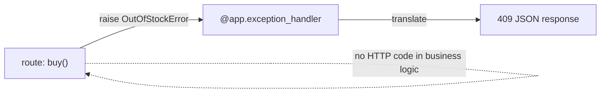

# 05 · Error Handling

> **Level:** Advanced · **Prerequisites:** [04 · Responses](04_responses_and_status.md), [Section 05 (exceptions)](../05_exceptions_and_errors/README.md)
> **Time:** ~1 hour · **Verified:** 2026-06-04 (FastAPI 0.136.3)

## Why this matters

APIs must fail *gracefully and informatively*. A client asking for a non-existent user should get a clean `404` with a clear message — not a `500` crash exposing your stack trace. This module connects directly to the special exceptions section: you'll raise `HTTPException` for HTTP errors, and **map your custom domain exceptions** (the `OutOfStockError`-style hierarchy from [Section 05.05](../05_exceptions_and_errors/05_raising_and_custom_exceptions.md)) to proper responses with exception handlers.

## Concept: `HTTPException`

To return an HTTP error from a route, `raise HTTPException(status_code, detail)`. FastAPI catches it and produces a proper JSON error response:

```python
from fastapi import FastAPI, HTTPException
from fastapi.testclient import TestClient

app = FastAPI()
_products = {1: {"name": "Mug"}, 2: {"name": "Book"}}

@app.get("/products/{product_id}")
def get_product(product_id: int):
    if product_id not in _products:
        raise HTTPException(status_code=404, detail=f"product {product_id} not found")
    return _products[product_id]

client = TestClient(app)
print(client.get("/products/1").json())          # found
r = client.get("/products/999")
print(r.status_code, r.json())                   # 404 + detail
```

Output (verified):

```text
{'name': 'Mug'}
404 {'detail': 'product 999 not found'}
```

`raise HTTPException(404, "...")` immediately stops the handler and returns `{"detail": "..."}` with the given status. This is the everyday way to signal "not found", "forbidden", "bad request", etc. It builds on the `raise` you learned in [Section 05.05](../05_exceptions_and_errors/05_raising_and_custom_exceptions.md) — same mechanism, HTTP-aware.

> 🧠 **Use the right code.** `404` for missing resources, `400` for malformed requests you detect yourself, `403` for "not allowed", `409` for conflicts (e.g. duplicate). Returning the correct status is part of a usable API — clients branch on it.

## Concept: adding headers to errors

`HTTPException` accepts custom headers — useful for things like `WWW-Authenticate` or rate-limit info:

```python
from fastapi import FastAPI, HTTPException
from fastapi.testclient import TestClient

app = FastAPI()

@app.get("/secure")
def secure():
    raise HTTPException(
        status_code=401,
        detail="not authenticated",
        headers={"WWW-Authenticate": "Bearer"},
    )

client = TestClient(app)
r = client.get("/secure")
print(r.status_code, r.json(), r.headers.get("www-authenticate"))
```

Output (verified):

```text
401 {'detail': 'not authenticated'} Bearer
```

## Concept: mapping domain exceptions to HTTP responses ⭐

Here's the powerful pattern that ties back to the special section. Your *business logic* should raise meaningful **domain exceptions** (`OutOfStockError`, `InsufficientFundsError`) — not HTTP-specific ones. Then you register an **exception handler** that translates each domain exception into the right HTTP response. This keeps your core logic free of web concerns.

```python
from fastapi import FastAPI, Request
from fastapi.responses import JSONResponse
from fastapi.testclient import TestClient

app = FastAPI()

# --- domain exceptions (pure business logic, no HTTP) — recall Section 05.05 ---
class ShopError(Exception):
    """Base for shop errors."""

class OutOfStockError(ShopError):
    def __init__(self, sku):
        self.sku = sku
        super().__init__(f"{sku} is out of stock")

# --- translate the domain exception into an HTTP response ---
@app.exception_handler(OutOfStockError)
async def out_of_stock_handler(request: Request, exc: OutOfStockError):
    return JSONResponse(
        status_code=409,                       # 409 Conflict
        content={"error": "out_of_stock", "sku": exc.sku},
    )

# --- the route just calls business logic; no HTTP error code here ---
_stock = {"BK-1": 0, "PN-7": 5}

@app.post("/buy/{sku}")
def buy(sku: str):
    if _stock.get(sku, 0) <= 0:
        raise OutOfStockError(sku)             # raise the DOMAIN error
    _stock[sku] -= 1
    return {"bought": sku, "remaining": _stock[sku]}

client = TestClient(app)
print(client.post("/buy/PN-7").json())          # success
r = client.post("/buy/BK-1")
print(r.status_code, r.json())                  # handled by our handler
```

Output (verified):

```text
{'bought': 'PN-7', 'remaining': 4}
409 {'error': 'out_of_stock', 'sku': 'BK-1'}
```

The route raises a plain `OutOfStockError` — knowing nothing about HTTP. The `@app.exception_handler(OutOfStockError)` catches it anywhere in the app and renders a `409` with a custom JSON body. **This separation is the professional pattern:** business code raises domain errors ([the hierarchy from Section 05](../05_exceptions_and_errors/05_raising_and_custom_exceptions.md)), and one place maps them to HTTP. Add `PaymentError`, register a handler, done — the routes stay clean.



## Concept: handling a base exception for a whole family

Register a handler on the **base** class to cover every subclass at once (the inheritance from [Section 05.04](../05_exceptions_and_errors/04_exception_hierarchy.md)):

```python
from fastapi import FastAPI, Request
from fastapi.responses import JSONResponse
from fastapi.testclient import TestClient

app = FastAPI()

class AppError(Exception):
    status_code = 400
    def __init__(self, message):
        self.message = message
        super().__init__(message)

class NotFoundError(AppError):
    status_code = 404

class ForbiddenError(AppError):
    status_code = 403

@app.exception_handler(AppError)               # one handler for the whole family
async def app_error_handler(request: Request, exc: AppError):
    return JSONResponse(
        status_code=exc.status_code,           # each subclass carries its code
        content={"error": type(exc).__name__, "message": exc.message},
    )

@app.get("/resource/{name}")
def get_resource(name: str):
    if name == "secret":
        raise ForbiddenError("you may not view this")
    if name == "ghost":
        raise NotFoundError("no such resource")
    return {"name": name}

client = TestClient(app)
print(client.get("/resource/public").json())
print(client.get("/resource/ghost").status_code, client.get("/resource/ghost").json())
print(client.get("/resource/secret").status_code, client.get("/resource/secret").json())
```

Output (verified):

```text
{'name': 'public'}
404 {'error': 'NotFoundError', 'message': 'no such resource'}
403 {'error': 'ForbiddenError', 'message': 'you may not view this'}
```

One handler on `AppError` serves every subclass; each subclass supplies its own `status_code`. This scales beautifully — define a new error type with a status code and it's handled automatically. (This is essentially what the capstone does.)

## Concept: validation errors are already handled

Recall from [Module 02–03](02_parameters_and_validation.md): FastAPI *automatically* turns Pydantic validation failures into `422` responses with detailed bodies. You don't handle those yourself — but you *can* customise the format by overriding the `RequestValidationError` handler if needed. For most apps the default `422` is great.

## Common mistakes

**Mistake: putting HTTP codes deep in business logic**
```python
def charge_card(amount):
    if amount > balance:
        raise HTTPException(402, "insufficient")   # HTTP leaking into core logic!
```
**Why:** now your payment logic can't be reused outside a web context (CLI, worker, tests). Raise a domain `InsufficientFundsError` and map it to HTTP in a handler. Keep web concerns at the edge.

**Mistake: letting unexpected exceptions become bare 500s with stack traces**
**Why:** an unhandled exception returns `500` and (in debug) may leak internals. Catch domain errors with handlers; for truly unexpected ones, a top-level handler can log the traceback ([Section 05.08](../05_exceptions_and_errors/08_best_practices.md)) and return a generic `500` without leaking details.

## Practice

**Exercise:** Create a domain exception hierarchy: `BankError` (base), `AccountNotFoundError` (404), and `InsufficientFundsError` (carrying `balance`/`amount`, 400). Register one handler on `BankError` that returns `exc.status_code` and a JSON body with the error type and message. Add `POST /accounts/{id}/withdraw?amount=N` that raises the right error, and verify a missing account (→404) and an overdraw (→400).

<details><summary>Solution</summary>

```python
from fastapi import FastAPI, Request
from fastapi.responses import JSONResponse
from fastapi.testclient import TestClient

app = FastAPI()

class BankError(Exception):
    status_code = 400
    def __init__(self, message):
        self.message = message
        super().__init__(message)

class AccountNotFoundError(BankError):
    status_code = 404

class InsufficientFundsError(BankError):
    status_code = 400
    def __init__(self, balance, amount):
        self.balance = balance
        self.amount = amount
        super().__init__(f"cannot withdraw {amount}; balance is {balance}")

@app.exception_handler(BankError)
async def bank_error_handler(request: Request, exc: BankError):
    return JSONResponse(
        status_code=exc.status_code,
        content={"error": type(exc).__name__, "message": exc.message},
    )

_balances = {1: 100}

@app.post("/accounts/{account_id}/withdraw")
def withdraw(account_id: int, amount: int):
    if account_id not in _balances:
        raise AccountNotFoundError(f"no account {account_id}")
    if amount > _balances[account_id]:
        raise InsufficientFundsError(_balances[account_id], amount)
    _balances[account_id] -= amount
    return {"balance": _balances[account_id]}

client = TestClient(app)
print(client.post("/accounts/1/withdraw?amount=30").json())
r1 = client.post("/accounts/999/withdraw?amount=10")
print(r1.status_code, r1.json())
r2 = client.post("/accounts/1/withdraw?amount=1000")
print(r2.status_code, r2.json())
```

Output:

```text
{'balance': 70}
404 {'error': 'AccountNotFoundError', 'message': 'no account 999'}
400 {'error': 'InsufficientFundsError', 'message': 'cannot withdraw 1000; balance is 70'}
```

The route raises clean domain errors; one handler on the `BankError` base maps each to its own status code and a consistent JSON body — exactly the layered design from the exceptions section, applied to HTTP.
</details>

## Recap & next

- ✅ `raise HTTPException(status_code, detail)` returns a clean JSON error.
- ✅ Used correct status codes (`404`, `403`, `409`, ...) and added error headers.
- ✅ **Mapped domain exceptions to HTTP** with `@app.exception_handler` — keeping business logic web-free.
- ✅ Handled a whole **exception family** with one handler on the base class.
- ✅ Validation errors are auto-`422`; you rarely handle those manually.
- Self-check: why raise a domain `OutOfStockError` instead of `HTTPException` inside your business logic?

→ Next: **[06 · Dependencies](06_dependencies.md)**
