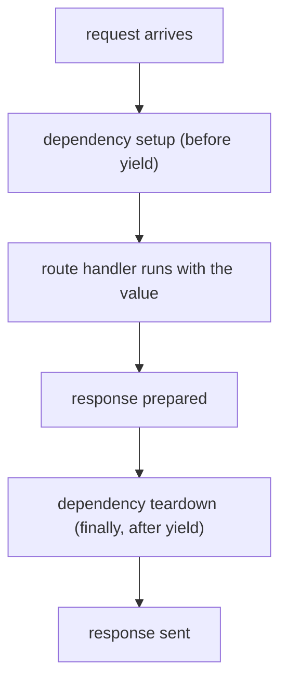

# 06 · Dependencies

> **Level:** Advanced · **Prerequisites:** [05 · Error handling](05_error_handling.md), [context managers](../06_pythonic_intermediate/04_context_managers.md)
> **Time:** ~1 hour · **Verified:** 2026-06-04 (FastAPI 0.136.3)

## Why this matters

Many routes share logic: parsing pagination, checking authentication, opening a database connection. Copy-pasting it everywhere is a maintenance nightmare. FastAPI's **dependency injection** lets you write that logic once as a function and *declare* it on any route that needs it — FastAPI runs it and passes the result in. It's clean, testable, and the mechanism behind FastAPI's auth and database integration. It builds directly on functions, type hints, and the `yield`-based context managers you already know.

## Concept: a dependency is just a function

A **dependency** is a function (or other callable) whose result FastAPI computes and injects into your route via `Depends(...)`:

```python
from fastapi import FastAPI, Depends
from fastapi.testclient import TestClient
from typing import Annotated

app = FastAPI()

def pagination(skip: int = 0, limit: int = 10):     # a plain function...
    return {"skip": skip, "limit": limit}

@app.get("/items")
def list_items(page: Annotated[dict, Depends(pagination)]):   # ...injected here
    return {"page": page}

client = TestClient(app)
print(client.get("/items?skip=20&limit=5").json())
print(client.get("/items").json())                  # defaults
```

Output (verified):

```text
{'page': {'skip': 20, 'limit': 5}}
{'page': {'skip': 0, 'limit': 10}}
```

What happened: FastAPI saw `Depends(pagination)`, called `pagination` (reading `skip`/`limit` from the query string — dependencies get parameters just like routes do!), and passed the returned dict in as `page`. Declare `Depends(pagination)` on ten routes and they all get consistent pagination — defined once.

> 📌 **`Annotated[dict, Depends(pagination)]`** is the modern style (matches the `Annotated` you used for `Query`/`Path`). The older form `page: dict = Depends(pagination)` also works.

## Concept: dependencies can use other parameters and dependencies

A dependency function can declare query/path/header params and *even depend on other dependencies* — FastAPI resolves the whole tree. This composability is the point:

```python
from fastapi import FastAPI, Depends
from fastapi.testclient import TestClient
from typing import Annotated

app = FastAPI()

def pagination(skip: int = 0, limit: int = 10):
    return {"skip": skip, "limit": min(limit, 100)}     # cap the limit

def query_params(q: str = "", page: Annotated[dict, Depends(pagination)] = None):
    return {"q": q, **page}                              # depends on pagination!

@app.get("/search")
def search(params: Annotated[dict, Depends(query_params)]):
    return params

client = TestClient(app)
print(client.get("/search?q=phone&limit=999").json())
```

Output (verified):

```text
{'q': 'phone', 'skip': 0, 'limit': 100}
```

`query_params` depends on `pagination`; FastAPI builds the chain and the limit gets capped at 100. Dependencies compose like Lego — small reusable pieces combined into bigger ones.

## Concept: dependencies with `yield` (setup & teardown) ⭐

This is where context managers ([Section 06.04](../06_pythonic_intermediate/04_context_managers.md)) meet FastAPI. A dependency that uses `yield` runs setup code, **yields** the value to the route, then runs teardown **after the response is sent** — perfect for database sessions, connections, files:

```python
from fastapi import FastAPI, Depends
from fastapi.testclient import TestClient
from typing import Annotated

app = FastAPI()
log = []

def get_db():
    log.append("open connection")          # setup (before the route)
    db = {"connected": True}
    try:
        yield db                           # the route runs with this value
    finally:
        log.append("close connection")     # teardown (after the response)
        db["connected"] = False

@app.get("/status")
def get_status(db: Annotated[dict, Depends(get_db)]):
    return {"connected": db["connected"]}

client = TestClient(app)
print(client.get("/status").json())
print("lifecycle:", log)
```

Output (verified):

```text
{'connected': True}
lifecycle: ['open connection', 'close connection']
```

The dependency opened the "connection" before the route, the route used it (`connected: True`), and the `finally` closed it after — exactly the guaranteed cleanup of a context manager, integrated into the request lifecycle. **This is how real apps manage database sessions:** `yield` the session, commit/close in `finally`. Cleanup runs even if the route raises.



## Concept: dependencies for authentication

A very common use: a dependency that checks credentials and either returns the user or raises an HTTP error. Routes that depend on it are automatically protected:

```python
from fastapi import FastAPI, Depends, HTTPException, Header
from fastapi.testclient import TestClient
from typing import Annotated

app = FastAPI()

def require_token(x_token: Annotated[str | None, Header()] = None):
    if x_token != "secret":
        raise HTTPException(status_code=401, detail="invalid or missing token")
    return {"user": "ada"}                 # the "logged-in" user

@app.get("/me")
def read_me(user: Annotated[dict, Depends(require_token)]):
    return user

client = TestClient(app)
print("no token:", client.get("/me").status_code)
print("bad token:", client.get("/me", headers={"x-token": "wrong"}).status_code)
print("good token:", client.get("/me", headers={"x-token": "secret"}).json())
```

Output (verified):

```text
no token: 401
bad token: 401
good token: {'user': 'ada'}
```

`require_token` reads the `X-Token` header (FastAPI maps `x_token` ↔ `X-Token`), rejects bad tokens with `401`, and returns the user on success. Any route that declares `Depends(require_token)` is now guarded — and the route body only runs for authenticated requests. Add it to ten routes and all ten are protected, consistently. (Real apps use FastAPI's `security` utilities for OAuth2/JWT, built on this same idea.)

## Concept: why dependency injection?

| Benefit | How |
|---------|-----|
| **Reuse** | write shared logic once, declare it on many routes |
| **Separation** | routes focus on their job; cross-cutting concerns live in dependencies |
| **Testability** | swap a dependency for a fake in tests (`app.dependency_overrides`) |
| **Lifecycle** | `yield` dependencies guarantee setup/teardown per request |
| **Composability** | dependencies depend on dependencies — build complex from simple |
| **Docs** | dependency params (query, header) appear in `/docs` automatically |

## Common mistakes

**Mistake: putting cleanup after `yield` without `try/finally`**
```python
def get_db():
    db = connect()
    yield db
    db.close()       # if the route raises, this may not run!
```
**Why:** like any `@contextmanager` ([Section 06.04](../06_pythonic_intermediate/04_context_managers.md)), wrap the `yield` in `try/finally` so teardown runs even on error: `try: yield db finally: db.close()`.

**Mistake: doing expensive work in a dependency on every request without caching**
**Why:** dependencies run per request. For something that should run once (or be shared), use `lru_cache` on the dependency, or app lifespan/state. FastAPI also *caches* a dependency's result *within a single request* if used multiple times (so it runs once per request, not once per `Depends`).

## Practice

**Exercise:** Write a dependency `get_current_user` that reads an `Authorization` header; if it equals `"Bearer letmein"` return `{"username": "ada", "role": "admin"}`, else raise `401`. Add a second dependency `require_admin` that depends on `get_current_user` and raises `403` if the role isn't `"admin"` (here it always is, but show the structure). Protect `GET /admin/dashboard` with `require_admin`. Verify no header (→401) and the valid header (→200).

<details><summary>Solution</summary>

```python
from fastapi import FastAPI, Depends, HTTPException, Header
from fastapi.testclient import TestClient
from typing import Annotated

app = FastAPI()

def get_current_user(authorization: Annotated[str | None, Header()] = None):
    if authorization != "Bearer letmein":
        raise HTTPException(status_code=401, detail="not authenticated")
    return {"username": "ada", "role": "admin"}

def require_admin(user: Annotated[dict, Depends(get_current_user)]):
    if user["role"] != "admin":
        raise HTTPException(status_code=403, detail="admins only")
    return user

@app.get("/admin/dashboard")
def dashboard(admin: Annotated[dict, Depends(require_admin)]):
    return {"welcome": admin["username"], "panel": "admin"}

client = TestClient(app)
print("no header:", client.get("/admin/dashboard").status_code)
print("authed:", client.get("/admin/dashboard",
                            headers={"Authorization": "Bearer letmein"}).json())
```

Output:

```text
no header: 401
authed: {'welcome': 'ada', 'panel': 'admin'}
```

`require_admin` builds on `get_current_user` (a dependency chain): the first authenticates, the second authorises. The route only runs for an authenticated admin; everyone else is stopped with `401`/`403` before the handler.
</details>

## Recap & next

- ✅ A **dependency** is a function injected via `Depends(...)`; declare it on any route.
- ✅ Dependencies take their own params (query/header) and can depend on other dependencies.
- ✅ **`yield` dependencies** provide per-request setup/teardown (use `try/finally`) — ideal for DB sessions.
- ✅ Auth is a dependency that returns the user or raises `401`/`403`.
- ✅ DI gives reuse, separation, testability, and clean lifecycles.
- Self-check: when does the teardown code (after `yield`) in a dependency run?

→ Next: **[07 · Testing](07_testing.md)**
